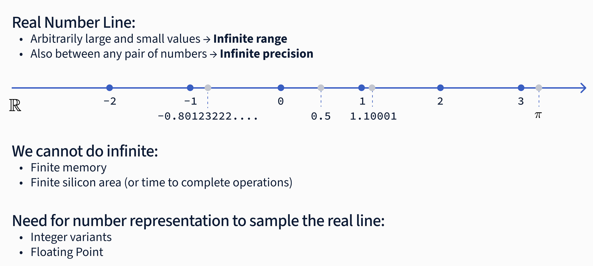

# Unlocking NVFP4: The Journey from 32-bit to 4-bit Precision
Over the past decade, we have seen a fascinating evolution and research going on in the field of low precision computing for AI models. The focus on this topic has become more and more important as following scaling laws (see the papers [1](https://arxiv.org/abs/2001.08361),[2](https://arxiv.org/abs/2203.15556)) models have been scaled up exponentially. This bet was also backed by another bet on the GPU, TPUs and other accelerators archiecture design. To fully understand and exploit the performances promised by the hardware vendors it is essential to understand the underlying hardare choices and the tradeoffs needed to improve the performences of our training or inference workloads.
Reducing the number of bits needed to represent the model weights, activations, and gradients impacts directly the design choices for the chip, but can be beneficial in terms of speed, energy efficiency and memory and communications bandwidth. Why so? Using less bits means that less memory is needed to store the model, but also the amount of data that gets tranferred over multiple GPUs is lower making communications faster. Computing is also faster as the data is smaller and the operations are less expensive. Adding all these together has some prices to pay however, since there is no free lunch and the researchers had to find some ways to mitigate the accuracy loss and the impact of the model performance at inference time or instabilities during the training phase. 
But before delving into that, let's first have a look at what is a floating point number that we will talk a lot about in this series of posts.

In simple terms, floating point numers is a way of representing real number on a computer using a fixed number of bits. This representation allows to represent a wide dynamic range of values. When referrring to numerical representations on a machine there are two concepts that allows to understand the tradeoffs we are making when choising that particular representation: 
- Precision -> refers to the sample density on the real number line for a given represntation. If the sampling is finer we have a higher precison
- Accuracy -> measures the error between the number stored in the machine representaiton and the actual real number.



An example taken from the GPU MODE lecture, if we want to represent $\pi$ we can for instance have several distinct representations:
1. `3.14` a very approximate representation of $\pi$.
2. `3.141543` is both more precise and more accurate of `3.14`.
3. `3.142738` which is more precise than `3.14` but at the same time less accurate than `3.14`.

This examples shows clearly that the choice of the numerical representation affects a lot the outcome of the mod
For more details on these concepts checkout the [GPU model lecture on numerics](https://youtu.be/ua2NhlenIKo?si=AG-ekf7DCkAkIJAa) by [Paulius Mickevicius](https://developer.nvidia.com/blog/author/pauliusm/). 

The real number line allows for infinite precision, but silicon and memory are finite. Using a floating p   oint representation we can sample the real line and represent it using three bit fields:
1.  Sign (S): Positive or negative.
2.  Exponent (E): The dynamic range (which power of 2 is sampled).
3.  Mantissa (M): The precision (samples between powers of two).

The mathematical representation is defined as:

$$
\begin{equation}
\begin{aligned}
N = (-1)^{S} \times 1.M \times 2^{E - bias}\\
\text{where } \text{bias} = 2^{E_\text{max} - 1} - 1
\end{aligned}
\end{equation}
$$

Let's break down the formula above. The floating point representation uses 1 bit for the sign (`S`) which determines if the number is positive `S = 0` or negative `S = 1`.  
The exponent (`E`) is an integer that represents the power of 2 that is adjusted using the bias term and multiplied by the mantissa (`M`). The exponent gives us the dynamic range of the number we can represent, aka which slice of the real number line we are sampling.  
The mantissa (`M`) or significand is a binary number that represents the precision of the number we are representing, if the exponent is giving us the scale, the mantissa on the other hand is telling us which sample in we are sampling in the real number.  
[Further details on the floating point representation are discussed in the appendix of the blogpost](#appendix-a-floating-point-representation)


The Floating Point 32 together with FP64 are the most common representations used in engineering and scientific applications. Aside some corner cases requiring higher precisions, historically, deep learning relied on FP32 (32-bit). 
FP32 is a 32-bit representation (also known as single precision) and uses E8M23. 8 bits are used for the exponent while 23 bits for the mantissa.  
Over time, both industry and academia realized that these models are surprisingly resilient to noise, allowing to move to FP16. This shift to 16 bits halves memory footprint and increases the performance of the models.  
Let's break down some concrete example with FP16. This format uses E5M10. 5 bits are used for the exponent while 10 bits for the mantissa. We want to represent the number `3.14`, but we can't have infinite precision so the number we will end up representing will be the closest one to `3.14` which is `3.140625`. 
Looking at the bits will self-explain why:
```
3.14 ~ 3.140625 = 0.10000.1001001000 (binary)
                = 0x4248 (in hexadecimal)
```

- `S=0`: the number is positive,  
- `E=10000`:  exponent is 16 in base 10 ($2^4$), but it's adjusted with the bias term `bias=15`, so the actual exponent is $16 - 15 = 1$.
- `M=1001001000`: the mantissa is the binary representation of `3.140625`.

If we plug this values into equation (1) we get:

$$
\begin{align}
N &= (-1)^{0} \times (1.1001001000)_2 \times 2^{(10000)_2 - 15} =\\
&= 1 \times (1.1001001000)_2 \times 2^{1} = \\
&= (1.1001001000)_2 \times 2
\end{align}
$$

Looking closer at the mantissa we have:
```
M = (1.1001001000)_2
```
The first bit is implicitly stored and since it's always 1

$$
\begin{align*}
(1.1001001000)_2 &= 1 + \frac{1}{2} + \frac{0}{4} + \frac{0}{8} + \frac{1}{16} + \frac{0}{32} + \frac{0}{64} + \frac{1}{128} + \frac{0}{256} + \frac{0}{512} =\\ 
&= 1 + \frac{1}{2} + \frac{1}{16} + \frac{1}{128} =\\
&= 1 + 0.5 + 0.0625 + 0.0078125 =\\
&= (1.5625)_{10}
\end{align*}
$$

Putting all together we have:
```
N = 0.10000.1001001000 
  = (-1)^0 * (1.1001001000)_2 * 2^((10000)_2 - 15) 
  = (-1)^0 * 1.5625 * 2^(16-15) =
  = 1 * 1.5625 * 2^1
  = 3.140625
```

FP32, FP16 and FP64 are defined in the IEEE 754 standard and were the standard for FP arithmetic in DL for many years until 2017 when Google Brain introduced `bfloat16`. This format, championed by Google engineers for TPUs, kept the dynamic range of FP32 by using the same number of exponent bits but shortened the mantissa, `E5M10 -> E8M7`. This format is a clever way to get the best of both worlds: faster training with enough range to handle large values that may otherwise lead to numerical instabilities during the training phase of the models.


## Introducing NVFP4: Efficiency Without Compromise
NVFP4 is a 4-bit format consisting of **1 sign bit, 2 exponent bits, and 1 mantissa bit (E2M1)**.

The immediate challenge with 4-bit precision is the limited number of representable values—essentially 16 values to represent complex model weights. If you simply quantized a standard distribution to 4 bits, you would lose significant accuracy, particularly with outliers.

### The Secret Sauce: Block Scaling
To solve this, NVFP4 utilizes **Block Scaling**. Instead of scaling the entire tensor broadly, scaling factors are applied to small blocks of elements.

While the Open Compute Project (OCP) MXFP4 specification uses a block size of 32 elements, NVIDIA’s NVFP4 uses a finer granularity of **16 elements**.
* **Smaller Blocks:** A block size of 16 allows the format to better capture outliers.
* **Higher Accuracy:** This minimizes the number of values quantized to zero, maintaining model fidelity.

## The NVFP4 Training Recipe
Training in FP4 requires a sophisticated "recipe" to ensure convergence. The Blackwell architecture supports this through a specific pipeline:

1.  **2D Scaling:** Scaling factors are applied row-wise and column-wise to maximize dynamic range.
2.  **Stochastic Rounding (SR):** Unlike "nearest" rounding, SR rounds probabilistically. The formula preserves the cexpected value of the number:

$$\mathbb{E}\left[\text{Round}(x)\right] = x$$
$$
\text{Round}(x) = 
\begin{cases} 
    \lfloor x \rfloor, & \text{w/ prob. } 1-p \\ 
    \lceil x \rceil, & \text{w/ prob. } 
\end{cases}
$$

$$p = (x - \lfloor x \rfloor) / (\lceil x \rceil - \lfloor x \rfloor)$$

3.  **Random Hadamard Transforms:** This technique spreads outlier information across the vector, preventing specific weights from dominating the quantization error.

## From DeepSeek V3 to the Future
We are already seeing the industry move toward lower precision. Frontier labs like DeepSeek have successfully implemented FP8 mixed precision training, utilizing fine-grained quantization to mitigate errors caused by feature outliers.

NVFP4 on Blackwell represents the next step. By combining the E2M1 format with 16-element block scaling and stochastic rounding, we can achieve the speed and memory efficiency of 4-bit compute while retaining the necessary accuracy for frontier models.

At Verda, we are building the AI-native cloud to support these next-generation workloads, ensuring that infrastructure keeps pace with the rapid evolution of algorithmic efficiency.


---- 
### Appendix A: Floating Point Representation
#### TODO
Add more details on the floating point representation and the bias term.
bias term
the fact the first bit is always 1 and introducing the rest of the things from the GPU MODE lecture.    
