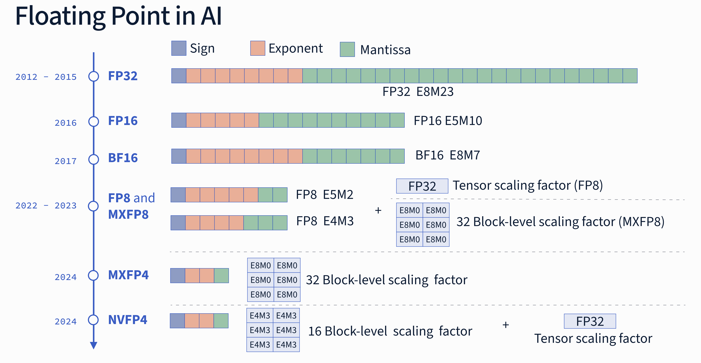
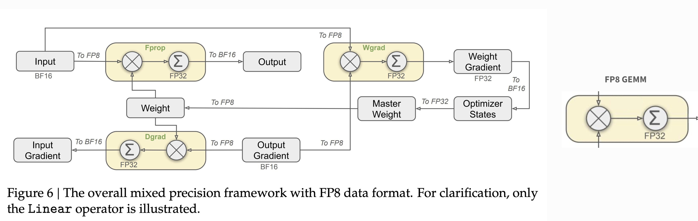

# Unlocking NVFP4: How we got from 32-bit to 4-bit Precision
<!-- Intro -->
Over the past decade, AI models have increasingly shifted toward lower precision for both training and inference. As Moore’s Law nears its physical limits and transistor density plateaus, chip designers must find new ways to boost FLOPs with each yearly release. Adopting lower-precision data types has become a primary strategy; it not only accelerates computation but also significantly reduces the memory footprint required for model weights, activations, and gradients.

<!-- Floating Point Representation -->
## Floating Point Representation
In simple terms, floating point numbers are a way of representing real numbers on a computer using a fixed number of bits. This representation allows us to represent a wide dynamic range of values.  
One of the crucial points we have to keep in mind is that on a machine we have to deal with a fixed budget represented by the number of bits used. To understand the tradeoffs, we must distinguish between three concepts that depend on how we allocate the bits of the representation:
- **Dynamic range**, controlled by the **exponent** (E) bits determines the scale of the number we are trying to represent, aka how large or how small a number can be (e.g. from $10^{-45}$ to $10^{38}$). With more E bits, we can represent a wider range, reducing the risk of overflow or underflow.
- **Precision**, controlled by the **mantissa** (M) bits and refers to the density of samples on the real number line $\mathbb{R}$.
- **Accuracy**, which measures the error between the stored number in the chosen representation and the actual real number.


**Figure 1.** *The figure summarizes the different Floating Point formats discussed in this post. Chronologically we have FP32, FP16, BF16, FP8 (which used a tensor-scale factor), `MXFP*` formats (using a 32 block-level scaling factor) and finally the NVFP4 (which uses a combination of fractional 16-block-level scaling and a FP32 tensor-level scaling).*

As an example, if we want to represent $\pi$ we can have several distinct representations using a finite number of bits. Let's for a moment focus on some values we could end up storing in our machine when representing $\pi$ in a FP number:
1. `3.141` a very crude approximation of $\pi$ that uses only 3 fractional digits in base 10.
2. `3.141543` is both more precise and more accurate than `3.141`.
3. `3.142738` which is more precise than `3.141` but less accurate than `3.141`, since the absolute error $|\pi - x|$ ~0.0011.. vs. ~0.0005).


**Figure 2.** *Illustration of precision vs. accuracy using different approximations of $\pi$. The figure demonstrates how a more precise representation (more decimal digits) does not necessarily mean higher accuracy (closer to the true value). The three examples show: `3.141` (low precision, moderate accuracy), `3.141543` (higher precision and accuracy), and `3.142738` (higher precision but lower accuracy than `3.141`).*


This simple example shows clearly that the choice of the numerical representation greatly affects the outcome of the computations taking place in our hardware. The example and some of the definitions used in this article are inspired from the [GPU Mode lecture on numerics](https://youtu.be/ua2NhlenIKo?si=AG-ekf7DCkAkIJAa) by [Paulius Mickevicius](https://developer.nvidia.com/blog/author/pauliusm/).

The real number line allows for infinite precision, but silicon and memory are finite. Using a FP representation, we can sample the real line and represent it using three bit fields:
1.  **Sign (S):** Positive or negative.
2.  **Exponent (E):** The dynamic range (which power of 2 is used).
3.  **Mantissa (M):** The precision (samples between powers of two).

The mathematical representation is defined as:


$$
\begin{equation}
N = (-1)^{S} \times 1.M \times 2^{E - bias}
\end{equation}
$$

Let's break down the formula above:
- The floating point representation uses 1 bit for the sign (`S`) which determines if the number is positive `S = 0` or negative `S = 1`.  
- The exponent (`E`) is an integer that represents the power of 2 that is adjusted using the $\text{bias}$ term and multiplied by the mantissa (`M`). The exponent gives us the dynamic range of the number we can represent, aka which slice of the real number line we are sampling.  
- The mantissa (`M`) or significand is a binary number that represents the precision of the number we are representing; if the exponent is giving us the scale, the mantissa on the other hand is telling us which sample we are taking from that slice of the real number line. 

In normalized floating point representation, the significand always starts with an implicit leading `1` (this is why it's called "normalized"). The first bit is (almost) always 1 to maximize precision. The mantissa bits, e.g., `1001001000`, represent the fractional digits that come after this implicit `1`, forming the complete significand `1.1001001000` in binary. Each bit position corresponds to a negative power of 2: the first bit after the decimal point represents $2^{-1} = 0.5$, the second $2^{-2} = 0.25$, the third $2^{-3} = 0.125$, and so on. This allows the mantissa to encode fine-grained precision within the slice of the real number line determined by the exponent.


### Floating Point 32 
The Floating Point 32 together with FP64 are the most common representations used in engineering and scientific applications. Aside some corner cases requiring higher precisions, historically, deep learning relied on FP32. 
FP32 is a 32-bit representation, also known as single precision. In FP32, 8 bits are used for the exponent while 23 bits for the mantissa (`E8M23`).  
Over time, both industry and academia realized that these models are surprisingly resilient to noise, allowing to move to FP16. This shift to 16 bits halves memory footprint and increases the performance of the models.  
Let's break down a concrete example with FP16. This format uses E5M10. 5 bits are used for the exponent while 10 bits for the mantissa. Let's say we want to represent the number `3.14` using FP16. First of all we will find that we cannot represent the exact value `3.14` so the number we will end up storing will be the closest in this format which is `3.140625`. 
Looking at the crude bits will self-explain why:
```
3.14 ~ 3.140625 = 0.10000.1001001000 (binary)
                = 0x4248 (in hexadecimal)
```

- `S=0`: the number is positive,  
- `E=10000`:  exponent is 16 in base 10 ($2^4$), but it's adjusted with the bias term `bias=15`, so the actual exponent is $16 - 15 = 1$.
- `M=1001001000`: the mantissa represents the fractional part of the normalized significand. 

If we plug this values into equation (1) we get:

$$
\begin{align}
N &= (-1)^{0} \times (1.1001001000)_2 \times 2^{(10000)_2 - 15} =\\
&= 1 \times (1.1001001000)_2 \times 2^{1} = \\
&= (1.1001001000)_2 \times 2
\end{align}
$$

Looking closer at the mantissa we have:
```
M = (1.1001001000)_2
```
The first bit is implicitly stored and since it's always 1

$$
\begin{align*}
(1.1001001000)_2 &= 1 + \frac{1}{2} + \frac{0}{4} + \frac{0}{8} + \frac{1}{16} + \frac{0}{32} + \frac{0}{64} + \frac{1}{128} + \frac{0}{256} + \frac{0}{512} + \frac{0}{1024}=\\ 
&= 1 + \frac{1}{2} + \frac{1}{16} + \frac{1}{128} =\\
&= 1 + 0.5 + 0.0625 + 0.0078125 =\\
&= (1.5703125)_{10}
\end{align*}
$$

Putting all together we have:
```
N = 0.10000.1001001000 
  = (-1)^0 * (1.1001001000)_2 * 2^((10000)_2 - 15) 
  = (-1)^0 * 1.5703125 * 2^(16-15) =
  = 1 * 1.5703125 * 2^1
  = 3.140625
```

If we took instead the two closest representable FP numbers we would have got:
```

N_{+1} = 0.10000.1001001001 = 1 * 1.5712890625 * 2 = 3.142578125
N      = 0.10000.1001001000 = 3.140625 <--- More accurate representation for 3.14
N_{-1} = 0.10000.1001000111 = 1 * 1.5693359375 * 2 = 3.138671875
```

### `bfloat16`
FP32, FP16 and FP64 are defined in the IEEE 754 standard and were the standard for FP arithmetic in DL for many years until 2017 when Google Brain introduced `bfloat16`. This format, championed by Google engineers for TPUs, kept the dynamic range of FP32 by using the same number of exponent bits but shortened the mantissa, `E5M10 -> E8M7`. This format is a clever way to get the best of both worlds: faster training with enough range to handle large values that may otherwise lead to numerical instabilities during the training phase of the models.
<p align="center">
  
</p>

**Figure 3.** *Jeff Dean's X post explaining the bfloat16 format. (Source: [X Thread by Jeff Dean on bfloat16](https://x.com/JeffDean/status/1134523127357161473))* 

Let's see how `3.14` is represented in bfloat16. This format uses `E8M7`: 8 bits for the exponent (same as FP32, with `bias=127`) and 7 bits for the mantissa. The closest representable value to `3.14` in bfloat16 is `3.140625`.

Looking at the bits:
```
3.14 ~ 3.140625 = 0.10000000.1001001 (binary)
                = 0x4049 (in hexadecimal)
```

- `S=0`: the number is positive,
- `E=10000000`: exponent is 128 in base 10 ($2^7$), adjusted with the bias term `bias=127`, so the actual exponent is $128 - 127 = 1$.
- `M=1001001`: the mantissa represents the fractional part of the normalized significand (7 bits).

If we plug these values into equation (1) we get:

$$
\begin{align}
N &= (-1)^{0} \times (1.1001001)_2 \times 2^{(10000000)_2 - 127} =\\
&= 1 \times (1.1001001)_2 \times 2^{1} = \\
&= (1.1001001)_2 \times 2
\end{align}
$$

Looking closer at the mantissa:
```
M = (1.1001001)_2
```

$$
\begin{align*}
(1.1001001)_2 &= 1 + \frac{1}{2} + \frac{0}{4} + \frac{0}{8} + \frac{1}{16} + \frac{0}{32} + \frac{0}{64} + \frac{1}{128} =\\ 
&= 1 + \frac{1}{2} + \frac{1}{16} + \frac{1}{128} =\\
&= 1 + 0.5 + 0.0625 + 0.0078125 =\\
&= (1.5703125)_{10}
\end{align*}
$$

Putting all together:
```
N = 0.10000000.1001001 
  = (-1)^0 * (1.1001001)_2 * 2^((10000000)_2 - 127) 
  = (-1)^0 * 1.5703125 * 2^(128-127) =
  = 1 * 1.5703125 * 2^1
  = 3.140625
```

If we consider the two closest representable bfloat16 numbers around `3.14`, we get:
```
N_{+1} = 0.10000000.1001010 = 1 * 1.578125 * 2 = 3.15625
N      = 0.10000000.1001001 = 1 * 1.5703125 * 2 = 3.140625 <--- More accurate representation for 3.14
N_{-1} = 0.10000000.1001000 = 1 * 1.5625 * 2 = 3.125
```

Note that while bfloat16 results in the same representable value as FP16 for this specific example, generally bfloat16 has lower precision (7 mantissa bits vs 10) in exchange for the wider dynamic range required for training stability. This is noticeable if you check the closest representations to `N` computed here and compare them to those from the previous section, we can see that the gap between the values is larger due to the smaller precision of `bf16` format.

### FP8
As model sizes and training throughput demands continued to grow, `bfloat16` has become a limiting factor due to the heavier memory bandwidth and compute density with bigger models. This motivated the transition toward even lower-precision formats such as FP8.  
FP8 reduces the number of bits used in the floating point representation to 8 and is typically implemented in two complementary formats: `E4M3`, which prioritizes precision, and `E5M2`, which prioritizes dynamic range. On modern GPUs, FP8 is tightly integrated with Tensor Cores, enabling significantly higher arithmetic throughput and better utilization of on-chip compute resources compared to FP16 or BF16. By halving the data size again, FP8 allows more operands to be processed per cycle, increasing arithmetic intensity and reducing memory traffic which represent two critical factors for scaling large-model training.  

However, these gains come with important trade-offs. The reduced mantissa and exponent budgets make FP8 more sensitive to numerical noise, overflow, and underflow. As a result, FP8 training typically relies on explicit scaling strategies, careful format selection (`E4M3` vs. `E5M2`), and higher-precision accumulation (often FP16 or FP32) to maintain stability and convergence. In practice, FP8 shifts part of the complexity from hardware to software, requiring tighter coordination between kernels, scaling logic, and model architecture.
Moving to FP8 requires a sophisticated orchestration of different numerical formats to balance speed and stability. In early 2025 a lot of buzz around DeepSeek was also due to them releasing their training recipe for FP8 that they used to train their DeepSeek-V3 base model.
In their paper discussing the architecture (see [DeepSeek-V3 Technical Report](https://arxiv.org/abs/2412.19437)), they detail their customized mixed-precision strategy. Not all tensors in the training loop are using the same low-precision, while the weights tend to be more stable requiring precision, on the other hand, the activations can have sharp outliers requiring higher dynamic range.


*Figure . DeepSeek-V3 Mixed Precision Training Strategy (Source: [DeepSeek-V3 Technical Report](https://arxiv.org/abs/2412.19437))*

As illustrated in the figure above from their technical report, DeepSeek adopts different FP8 variants depending on the operation:

* **Weights (FWD/BWD):** Utilizing FP8 `E4M3`, since weights require finer precision the extra mantissa bit helps in more accurate computations.
* **Activations (FWD):** Utilizing FP8 `E5M2`, they often contain outliers that push the boundaries of dynamic range; the extra exponent bit here prevents overflows that would destabilize training.
* **Master Weights and Optimizer States:** are kept in higher precision (FP32 and FP16) to ensure accurate gradient accumulation and stable convergence over long training runs.

Furthermore, to handle outliers that even `E5M2` can't catch, DeepSeek employs a fine-grained quantization scaling blocks of FP8 elements rather than whole tensors. This software-heavy approach to managing numerical instability highlights the immense challenges of scaling low-precision training.

### Microscaling (MX) Formats
While DeepSeek-V3 (and likely many other frontier models) shows us that FP8 is viable with careful engineering, the desire for efficiency pushed AI workloads towards even smaller formats like 6-bit or 4-bit. At these low precisions, standard per-tensor scaling breaks down. A single large outlier in a tensor of millions of parameters can skew the quantization scale, effectively pushing all smaller values to zero and lowering model accuracy.

To solve this, a consortium of tech companies, including AMD, Arm, Intel, NVIDIA, and Qualcomm, aligned under the Open Compute Project (OCP) to introduce Microscaling (MX) formats.

The core idea of Microscaling is to move from per-tensor to per-block scaling.
Instead of assigning one scaling factor to an entire tensor, the tensor is divided into small blocks, e.g., 32 elements. Each block gets its own shared scale, an 8-bit exponent value.

To recap how it works an `MXFP*` format uses: 
1.  **Block grouping:** Elements are grouped into blocks of $k$ elements (usually $k=32$).
2.  **Shared Per-block Scale:** The hardware calculates the maximum absolute value in that block to determine a shared 8-bit exponent.
3.  **Local Quantization:** The individual elements are then quantized to 4 bits relative to that local shared scale.

This approach isolates the impact of outliers. If a massive value exists in the tensor, it only affects the scale of its specific block of 32 neighbors, leaving the rest of the model's weights untouched and precise. This compartmentalization of numerical noise is the key breakthrough that allows training to survive at 4-bit precision.


### NVFP4
The NVFP4 format introduced with the Blackwell architecture represents the most aggressive step yet in low bit representation.
NVFP4 is a 4-bit floating point format (`E2M1`) composed of:
* Sign: 1 bit
* Exponent: 2 bits
* Mantissa: 1 bit (plus one implicit)

With only 16 unique values available in a 4-bit representation, careful block- and tensor-level scaling becomes critical to preventing quantization errors.

While the OCP MX specification typically suggests a block size of 32 elements, NVIDIA chose a finer granularity for Blackwell of 16 elements.
By calculating the shared scale factor over these fewer elements, NVFP4 "confines" outliers even more tightly than the standard. This means a single sharp spike in activation values distorts a smaller neighborhood, preserving the fidelity of the surrounding weights.


**Figure 5.** *Illustration of the compute flow for a NVFP4 quantized linear layer. All GEMM operations quantize their inputs to NVFP4.  (Source: [Pretraining Large Language Models with NVFP4](https://arxiv.org/abs/2509.25149))*


Hardware support is only half the story, in fact, training a model in 4-bit precision without it diverging into noise requires a specific algorithmic recipe, as showcased in the paper from NVIDIA ["Pretraining Large Language Models with NVFP4"](https://arxiv.org/abs/2509.25149).  
NVIDIA implements NVFP4 training through a specialized pipeline:

1. **2D Block Scaling**  
   Scaling isn't just applied along one dimension. Factors are calculated both **row-wise** and **column-wise** for the matrix multiplication. This maximizes the effective dynamic range, allowing the tiny 4-bit payload to represent values that would otherwise be out of bounds.

2. **Random Hadamard Transform (RHT)**  
   One of the biggest enemies of quantization is "outlier features"—specific neurons that consistently fire with massive values. These outliers can wreck the quantization scale for their entire block.
Blackwell can apply a Random Hadamard Transform *before* quantization. This mathematical operation "smears" or spreads the outlier information across the entire vector.
    * Before RHT: One massive value, many small ones. (Hard to quantize).
    * After RHT: Many medium values. (Easy to quantize efficiently).

3. **Stochastic Rounding (SR)**  
   When you have very few bits, standard "nearest" rounding is dangerous because it creates a systematic bias (always rounding down 0.4 to 0 accumulates a massive error over billions of operations).
   NVFP4 uses **Stochastic Rounding**, which rounds probabilistically based on the distance to the next number. This ensures that **on average**, the expected value of the rounded number equals the original number allowing for the gradient descent to converge correctly over time. In formulas, we have,
   
$$\mathbb{E}\left[\text{Round}(x)\right] = x$$

$$
\text{Round}(x) = 
\begin{cases} 
    \lfloor x \rfloor, & \text{w/ prob. } 1-p \\ 
    \lceil x \rceil, & \text{w/ prob. } p
\end{cases}
$$
$$p = (x - \lfloor x \rfloor) / (\lceil x \rceil - \lfloor x \rfloor)$$

Putting all together, we get a full working scheme that closely resembles the one from DeepSeekV3 shown earlier:


*Figur 6.: Illustration of the NVFP4 training flow for a linear layer. Notice that all GEMMs are performed using NVFP4. (Source: [Pretraining Large Language Models with NVFP4](https://arxiv.org/abs/2509.25149))*


## Conclusions
The journey from 32-bit to 4-bit precision highlights a fundamental shift in AI scaling. We are no longer just relying on transistor density (Moore’s Law) to make models faster; we are fundamentally changing the mathematics of how these models represent reality.

NVFP4 proves that with the right algorithmic "safety nets"—like Stochastic Rounding and Hadamard Transforms—we can strip away precision without sacrificing intelligence. As models continue to grow, this tight co-design between hardware constraints and algorithmic innovation will define the next generation of AI infrastructure.

---- 
