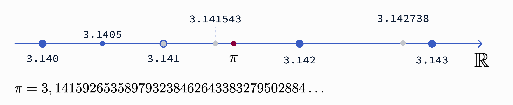
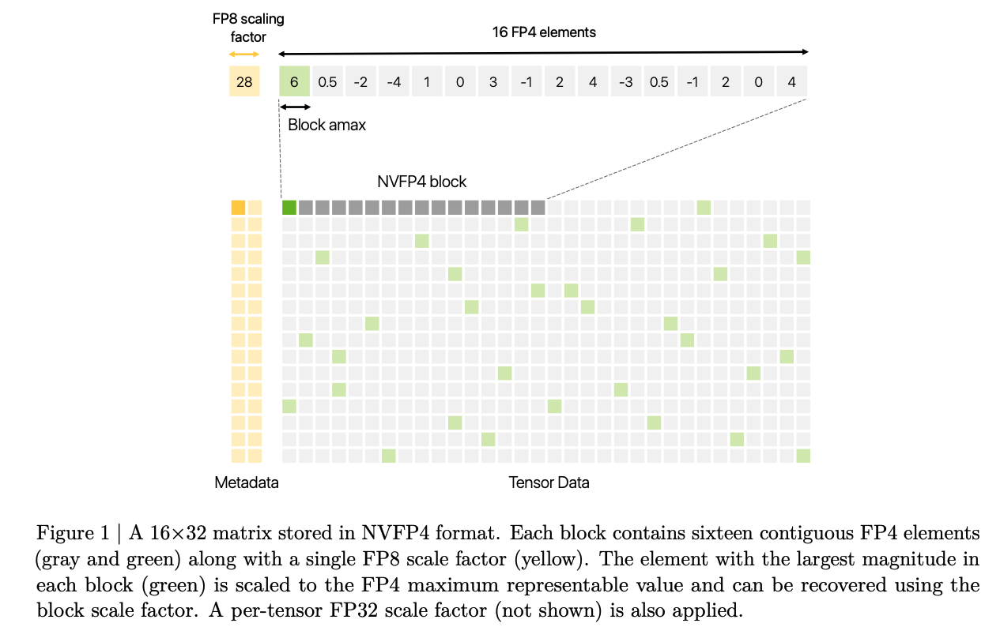
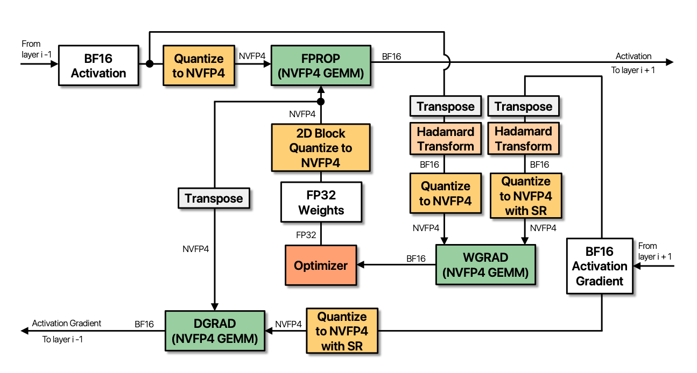

# Unlocking NVFP4: How We Got from 32-bit to 4-bit Precision

Over the past decade, AI models have increasingly shifted toward lower precision for both training and inference. As Moore's Law nears its physical limits and transistor density plateaus, chip designers must find new ways to boost FLOPs with each yearly release. Adopting lower-precision data types has become a primary strategy; it not only accelerates computation but also significantly reduces the memory footprint required for model weights, activations, and gradients.

## Floating Point Representation

In simple terms, floating point numbers are a way of representing real numbers on a computer using a fixed number of bits. This representation allows us to represent a wide dynamic range of values.

One of the crucial points we have to keep in mind is that on a machine we have to deal with a fixed budget represented by the number of bits used. To understand the tradeoffs, we must distinguish between three concepts that depend on how we allocate the bits of the representation:

- **Dynamic range**, controlled by the **exponent** (E) bits, determines the scale of the number we are trying to represent, aka how large or how small a number can be (e.g., from $10^{-45}$ to $10^{38}$). With more E bits, we can represent a wider range, reducing the risk of overflow or underflow.
- **Precision**, controlled by the **mantissa** (M) bits, refers to the density of samples on the real number line $\mathbb{R}$.
- **Accuracy** measures the error between the stored number in the chosen representation and the actual real number.


**Figure 1.** *The figure summarizes the different floating point formats discussed in this post. Chronologically: FP32, FP16, BF16, FP8 (which uses a tensor-scale factor), `MXFP*` formats (using a 32-element block-level scaling factor), and finally NVFP4 (which uses a combination of 16-element block-level scaling and FP32 tensor-level scaling).*

As an example, if we want to represent $\pi$ we can have several distinct representations using a finite number of bits. Let's focus on some values we could end up storing when representing $\pi$ as a floating point number that are allowed to use different number of fractional digits:

1. `3.141`: a crude approximation of $\pi$ that uses only 3 fractional digits in base 10.
2. `3.141543`: both more precise and more accurate than `3.141`.
3. `3.142738`: more precise than `3.141` but *less accurate*, since the absolute error $|\pi - x|$ is ~0.0011 vs. ~0.0005.


**Figure 2.** *Illustration of precision vs. accuracy using different approximations of $\pi$. A more precise representation (more decimal digits) does not necessarily mean higher accuracy (closer to the true value). The three examples show: `3.141` (low precision, moderate accuracy), `3.141543` (higher precision and accuracy), and `3.142738` (higher precision but lower accuracy than `3.141`).*

This simple example shows clearly that the choice of numerical representation greatly affects the outcome of computations. The example and some of the definitions used in this article are inspired by the [GPU Mode lecture on numerics](https://youtu.be/ua2NhlenIKo?si=AG-ekf7DCkAkIJAa) by [Paulius Mickevicius](https://developer.nvidia.com/blog/author/pauliusm/).

The real number line allows for infinite precision, but silicon and memory are finite. Using a floating point representation, we can sample the real line using three bit fields:

1. **Sign (S):** Positive or negative.
2. **Exponent (E):** The dynamic range (which power of 2 is used).
3. **Mantissa (M):** The precision (samples between powers of two).

The mathematical representation is defined as:

$$
\begin{equation}
N = (-1)^{S} \times 1.M \times 2^{E - \text{bias}}
\end{equation}
$$

Let's break down the formula:

- The sign bit (`S`) determines if the number is positive (`S = 0`) or negative (`S = 1`).
- The exponent (`E`) is an integer representing the power of 2, adjusted by the $\text{bias}$ term. The exponent gives us the dynamic range, meaning which slice of the real number line we are sampling.
- The mantissa (`M`) or significand is a binary number representing the precision; if the exponent gives us the scale, the mantissa tells us which sample we are taking from that slice of the real number line.

In normalized floating point representation, the significand always starts with an implicit leading `1` (this is why it's called "normalized"). The mantissa bits, e.g., `1001001000`, represent the fractional digits that come after this implicit `1`, forming the complete significand `1.1001001000` in binary. Each bit position corresponds to a negative power of 2: the first bit after the decimal point represents $2^{-1} = 0.5$, the second $2^{-2} = 0.25$, the third $2^{-3} = 0.125$, and so on.

### Floating Point 32 and Floating Point 16

FP32 and FP64 are the most common representations used in engineering and scientific applications. Aside from some corner cases requiring higher precision, historically, Deep Learning relied on FP32.

FP32 is a 32-bit representation, also known as single precision. In FP32, 8 bits are used for the exponent while 23 bits are used for the mantissa (`E8M23`).

Over time, both industry and academia realized that neural networks are surprisingly resilient to noise, allowing the move to FP16. This shift to 16 bits halves memory footprint and increases throughput.

Let's break down a concrete example with FP16. This format uses `E5M10`: 5 bits for the exponent and 10 bits for the mantissa. If we want to represent `3.14` using FP16, we find that we cannot represent the exact value—the closest representable number is `3.140625`.

Looking at the bits:
```
3.14 ≈ 3.140625 = 0.10000.1001001000 (binary)
                = 0x4248 (hexadecimal)
```

- `S=0`: the number is positive
- `E=10000`: exponent is 16 in base 10, adjusted with `bias=15`, so the actual exponent is $16 - 15 = 1$
- `M=1001001000`: the mantissa represents the fractional part of the normalized significand

Plugging these values into equation (1):

$$
\begin{align}
N &= (-1)^{0} \times (1.1001001000)_2 \times 2^{(10000)_2 - 15} \\
&= 1 \times (1.1001001000)_2 \times 2^{1} \\
&= (1.1001001000)_2 \times 2
\end{align}
$$

Looking closer at the mantissa we have:
```
M = (1.1001001000)_2
```
The first bit is implicitly stored and is always 1 for normalized numbers.

$$
\begin{align*}
(1.1001001000)_2 &= 1 + \frac{1}{2} + \frac{0}{4} + \frac{0}{8} + \frac{1}{16} + \frac{0}{32} + \frac{0}{64} + \frac{1}{128} + \frac{0}{256} + \frac{0}{512} + \frac{0}{1024}=\\ 
&= 1 + \frac{1}{2} + \frac{1}{16} + \frac{1}{128} =\\
&= 1 + 0.5 + 0.0625 + 0.0078125 =\\
&= (1.5703125)_{10}
\end{align*}
$$

Putting all together we have:
```
N = 0.10000.1001001000 
  = (-1)^0 * (1.1001001000)_2 * 2^((10000)_2 - 15) 
  = (-1)^0 * 1.5703125 * 2^(16-15) =
  = 1 * 1.5703125 * 2^1
  = 3.140625
```

If we took instead the two closest representable FP numbers we would get:
```
N_{+1} = 0.10000.1001001001 = 1 * 1.5712890625 * 2 = 3.142578125
N      = 0.10000.1001001000 = 3.140625 <--- More accurate representation for 3.14
N_{-1} = 0.10000.1001000111 = 1 * 1.5693359375 * 2 = 3.138671875
```

The gap between adjacent representable values is approximately 0.002—this is the *quantization step size* at this magnitude, and it's directly determined by the number of mantissa bits.

### bfloat16

FP32, FP16, and FP64 are defined in the IEEE 754 standard and were standard for floating point arithmetic in deep learning for many years, until 2017 when Google Brain introduced `bfloat16`. This format, championed by Google engineers for TPUs, kept the dynamic range of FP32 by matching its 8 exponent bits, while using only 7 mantissa bits (compared to FP16's 10). The result is `E8M7`, a format that trades precision for range. This is a clever way to get the best of both worlds: faster training with enough range to handle large values that might otherwise cause numerical instabilities.

<p align="center">
  
</p>

**Figure 3.** *Jeff Dean's X post explaining the bfloat16 format. (Source: [X Thread by Jeff Dean on bfloat16](https://x.com/JeffDean/status/1134523127357161473))*

Let's see how `3.14` is represented in bfloat16. This format uses `E8M7`: 8 bits for the exponent (same as FP32, with `bias=127`) and 7 bits for the mantissa. The closest representable value to `3.14` is again `3.140625`.

```
3.14 ~ 3.140625 = 0.10000000.1001001 (binary)
                = 0x4049 (hexadecimal)
```

The two closest representable bfloat16 numbers:
```
N_{+1} = 0.10000000.1001010 = 1 * 1.578125 * 2 = 3.15625
N      = 0.10000000.1001001 = 1 * 1.5703125 * 2 = 3.140625 <--- More accurate representation for 3.14
N_{-1} = 0.10000000.1001000 = 1 * 1.5625 * 2 = 3.125
```

Note that while bfloat16 results in the same representable value as FP16 for this specific example, bfloat16 generally has lower precision (7 mantissa bits vs. 10) in exchange for wider dynamic range. This is visible in the neighboring values: the gap between adjacent bfloat16 numbers (~0.016) is larger than for FP16 (~0.002). This coarser precision is acceptable for training because gradient updates are inherently noisy, but the wider range prevents overflow on large activation values.

### FP8

As model sizes and training throughput demands continued to grow, bfloat16 became a limiting factor due to memory bandwidth and compute density constraints. This motivated the transition toward FP8. FP8 training, formalized by [Micikevicius et al.](https://arxiv.org/abs/2209.05433), became feasible at scale with the introduction of FP8 tensor cores in NVIDIA's Hopper (H100) architecture.

FP8 reduces the representation to 8 bits, typically implemented in two complementary formats: `E4M3` (prioritizing precision) and `E5M2` (prioritizing dynamic range). On modern GPUs, FP8 is tightly integrated with Tensor Cores, enabling significantly higher arithmetic throughput compared to FP16 or BF16. By halving the data size again, FP8 allows more operands to be processed per cycle, increasing arithmetic intensity and reducing memory traffic—two critical factors for scaling large-model training.

However, these gains come with important trade-offs. The reduced mantissa and exponent budgets make FP8 more sensitive to numerical noise, overflow, and underflow. As a result, FP8 training typically relies on explicit scaling strategies, careful format selection (`E4M3` vs. `E5M2`), and higher-precision accumulation (often FP16 or FP32) to maintain stability and convergence.

**Why is 8-bit harder than 16-bit?** Consider the quantization error. With FP16's 10 mantissa bits, we have 1024 distinct values between consecutive powers of two. With FP8 E4M3's 3 mantissa bits, we have only 8. This means the average rounding error increases by ~128×. At 4 bits, the problem becomes even more severe—we're down to just 2 mantissa bits (4 values between powers of two), making careful scaling essential for survival.

Moving to FP8 requires sophisticated orchestration of different numerical formats. DeepSeek garnered attention partly for releasing their FP8 training recipe for the DeepSeek-V3 base model. In their [technical report](https://arxiv.org/abs/2412.19437), they detail their customized mixed-precision strategy.


**Figure 4.** *DeepSeek-V3 Mixed Precision Training Strategy (Source: [DeepSeek-V3 Technical Report](https://arxiv.org/abs/2412.19437))*

DeepSeek adopts different FP8 variants depending on the operation:

- **Weights (forward/backward pass):** FP8 `E4M3`, since weights require finer precision; the extra mantissa bit enables more accurate computations.
- **Activations (forward pass):** FP8 `E5M2`, since activations often contain outliers that push the boundaries of dynamic range; the extra exponent bit prevents destabilizing overflows.
- **Master Weights and Optimizer States:** Kept in higher precision (FP32 and FP16) to ensure accurate gradient accumulation and stable convergence.

Furthermore, to handle outliers that even `E5M2` can't accommodate, DeepSeek employs fine-grained quantization, scaling blocks of FP8 elements rather than whole tensors. This software-heavy approach to managing numerical instability highlights the challenges of scaling low-precision training.

### Microscaling (MX) Formats

While DeepSeek-V3 demonstrates that FP8 is viable with careful engineering, the desire for efficiency pushed AI workloads toward even smaller formats like 6-bit or 4-bit. At these precisions, standard per-tensor scaling breaks down. A single large outlier in a tensor of millions of parameters can skew the quantization scale, effectively pushing all smaller values to zero.

To solve this, a consortium of tech companies, including AMD, Arm, Intel, NVIDIA, and Qualcomm, aligned under the Open Compute Project (OCP) to introduce Microscaling (MX) formats.

The core idea is moving from per-tensor to per-block scaling. Instead of assigning one scaling factor to an entire tensor, the tensor is divided into small blocks (e.g., 32 elements), each with its own shared 8-bit scale exponent.

**How it works:**

1. **Block grouping:** Elements are grouped into blocks of $k$ elements (typically $k=32$).
2. **Shared per-block scale:** The hardware finds the maximum absolute value in each block to determine a shared 8-bit exponent.
3. **Local quantization:** Individual elements are quantized to 4 bits relative to their block's scale.

**A simple example (real blocks use 32 elements):** Consider a block of 4 values: `[0.001, 0.002, 100.0, 0.003]`. With per-tensor scaling, the scale would be dominated by `100.0`, and the small values would all round to zero. With per-block scaling, if this block gets its own scale, the outlier only affects these 4 neighbors; the rest of the tensor remains well-quantized.

This compartmentalization of numerical noise is the key breakthrough enabling training at 4-bit precision.

### NVFP4

Building on the MX foundation, NVIDIA developed NVFP4 for their Blackwell architecture, adding hardware-specific refinements to push the limits of low-bit training.

NVFP4 is a 4-bit floating point format (`E2M1`):
- Sign: 1 bit
- Exponent: 2 bits
- Mantissa: 1 bit (plus one implicit)

With only **16 unique values** available in a 4-bit representation, careful scaling becomes critical. To put this in perspective: FP32 can represent ~4 billion distinct positive values; NVFP4 can represent 8.

While the OCP MX specification suggests 32-element blocks, NVIDIA chose finer granularity: **16-element blocks**. By calculating the shared scale factor over fewer elements, NVFP4 confines outliers more tightly—a single spike distorts a smaller neighborhood, preserving fidelity in surrounding weights.


**Figure 5.** *A 16×32 matrix stored in NVFP4 format. Each block contains 16 contiguous FP4 elements (gray and green) with a shared FP8 scale factor (yellow). The largest magnitude element in each block (green) is scaled to the FP4 maximum representable value. A per tensor FP32 scale factor is also applied (not shown). (Source: [Pretraining Large Language Models with NVFP4](https://arxiv.org/abs/2509.25149))*

Hardware support is only half the story. Training a model in 4-bit precision without diverging into noise requires specific algorithmic interventions, as detailed in NVIDIA's paper ["Pretraining Large Language Models with NVFP4"](https://arxiv.org/abs/2509.25149).

**1. 2D Block Scaling**

Scaling is applied along both **row-wise** and **column-wise** dimensions for weight matrices (16×16 blocks). Why both? During forward pass, scaling happens along rows; during backward pass, tensors are transposed, so scaling happens along columns. Without 2D scaling, the same weight would have two different quantized representations, breaking the chain rule and degrading training quality.

**2. Random Hadamard Transform (RHT)**

One of the biggest enemies of quantization is "outlier features"—specific neurons that consistently fire with massive values. These outliers can wreck the quantization scale for their entire block.

The Random Hadamard Transform "smears" outlier information across the entire vector *before* quantization:
- **Before RHT:** One massive value, many small ones → hard to quantize
- **After RHT:** Many medium values → efficient quantization

This mathematical operation redistributes energy so that no single element dominates the scale calculation.

**3. Stochastic Rounding (SR)**

With very few bits, standard "round-to-nearest" creates systematic bias. Always rounding 0.4 down to 0 accumulates massive error over billions of operations.

NVFP4 uses **stochastic rounding**, which rounds probabilistically based on the distance to the nearest representable values:

$$\mathbb{E}[\text{Round}(x)] = x$$

$$
\text{Round}(x) = 
\begin{cases} 
    \lfloor x \rfloor & \text{with probability } 1-p \\ 
    \lceil x \rceil & \text{with probability } p
\end{cases}
$$

where $p = \frac{x - \lfloor x \rfloor}{\lceil x \rceil - \lfloor x \rfloor}$

This ensures that **on average**, the expected value of the rounded number equals the original. Over many operations, rounding errors cancel out rather than accumulate in one direction, allowing gradient descent to converge correctly despite the severe quantization.


**Figure 6.** *Illustration of the compute flow for an NVFP4 quantized linear layer. All GEMM operations quantize their inputs to NVFP4. (Source: [Pretraining Large Language Models with NVFP4](https://arxiv.org/abs/2509.25149))*

---

## Summary: Floating Point Formats for AI

| Format | Bits | Layout | Dynamic Range | Precision | Primary Use | Key Tradeoffs |
|--------|------|--------|---------------|-----------|-------------|---------------|
| **FP32** | 32 | E8M23 | ~10⁻⁴⁵ to 10³⁸ | Very high | Master weights, accumulation | Gold standard; high memory cost |
| **FP16** | 16 | E5M10 | ~10⁻⁸ to 10⁴ | Moderate | Mixed-precision training | 2× savings; overflow risk |
| **BF16** | 16 | E8M7 | ~10⁻⁴⁵ to 10³⁸ | Lower | Training (weights, gradients) | FP32 range; coarser precision |
| **FP8 E4M3** | 8 | E4M3 | ±240 | Higher (for FP8) | Weights | Better precision; narrow range |
| **FP8 E5M2** | 8 | E5M2 | ±57344 | Lower (for FP8) | Activations | Handles outliers; less precision |
| **MXFP4** | 4+8 | E2M1 + scale | Block-dependent | Very low | Inference | 32-element blocks; OCP standard |
| **NVFP4** | 4+8 | E2M1 + scale | Block-dependent | Very low | Blackwell training | 16-element blocks; RHT + SR required |

**Key observations:**
- **The precision-range tradeoff is fundamental:** Fewer bits force a choice between granularity (M bits) and range (E bits).
- **Scaling strategies evolved with bit reduction:** FP32/16 use implicit scaling; FP8 needs per-tensor scaling; 4-bit demands per-block microscaling.
- **Lower precision shifts complexity to software:** NVFP4 only works due to algorithmic interventions (Hadamard transforms, stochastic rounding, 2D scaling).
- **Format selection is operation-dependent:** Modern training uses different formats for weights vs. activations vs. gradients vs. optimizer states.

---

## Conclusions

The journey from 32-bit to 4-bit precision highlights a fundamental shift in AI scaling. We are no longer just relying on transistor density (Moore's Law) to make models faster; we are fundamentally changing how these models represent numbers.

NVFP4 proves that with the right algorithmic safety nets (stochastic rounding, Hadamard transforms, fine-grained block scaling) we can strip away precision without sacrificing model quality. Early benchmarks on NVIDIA Blackwell demonstrate the payoff: **3x faster training** compared to Hopper on equivalent GPU counts, **4 to 6x speed gains** over BF16 operations, and **approximately 1.8x memory reduction** versus FP8, all while maintaining validation loss within 1 to 1.5% of FP8 baselines.

**When to use which format:**
* **FP32/FP16**: Master weights, optimizer states, and accumulation; use anywhere numerical stability is paramount.
* **BF16**: Default choice for training weights and gradients when you need FP32's dynamic range but can tolerate lower precision.
* **FP8**: Production training on Hopper/Ada hardware; use `E4M3` for weights and `E5M2` for activations.
* **NVFP4**: Blackwell native training when maximum throughput matters; requires algorithmic support (RHT, SR, 2D scaling).

As models continue to grow, this tight co-design between hardware constraints and algorithmic innovation will define the next generation of AI infrastructure. The trend is clear: future formats will push precision even lower, demanding ever more sophisticated software techniques to maintain convergence.