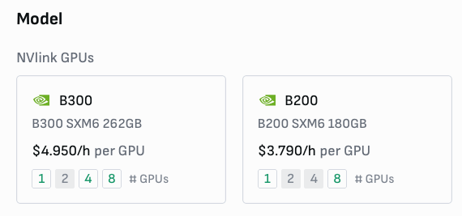
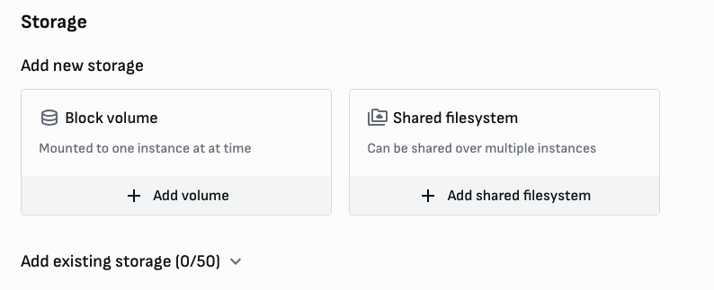
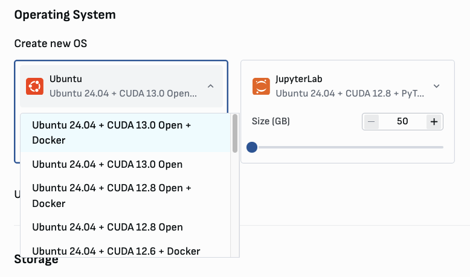

# Blackwell instances on Verda

Verda offers every possible option of nodes for the latest NVIDIA accelerators, more specifically instances equipped with the latest iteration of the Blackwell family: the B300 or Blackwell Ultra. 
(More on B300 vs B200 in our previous blog [here](https://verda.com/blog/nvidia-b300-vs-b200-complete-gpu-comparison-to-date)).

In this blog, we highlight the most convenient features that ensures a quick and smooth experience for executing the most common ML workloads.

### **Hardware:**


- Multiple configurations for the node offering of B300s and B200s SXM6 

(maybe commenting here something about the [prices](https://datacrunchio.slack.com/archives/C0688DZG3EC/p1765449144444659)) 



> SXM6 means **SMX6** B300 on a **HGX** B300 board (with NVIDIA NVLink 5 + NVSwitch domain), which differs from the on-chip GB300s installed on the trays of the NVL72 GB300.
> 
- Persistent storage options: block volumes or SFS that can be shared over multiples VMs, with the option of attaching existing storage volumes:



### **Software stack**

- Latest ubuntu (24.04) with CUDA 13.0 toolkit + Open NVIDIA drivers installed out of the box:



- system nccl already in place (but not mpi so not sure if include this)with perf bw.

```bash
dpkg -l | grep nccl
```

```bash
sudo apt install -y openmpi-bin libopenmpi-dev
MPI_HOME=/usr/lib/x86_64-linux-gnu/openmpi
git clone https://github.com/NVIDIA/nccl-tests.git /home/ubuntu/nccl-tests
cd /home/ubuntu/nccl-tests
make MPI=1 MPI_HOME=$MPI_HOME -j$(nproc)
OMPI_ALLOW_RUN_AS_ROOT=1 OMPI_ALLOW_RUN_AS_ROOT_CONFIRM=1 mpirun -np 4 all_reduce_perf -b 512M -e 8G -f 2 -g 1
```

```bash

# Avg bus bandwidth    : 645.937 
```

- NVIDIA Container Toolkit and Docker Engine out of the box:

```bash
sudo docker run --rm --runtime=nvidia --gpus all ubuntu nvidia-smi
```

- virtual env with torch 2.9 + cu13 out ot the box.
  
As of now **(12-12-2025)**, current torch stable version `torch==2.9.1+cu130` [https://download.pytorch.org/whl/cu130](https://download.pytorch.org/whl/cu130) points to a Triton version which PTXAS is not compiled for `sm_103a` compute capabilites (B300). Thus a `venv` is provided with a solution. (See Anex I)

> UPDATE: torch nighlty version seems to fix this issue `pip3 install --pre torch torchvision --index-url https://download.pytorch.org/whl/nightly/cu130`

Testing performed using Persistent matmul kernel from [Triton repo](https://github.com/triton-lang/triton/blob/main/python/tutorials/09-persistent-matmul.py):
```bash
(torch) python 09-persistent-matmul.py 
M=32, N=32, K=32, verification naive vs: 
  Torch: ✅  
  cuBLAS: ✅  
  Persistent: ✅  
  TMA (warp_specialize=False): ✅  
  TMA (warp_specialize=True): ✅  
  TMA Persistent (warp_specialize=False): ✅  
  TMA Persistent (warp_specialize=True): ✅  
  Tensor Descriptor Persistent (warp_specialize=False): ✅  
  Tensor Descriptor Persistent (warp_specialize=True): ✅  

M=8192, N=8192, K=512, verification naive vs: 
  Torch: ✅  
  cuBLAS: ✅  
  Persistent: ✅  
  TMA (warp_specialize=False): ✅  
  TMA (warp_specialize=True): ✅  
  TMA Persistent (warp_specialize=False): ✅  
  TMA Persistent (warp_specialize=True): ✅  
  Tensor Descriptor Persistent (warp_specialize=False): ✅  
  Tensor Descriptor Persistent (warp_specialize=True): ✅  
```


## References

- [An overview of NVIDIA Blackwell Ultra](https://www.ori.co/blog/nvidia-blackwell-ultra-b300-gb300-gpus)
- [NVIDIA Container Toolkit: Running a Sample Workload with Docker](https://docs.nvidia.com/datacenter/cloud-native/container-toolkit/latest/sample-workload.html)
- [NVIDIA container Toolkit Github repo](https://github.com/NVIDIA/nvidia-container-toolkit)
- [Update ptxas and nvidia toolchain for sm103 Issue #7964](https://github.com/triton-lang/triton/pull/7964)

## Anex I

### Torch venv

As Triton wheels are not updated to contemplate sm_103a this error is raised when compiling:

```bash
raise NoTritonConfigsError(
torch._inductor.runtime.triton_heuristics.NoTritonConfigsError: No valid triton configs. PTXASError: PTXAS error: Internal Triton PTX codegen error
`ptxas` stderr:
ptxas fatal   : Value 'sm_103a' is not defined for option 'gpu-name'bas
```

This script automates the creation of a “torch” venv with the proper PTXAS location (Note `TRITON_PTXAS_PATH` var):

```bash
#!/bin/bash

# install python, venv and pip system wide
sudo apt install -y python3 python3-venv python3-pip

# install uv
curl -LsSf https://astral.sh/uv/install.sh | sudo env UV_INSTALL_DIR=/usr/local/bin sh
uv --version # sanity check
# create new .venv 
uv venv torch --python 3.12
# patch ptxas baked into the en activattion
echo "export TRITON_PTXAS_PATH="$(which ptxas)"">> ~/torch/bin/activate
# Activate the venv
source ~/torch/bin/activate

# install pip
python -m ensurepip --upgrade
python -m pip install --upgrade pip

# install torch
pip3 install torch torchvision --index-url https://download.pytorch.org/whl/cu130
```
