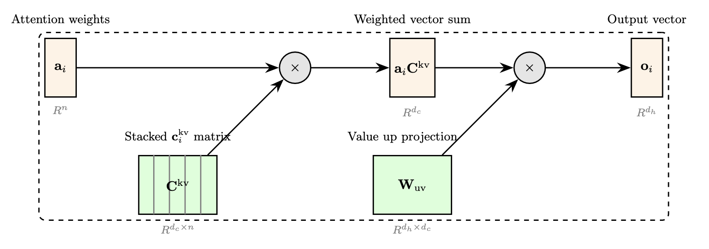

# DeepSeek + SGLang: Multi-Head Latent Attention 

This post continues our technical series exploring inference of DeepSeek v3 on [SGLang](https://github.com/sgl-project/sglang). Our goal is to provide both theoretical insights and practical implementation details.

One of the key innovations enabling the DeepSeek V3 and the subsequent R1 model was the idea of the multi-head latent attention (MLA). MLA essentially makes improvements on the KV cache management which is crucial for unlocking long context reasoning models. In this blog post, we examine two key aspects: 

- First, we analyze why MLA represents an improvement over the previously popular Group Query Attention (GQA), with implications for broader adoption across open-source LLMs.
- Secondly, we examine the weight absorption trick first mentioned in the DeepSeek v2 paper and how it transforms the calculations of attention for inference.

## The KV Cache Problem

Multi-head attention (MHA) is typically memory-bound when generating a response (token-phase [1]). In a generation, the attention calculation is only for the latest token, but it takes all keys and values of the whole sequence as an input. To see where this comes from, let's repeat the basic formula:

$$
\mathbf{o}_i= \mathbf{a}_i\mathbf{V} \quad \text{where} \quad  \mathbf{a}_i = \text{softmax}\left( \mathbf{q}_i^{\top} \mathbf{K} \right) \quad \text{and} \quad \mathbf{q}_i = \mathbf{W^{Q}}\mathbf{x}_i. \quad \quad (1)
$$

Above $\mathbf{o}_i$ is the output for a single head (without the softmax scaling factor) for the current token, the definitions are:

$$
\mathbf{q}_i \in \mathbb{R}^{d_h} \text{ (query vector for latest token i)},
$$
$$
\mathbf{x}_i \in \mathbb{R}^{d} \text{ (input token embedding)},
$$
$$
\mathbf{W^Q} \in \mathbb{R}^{d_h \times d} \text{ (Query projection matrix)}, \\
$$
$$
\mathbf{K} \in \mathbb{R}^{n \times d_h} \text{ (key matrix for whole sequence)},
$$
$$
\mathbf{V} \in \mathbb{R}^{n \times d_h} \text{ (value matrix for whole sequence)},
$$
$$
\mathbf{o}_i \in \mathbb{R}^{d_h} \text{ (output attention vector)}.
$$

Figure 1 helps visualize the calculations. The output is then concatenated for all the separate heads and passed through a further linear projection to give the final output of the attention layer. 


*Figure 1: The figures show the key computations in attention, and how the KV cache matrices increase with sequence length.* 

When implementing the above in code, we have an additional batch size dimension and number of heads. The forward pass would be:

```python
def forward_mha(self, hidden_state: torch.Tensor, key_states: torch.Tensor, value_states: torch.Tensor):
    """
    Dimension key:
        B: batch size
        L: sequence length (number of past tokens)
        D: model dimension (also called d_model or embedding_dim)
        H: number of attention heads in a layer
        K: size of each attention key or value per head (d_kv, typically D / H)
        C: latent dimension (d_c)

    Input:
        hidden_state: Current token embedding, shape (B, D)
        key_states: All previous Keys, shape (B, L, H, K)
        value_states: All previous Values, shape (B, L, H, K)

    """
    # Some matrix multiplications + softmax
    return attention_output
```

*Code 1: Uncompressed KV cache in batch format and for all heads in a layer.* 

From above, it’s evident that the KV-cache needs to be stored and loaded to the attention forward pass, and the cache grows with the size of the context and the number of heads and layers. 

## Learning Linear Projections

Many innovations have been made to reduce the KV cache; the most popular approaches are GQA, used in Llama models, and MLA, used in DeepSeek models. GQA reduces memory usage by sharing key and value projections across multiple query heads, effectively grouping queries together. MLA, on the other hand, uses learned projections to compress key-value pairs into a lower-dimensional latent space and then project them back up when needed. Both use the same attention calculation in (1) but adjust the keys and values calculation to reduce the memory footprint. GQA and MLA become unified by viewing both approaches as linear down projections to a latent space for saving memory, followed by an up projection for using (1). 

Let's now compute all head values in an attention layer as one unified projection (the keys have a similar calculation). For the standard MHA, this becomes:

$$
\mathbf{\bar{v}}\_i = \mathbf{\bar{W}}\_\mathbf{v}\mathbf{x}\_i, 
$$

where,

$$
\mathbf{\bar{v}}\_i = [\mathbf{v}_1; \mathbf{v}_2; \ldots; \mathbf{v}_h] \text{, the concatenated vector for all heads, }
$$
$$
\text{so } \mathbf{\bar{v}} \in \mathbb{R}^{h \cdot d_h} \text{ and}
$$
$$
\mathbf{\bar{W}_v} = [\mathbf{W_v}_1; \mathbf{W_v}_2; \ldots; \mathbf{W_v}_h]^{\top} \text{, the stacked weight matrices}
$$
$$
\text{so } \mathbf{\bar{W}_v} \in \mathbb{R}^{h\cdot d_h \times d}.
$$

Using this formulation, we can now write GQA:

$$
\mathbf{\bar{v}}^{g}\_{i} = \mathbf{P}^{g}\mathbf{\bar{W}}^{g}\_\mathbf{v}\mathbf{x}\_i, 
$$

where,

$$
\mathbf{\bar{W}}^{g}\_\mathbf{v} = [\mathbf{W\_v}\_1; \mathbf{W\_v}\_2; \ldots; \mathbf{W\_v}\_g]^{\top}  \text{ is concatenated group weight matrices,}
$$
$$ 
\text{so }\mathbf{\bar{W}^{g}\_{v}} \in \mathbb{R}^{g \cdot d\_h \times d},
$$
$$
\mathbf{P}^g = \begin{bmatrix} 1 & 0 & \cdots & 0 \\0 & 1 & \cdots & 0 \\\vdots & \vdots & \ddots & \vdots \\1 & 0 & \cdots & 0\end{bmatrix} \text{ is the selector matrix, } \\\text{so } \mathbf{P} ^g\in \mathbb{R}^{h \cdot d\_h \times g \cdot d\_h}.
$$

The selector matrix $\mathbf{P}^g$ is a binary matrix that assigns each head to one of the shared groups, effectively copying keys and values from group heads to multiple query heads, which is key to GQA's memory optimization strategy. This is how memory efficiency is achieved compared to standard MHA: by storing the reduced number of groups $\mathbf{c}^g\_i = \mathbf{\bar{W}}^{\mathbf{g}}\_\mathbf{v}\mathbf{x}\_i$ instead of computing and storing for all heads. The memory saving is thus the ratio of the number of heads to the number of groups.

As pointed out in [2], MLA is similar to GQA when in a projection form, MLA is:

$$
\mathbf{\bar{v}}^{l}\_{i} = \mathbf{W}\_{\mathbf{uv}}\mathbf{W}\_{\mathbf{dkv}}\mathbf{x}\_i.
$$

where,

$$
\mathbf{W}\_{\mathbf{dkv}} \in \mathbb{R}^{ d\_c \times d}\text{ is the down projection matrix and} \\
\mathbf{W}\_{\mathbf{uv}} \in \mathbb{R}^{ h \cdot d\_h \times d\_c} \text{ is the up projection matrix. }
$$

The notation now is the same in the original explanation in [3], where $\mathbf{c}^{\mathbf{kv}}\_i = \mathbf{W}\_{\mathbf{dkv}}\mathbf{x}\_i$, signifying a shared down projection matrix for keys and values. Again, the above is only for values, but a similar process can be done for keys. The ablations in [3] suggest that MLA convincingly performs better than GQA, and in this form, there may be some intuition for why. Both methods involve a down projection to a memory compression (compressed KV cache) followed by a subsequent up projection for the MHA input, similar to encoder/decoder models. However, MLA learns an up projection $\mathbf{W}\_{\mathbf{uv}}$, whereas GQA has an arbitrary selector matrix $\mathbf{P}$, giving intuition for better performance from MLA, as it is more expressive.

## Weight Absorption Trick

Despite the memory saving from MLA, a naive implementation will in practice lead to a slowdown in performance compared to storing the full KV cache, as pointed out in [4]. The mock pseudo code for a naive implementation would be:

```python
def forward_compressed(self, hidden_state: torch.Tensor, compressed_kv: torch.Tensor):
    """
    Input:
        hidden_state: Current token embedding, shape (B, D)
        compressed_kv: Compressed KV cache vector, shape (B, L, C)
    """
    
    key_states_full = self.project_keys(compressed_kv)
    value_states_full = self.project_values(compressed_kv)
    
    attention_output = self.forward_mha(hidden_state, key_states_full, value_states_full)
    
    # The naive implementation results in a slowdown in performance compared to 
    # storing the full KV-cache because the projections step adds overhead.
    return attention_output
```

*Code 2: Projecting the compressed KV cache.*

We repeat a similar analysis done in [4] on an H200 and show the result in Figure 2. The [code](https://github.com/datacrunch-research/mla-blog-absorption/tree/main) shared in the repository is a simplified version of MLA that isolates the computations of the down and up projections and does not include the RoPE embeddings to keep the code simpler.


*Figure 2: The uncompressed attention KV Cache MLA uses equation (1) and stores the full KV cache. The compressed version uses equation (1) but stores the compressed KV cache and projects it up. The absorbed attention variant keeps calculations in the compressed state, reducing computational overhead.*  

The compressed attention layer has slower inference speed versus uncompressed layer due to the additional computational cost. Furthermore, the potential memory savings are also reduced by the need to project the KV cache. The weight absorption trick solves this problem. It works by ‘absorbing’ weights and rewriting the inputs in the attention formula.

Firstly, observe the following rearrangement of the inner product terms in (1), for a single element of $\mathbf{a}\_i$ using the MLA projections it can be written as:

$$
\mathbf{q}^{\top}\_i \mathbf{k}\_j = \mathbf{q}\_i^{\top}\, \mathbf{W}\_{\mathbf{uk}}\, \mathbf{c}\_j^{\mathbf{kv}} 
= \Bigl(\mathbf{W}\_{\mathbf{uk}}^\top \mathbf{q}\_i\Bigr)^\top\, \mathbf{c}\_j^{\mathbf{kv}} 
= \mathbf{\kappa}\_i^\top\, \mathbf{c}\_j^{\mathbf{kv}}.
$$

where $\kappa\_i=\mathbf{W}\_{\mathbf{uk}}^\top\, \mathbf{q}\_i$ and $\mathbf{W}\_{\mathbf{uk}}$ is the key equivalent of  $\mathbf{W}\_{\mathbf{uv}}$. Now the dimensions of the vectors inside the inner-product are both $d\_c$ and not $d\_h$. The attention scores for one head in an attention layer are shown in Figure 3.


*Figure 3: How the attention score computation takes place with the weight absorption trick.*

Furthermore, we can rewrite the output as,

$$
\mathbf{o}\_i = \sum\_j a\_{ij} \mathbf{v}\_j =  \sum\_j a\_{ij} (\mathbf{W}\_\mathbf{uv} \mathbf{c}^{\mathbf{kv}}\_j) = \mathbf{W}\_\mathbf{uv} \sum\_j a\_{ij} \mathbf{c}^{\mathbf{kv}}\_j.
$$

Which could be visualized as:



*Figure 4:  Computation of the output using the weight absorption trick.*

Combining these two terms we can rewrite (1) as follows:

$$
\mathbf{o}\_i = \mathbf{W}\_\mathbf{uv}\mathbf{a\_i}\mathbf{C}^{\mathbf{kv}}, \text{ where } \mathbf{a\_i} = \text{softmax} \left( \kappa\_i^\top \mathbf{C}^{\mathbf{kv}} \right) \,\text{and} \, \, \mathbf{C}^{\mathbf{kv}} = [\mathbf{c}\_i^{\mathbf{kv}}; \ldots; \mathbf{c}\_n^{\mathbf{kv}}]
$$

The code snippet to calculate attention now would appear as follows, for all heads and for a batch again:

```python
def forward(self, hidden_states_q: torch.Tensor, compressed_kv: torch.Tensor):
    """
    Input:
    - hidden_states_q: [B, D]
    - compressed_kv: [B, L, C]
    """
    bsz = hidden_states_q.shape[0]
    
    # Project query
    query_B_H_K = self.q_proj(hidden_states_q).view(bsz, self.num_heads, self.head_dim)
    
    query_absorbed_B_H_C = torch.einsum('bhk,hkc->bhc', query_B_H_K, self.w_kc)
    
    attn_scores_B_H_L = torch.einsum('bhc,blc->bhl', query_absorbed_B_H_C, compressed_kv)
    attn_probs_B_H_L = torch.nn.functional.softmax(attn_scores_B_H_L, dim=-1)
    
    context_B_H_C = torch.einsum('bhl,blc->bhc', attn_probs_B_H_L, compressed_kv)
    # self.lora_rank is d_c
    attn_output_B_H_K = torch.einsum('bhc,hkc->bhk', context_B_H_C, self.w_vc)
    
    attn_output_B_D = attn_output_B_H_K.reshape(bsz, self.num_heads * self.head_dim)
    
    return attn_output_B_D
```

*Code 3: A snippet of how to compute weight absorption MLA.*  

The weight absorption trick shows speed-ups for the attention layer, as shown in Figure 2. Looking at the code and contrasting it with the standard MHA diagram, we can see two important features of the formulation:

1. The expansion of the compressed KV is now avoided. Instead, the compressed KV is used directly in the score and output calculations. The $\mathbf{W}\_{\mathbf{uk}}$   and  $\mathbf{W}\_\mathbf{uv}$ act as down and up projections to match the local head dimension.
2. Every query head effectively attends the same key and value, meaning a group head size of one.

The absorption trick is now implemented by default in SGlang [5] and other inference packages. Further optimizations have also been done in terms of parallelization and memory management which we hope to discuss in future editions of our blog.

In conclusion, we have shown that MLA has the potential for more expressive compression based on its learned up-projection. With the weight absorption technique, one can achieve a lower memory footprint and faster attention per layer than standard MHA, which makes it ideal for longer contexts.

[1] [Splitwise improves GPU usage by splitting LLM inference phases](https://www.microsoft.com/en-us/research/blog/splitwise-improves-gpu-usage-by-splitting-llm-inference-phases/)

[2]  [The ultimate struggle between cache and effects: from MHA, MQA, GQA to MLA](https://spaces.ac.cn/archives/10091) 

[3] [DeepSeek-V2: A Strong, Economical, and Efficient Mixture-of-Experts Language Model](https://arxiv.org/abs/2405.04434) 

[4] [DeepSeek-V2高性能推理优化笔记：MLA优化](https://github.com/madsys-dev/deepseekv2-profile/blob/924174cb5dc11fad24bdaad3fd820ebf87506368/workspace/blog/optimizing-mla.md)

[5] [Support MLA for DeepSeek-V2 with Triton in SGLang](https://github.com/sgl-project/sglang/pull/905)
