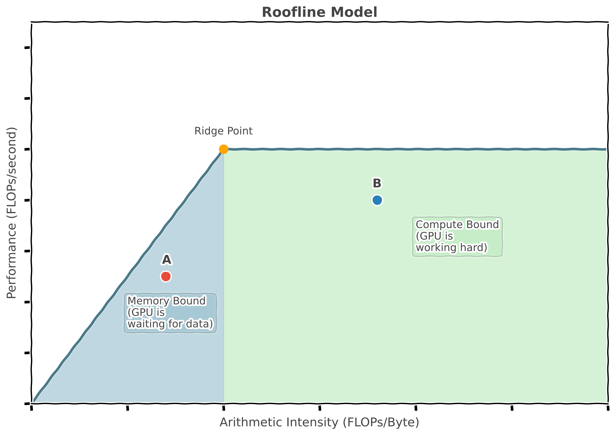
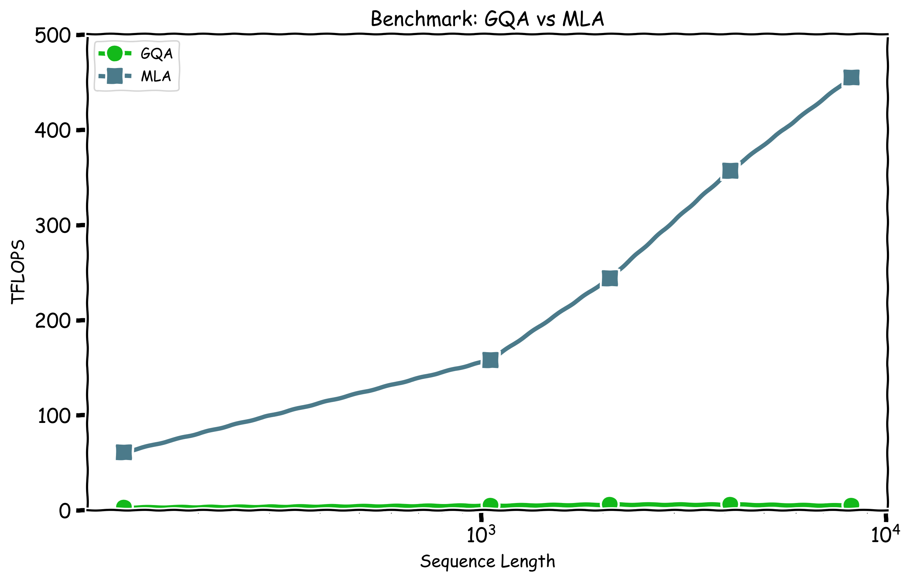

# The Arithmetic of Efficiency: Multi-Head Latent Attention's Benefits in Memory and Computation.

## Introduction

In a previous blog, we explained how an algebraic manipulation of the Multi-Head Latent Attention (MLA) formula results in a more efficient implementation, known as the 'weight absorption' trick. In the same post, we speculated that the low-rank projection used by the DeepSeek team is more expressive than the previous state-of-the-art Group Query Attention (GQA). For those that have not read it, go back and check it out [here](https://datacrunch.io/blog/deepseek-sglang-multi-head-latent-attention), as we will reuse definitions to save space.

In this blog, we want to examine the theoretical performance of the MLA kernel and the KV cache computation. The roofline model is a common way to analyze an algorithm; it plots intensity on the x-axis against performance on the y-axis. The concept is well covered in [1] ([All About Rooflines](https://jax-ml.github.io/scaling-book/roofline/)) and [2] ([Transformer Inference Arithmetic](https://kipp.ly/transformer-inference-arithmetic/)) understanding the intensity of a kernel helps to determine if it is memory bound or compute bound thus allowing one to determine what to focus optimizations on.

An accelerator's memory bandwidth and peak computational FLOPs determine the Roofline model. A program (kernel) will be either memory-bound or compute-bound depending on the amount of data that must flow to the computational cores and the potential for data reuse. In [Figure 1](#figure1), the algorithm `A` is memory-bound, meaning the accelerator's cores spend significant time idle waiting for data. In contrast, algorithm `B` is compute-bound, where processing capacity rather than data access is the bottleneck. Both points fall below the performance boundary, indicating potential for optimization. However, both kernels will remain in their respective regimes. The plotted Ridge Point marks where operational intensity transitions from memory-bound to compute-bound regions and varies for each accelerator.

*Figure 1: A roofline plot that helps determine whether your algorithm is **compute bound** or **memory bound** on a given accelerator.* 

During autoregressive generation, attention mechanisms become memory-bound operations, in contrast to their compute-bound nature during training. This performance limitation stems mainly from how each element of the batch now has only a single query vector that must access the KV cache for all previous tokens. Unlike training, where increasing batch size improves computational efficiency, inference with autoregressive models doesn't benefit from the same optimization. This memory overhead creates a bottleneck that prevents performance scaling through increased intensity, which also worsens with increased sequence length. Additionally, the KV-cache can grow so large that it exceeds the High Bandwidth Memory (HBM) capacity on GPUs. Therefore, to measure if MLA has improved theoretical performance, we must analyze **computational FLOPs**, **memory bandwidth** usage, and **total memory** requirements—all of which affect token generation performance.

---

## Transformer Arithmetic Revisited for MLA

Let's first look at some of the key parameters of the DeepSeek V3 model which we will use throughout for the calculations, these are summarized in [Table 1](#table1). Through the weight absorption technique ([detailed here](https://datacrunch.io/blog/deepseek-sglang-multi-head-latent-attention)), MLA can be viewed as having only a single Key-Value head that's shared across all query heads. The Key head is concatenated with the RoPE embedding, which has a dimension of 64, while the Value uses only the compressed KV cache without any concatenation. In this blog, we will focus solely on the MLA operator and therefore, for now we ignore the MLP layers.

| Model                     | $H$ (`kv_heads`) | $H_q$ (`q_heads`) | $K/C$ (`k_dim`) | $V/C_v$ (`v_dim`) | $D$ (`h_dim`)   | `n_layers` | $L$ (`seq_len`) | KV size | Total GB |
|--------------------------|------------------|-------------------|------------------|-------------------|-----|------------|------------------|---------|----------|
| Llama-13b                | 128              | 128               | 40               | 40                |   5120  | 40         | 8192             | 2       | 3.13     |
| DeepSeek V3 MHA equivalent | 128            | 128               | 128              | 128               |   7168  | 61         | 8192             | 2       | 15.25    |
| DeepSeek V3 GQA equivalent | 24             | 128               | 128              | 128               |  7168   | 61         | 8192             | 2       | 3.05     |
| **DeepSeek V3 MLA**          | 1                | 128               | 576              | 512               |   7168  | 61         | 8192             | 1       | 0.29     |

*Table 1: Total memory requirement for different model variants (`B=1`), showing MLA greatly reduces memory requirements.*

[Table 1](#table1) presents the total memory requirements for the KV cache across all attention layers. All parameters are in FP8. For standard attention mechanisms, $K/C$ represents the key head dimension, while $V/C_v$ represents the value head dimension. For MLA, $V/C_v​=512$ is the dimension of the compressed vector stored in the KV cache per token (shape (`B, L, C_v`)). The $K/C=576$ represents the effective dimension used during key-side attention computations, achieved by combining the stored $C_v$ vector with RoPE embeddings (`512+64=576`). 
 
For comparison, we've included memory requirements for equivalent models using 5-to-1 grouping GQA (Grouped Query Attention), standard MHA (Multi-Head Attention), and a small Llama model with MHA. The KV size column represents the two variables for keys and values, whereas there is only one equivalent in MLA.  

The KV cache's memory storage requirements for DeepSeek V3's MLA are dramatically reduced—approximately **55 times less** than the MHA equivalent and **11 times less** than the GQA equivalent implementation. This means that MLA can run longer sequences without running into out-of-memory errors.

### Computing KV cache

Before performing the MLA attention forward pass, one must first update the KV cache for the current token. DeepSeek V3 includes query down-projection and up-projection, but we'll focus specifically on the KV-cache elements and the kernel calculation.

The KV cache calculation that needs to be performed per layer is:

$$\mathbf{c}_i^{\mathbf{kv}} = \mathbf{W}_{\mathbf{dkv}}\mathbf{x}_i.$$

For a batch size B this matrix-vector multiplication requires:

$$\text{FLOPs} = 2 \cdot n_{\text{layers}}  \cdot B \cdot C_v \cdot D$$

This represents one matrix-vector multiplication per batch element. The associated memory access (in bytes) is:

$$\text{Total bytes} = n_{\text{layers}} \cdot (B \cdot D + C_v \cdot D + B \cdot C_v ) $$ 

The weight matrix $\mathbf{W}_{\mathbf{dkv}}$ is reused across the batch, so we count it only once. Compare this with the normal computation of doing the same for $\mathbf{k}_i$ and $\mathbf{v}_i$ detailed in [2] which involves,

$$\text{FLOPs} =  4 \cdot n_{\text{layers}} \cdot B \cdot D \cdot(H \cdot K).$$

Memory access (bytes):

$$\text{Total bytes} = n_{\text{layers}} \cdot (B \cdot D + 2\cdot D \cdot(H \cdot K) + B \cdot 2\cdot (H \cdot K)). $$
Note that in the memory access calculation we have also included the writing of the output back to HBM. Using these formulas we can now calculate the floating point operations and memory bandwidth used as well as the intensity:

| Model                     | GFLOPs | Memory Bandwidth GB | Intensity (FLOPs/Byte) |
|--------------------------|--------|----------------------|-----------|
| Llama-13b                | 4.19   | 2.10                 | 2.00      |
| DeepSeek V3 MHA equiv.   | 28.65   | 14.33                 | 2.00      |
| DeepSeek V3 GQA equiv.   | 5.37    | 2.69                 | 2.00      |
| **DeepSeek V3 MLA**          | 0.5    | 0.25                 | 2.00      |

*Table 2: KV calculations (`B=1`) showing much reduced memory and bandwidth for MLA, although similar intensity.*

Therefore, compared to the GQA equivalent, MLA requires approximately 12x fewer FLOPs and memory bandwidth to compute the KV cache values. The reduction is even more dramatic compared to the MHA equivalent (~64x). Despite similar algorithmic intensity for the computation, the lower FLOP count and memory access for MLA mean that this step will be processed significantly faster.

***

### Computing Attention 

Having analyzed the KV cache update, we now turn to the attention mechanism itself. The attention calculation involves the dot-product attention operation using the updated KV caches. During autoregressive generation (processing one new token at a time), using a tiled fused kernel like FlashAttention involves these main computational steps per layer detailed in [1]:

1. **QK Matmul:** Multiplying the single query vector with the Key cache.
2. **AV Matmul:** Multiplying the attention scores (after softmax) with the Value cache.

For a query length of one, and KV cache sequence length L, the total FLOPs across per layer is approximately:

$$\text{FLOPs}_\text{MHA} = H \cdot B \cdot (2 \cdot L \cdot K + 2 \cdot L \cdot K) = 4 \cdot B \cdot H \cdot L \cdot K$$

The memory access involves reading the query vector, reading the K and V caches, and writing the output vector. The total memory access (bytes) across all layers is:

$$\text{Bytes}_\text{MHA} = H \cdot B \cdot (K + 2 \cdot L \cdot K + K) = 2 \cdot B \cdot H \cdot K \cdot (1 + L)$$

-----

The core idea of MLA with weight absorption during the generation phase is to avoid decompressing the KV cache. Instead, the query is projected to the compressed dimension $C$, and the attention calculations (scores and output aggregation) happen in this compressed space. For the following analysis $C_v = 512$, therefore RoPE excluded and $C = 576$ so RoPE concatenation included as shown in [Table 1](#table1). The steps are thus:

1.  **Query Absorption:** Project query `q` (shape `H_q, K`) down using `W_uk` (shape `H_q, K, C`). FLOPs per layer = `2 * H_q * K * C`.
2.  **Attention Scores:** Compute scores between absorbed query `κ` (shape `H_q, C`) and compressed cache $\mathbf{C}^{\mathbf{kv}}$  (shape `L, C` repeated `H_q` times). FLOPs per layer = `2 * H_q * L * C`.
3.  **Attention-Value Multiplication:**  Multiply attention probabilities (shape `H_q, L`) by the compressed Value cache $\mathbf{C}^{\mathbf{kv}}$. FLOPs per layer = `2 * H_q * L * Cv`.
4.  **Output Projection:** Project aggregated context (shape `H_q, C_v`) up using `W_uv` (shape `H_q, K, C_v`). FLOPs per layer = `2 * H_q * C_v * K`.

Steps 2 and 3 are the equivalent of an adjusted flash attention style kernel. While we will now compute the roofline calculations for the attention kernel it is worth bearing in mind that there are additional projection overhead which would be carried out by other kernels that would not be there in GQA or MHA.

The total FLOPs for the kernel is then the sum of the Attention Scores (Step 2) and Attention-Value Multiplication (Step 3):

$$\text{FLOPs}_{\text{MLA-Attention}} = 2 \cdot B \cdot L \cdot H_q \cdot (C + C_v)$$

The memory requirements can be broken down to `Bytes = (Read KV + Read Q + Write O)` so:

$$\text{Bytes}_{\text{MLA-Attention}} = B \cdot L \cdot C + B \cdot H_q \cdot C + B  \cdot H_q \cdot C_v $$

To compute a roofline model we need to assume a GPU architecture so we will use a H200. Therefore from the [Nvidia H200 Datasheet](https://www.nvidia.com/en-gb/data-center/h200/) we can calculate the arithmetic intensity of the accelerator:

$$\text{Intensity(H200)} = \frac{\text{Peak FLOPs/s}}{\text{Memory Bandwidth}} = \frac{1.979 \times 10^{15} \text{ FLOPs/s}}{4.8 \times 10^{12} \text{ bytes/s}} = 412.3 \text{ FLOPs/byte}.$$

This level then becomes the ridge point that is shown in [Figure 1](#figure1). With this information we can also compute the theoretical FLOPS (Floating-point Operations Per Second) performance as:

$$\text{Achievable Performance (FLOPS) = min(Peak Compute FLOPS, Intensity} \cdot \text{Memory Bandwidth)}.$$

Putting this all together we get the following results:

| Model                     | GFLOPs | Memory Bandwidth GB | Intensity (FLOPs/Byte) | Theoretical TFLOPS  |
| :------------------------ | :----- | :------------------ | :--------------------- | :---------------------------- |
| Llama-13b                 | 0.168  | 0.084               | 1.95                   | 9.36                          |
| DeepSeek V3 MHA equiv.    | 0.537  | 0.268               | 2.00                   | 9.60                          |
| DeepSeek V3 GQA equiv.    | 0.101  | 0.050               | 2.02                   | 9.70                          |
| **DeepSeek V3 MLA** | 2.28   | 0.005               | 469                    | 1979                       |

*Table 3: Attention Operator Table (`B=1`)*

By redesigning the attention mechanism, MLA has fundamentally changed the nature of the attention kernel. The number of floating point operations has increased approximately 4 times versus standard MHA and 22 times versus GQA. However, this trade-off is clearly intentional because MLA dramatically increases the arithmetic intensity of the kernel—over 200 times compared to traditional approaches.

The MLA attention kernel is now **no longer memory bound but compute bound**, the intensity has increased significantly meaning the kernel spends less time idle. Furthermore, despite performing more calculations, the time elapsed will be substantially reduced because GPUs excel at handling highly parallel computations.

Essentially, MLA makes a strategic trade: it increases the raw number of computations within the attention kernel but drastically reduces the required memory access relative to those computations. This boosts operational intensity and ultimately performance.

---
## Benchmarking MLA v GQA Kernels

*Figure 2: A comparison of TFLOPS between the GQA kernel and MLA kernel with a batch size of 32 (B=32) across increasing sequence lengths.*

In [Figure 2](#figure2) we utilize the main inference kernel library [FlashInfer](https://github.com/flashinfer-ai/flashinfer) and their implementation of GQA and MLA. The benchmark code is available in our repository [here](https://github.com/datacrunch-research/blogs). As predicted by our theoretical analysis, the MLA kernel achieves significantly higher TFLOPS when properly implemented, as it overcomes memory bandwidth limitations. In contrast, the GQA kernel's TFLOPS performance remains flat regardless of sequence length.

---

## Conclusions

In essence, MLA optimizes Transformer inference by drastically cutting KV cache memory and boosting the attention kernel's operational intensity (>200x). This shift from memory-bound towards compute-bound allows for significantly higher achieved TFLOPS and faster token generation, validating MLA's effectiveness for efficient deployment.

---

## References

1.  Austin et al. [*All About Rooflines*](https://jax-ml.github.io/scaling-book/roofline/). The Scaling ML Book.
2.  Chen, Carol. (2023, June 12). [*Transformer Inference Arithmetic*](https://kipp.ly/transformer-inference-arithmetic/). 
