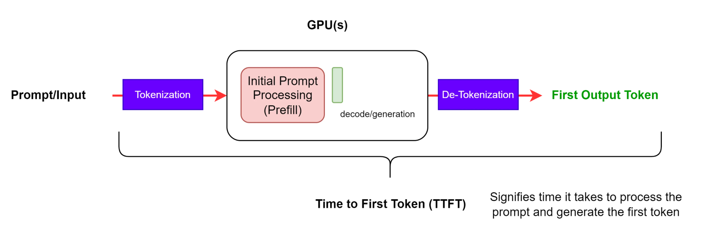

# Large Language Model Hopper Architecture Benchmarking

This blog is the first in a series of increasing technical analysis of the NVIDIA H200 GPU performance implications for the use case of LLM, VLM and DiT during inference and training. We are currently doing [co-research with SGLang](https://x.com/lmsysorg/status/1872251875070021831) to guarantee reproducible and formal results, providing both GPU infrastructure and engineering hours. In the next blogs we are going to explore H200 HW-aware tuning and the latest SGLang [DeepSeek V3 optimizations](https://github.com/sgl-project/sglang/issues/2591) (Tuning FP8 GEMM, FusedMoE tuning for H200).

# Hopper GPU specs comparison: H100 & H200

**Without sparsity**

| Technical Specifications |  |  |
| :---- | :---: | :---: |
|  | **H100 SXM** | **H200 SXM** |
| **BFLOAT16** | 989.5 TFLOPS | 989.5 TFLOPS |
| **FP16**  | 989.5 TFLOPS | 989.5 TFLOPS |
| **FP8** | 1979 TFLOPS | 1979 TFLOPS |
| **INT8** | 1979 TFLOPS | 1979 TFLOPS |
| **GPU Memory** | 80 GB | **141 GB** |
| **GPU Memory Bandwidth** | 3.35 TB/s | **4.8 TB/s** |

* [H100 whitepaper](https://resources.nvidia.com/en-us-tensor-core/nvidia-tensor-core-gpu-datasheet)  
* [H200 whitepaper](https://resources.nvidia.com/en-us-data-center-overview-mc/en-us-data-center-overview/hpc-datasheet-sc23-h200)

H200 GPU compute FLOP/s are equal to H100 for each data type, but it has **76%** more on-chip memory (141/80) and **43%** faster memory bandwidth (4.8/3.35).

# Research Questions

* Explore the tradeoffs of increasing the **number of chips** with more GPU memory, H200, versus increasing the parallel inference **world size** when H100. (see [Efficiently Scaling Transformer Inference](https://arxiv.org/abs/2211.05102)). Reduce the price/generation at scale as much as possible**.**  
* **Time to first token (TTFT)** is compute-bound, meaning H200 retains a similar time to first token as H100 (ref [NVIDIA TensorRT-LLM H200](https://github.com/NVIDIA/TensorRT-LLM/blob/b171e879563ff0ba4eb35b94cf0e59a471e13d80/docs/source/blogs/H200launch.md)).  
* **H200 Tokens per Second (TPS):** Transformer decoder-only auto-regressive decoding is memory bound, thus we expect higher TPS on H200s than H100s. We expect GPU memory bandwidth’s effect on auto-regressive decoding to improve over H100.  
* How can we leverage H200 **extra HBM** for efficient **KV cache** management during inference?  
* Measure the performance implications of faster GPU **memory bandwidth** while executing **distributed inference.**   
* Measure **multi-node** inference **overhead** compared to single-node (e.g. DeepSeek v3)  
* Explore the benefits of using **FP8** quantization. The speedup ratio over BF16/FP16 should be equal to H100.

# 1\. Where is memory allocated?

## 1.1 Model States: Optimizer States, Gradients and Parameters

For inference, we only consider the memory allocation associated with **model parameters**.

## 1.2 Residual State Memory

Besides the increasing number of parameters in SoTA LLMs, the major memory allocation during inference tends to be consumed by intermediate states, **activations**. The KV cache needs to be stored in memory during the autoregressive decoding phase. Bigger batch sizes and context lengths lead to the KV being significantly bigger than the model size memory footprint.

These considerations motivated our decision to choose [SGLang](https://github.com/sgl-project/sglang) as our LLM inference system, due to its performance-oriented design and easy-to-modify Python code base, instead of other production-ready ML systems like [vLLM](https://github.com/vllm-project/vllm) and [TensorRT-LLM](https://github.com/NVIDIA/TensorRT-LLM). Nevertheless, we plan to conduct inference system comparative benchmarking in the future.

# 2\. Large Language Model Inference: DeepSeek V3

The H200 shows great promise, particularly for extremely large Transformers models. For models exceeding 600B parameters, even FP8 precision cannot enable H100 single-machine (8xH100) execution. For Llama 405B, H200 allows to handle BFLOAT16 without multi-node inference, removing then any inter-node communication overhead, even if this can be hidden with computation. 

In such scenarios, the H200's 141GB memory capacity becomes crucial. Furthermore, the increased memory bandwidth will significantly impact current kernel configurations and performance. Higher GPU memory-bandwidth increased auto-regressive decoding performance. However, It's worth noting that neither [FlashInfer](https://flashinfer.ai/2024/12/16/flashinfer-v02-release.html) nor the [Triton](https://triton-lang.org/main/index.html) backend has been specifically optimized for the H200 yet. 

We choose DeepSeek V3 as our case study model for this blog due to its SOTA model capabilities and high demanding GPU resources for model serving in production and research environments.

[DeepSeek-V3](https://github.com/deepseek-ai/DeepSeek-V3/blob/main/DeepSeek_V3.pdf), 671B MoE with 37B active param, is a SOTA LLM using Mixture-of-Experts (MoE) architecture that allows efficient inference scaling beyond dense models (e.g. Llama 405B). DeepSeek-V3 has novel architectures properties including [Multi-head Latent Attention (MLA)](https://arxiv.org/abs/2405.04434), a new advancement regarding efficient KV cache computation from existing MHA (Multi-Head Attention), MQA (Multi-Query Attention), GQA (Grouped-Query Attention), popularized by Llama 3 architecture (see [The Llama 3 Herd of Models)](https://arxiv.org/abs/2407.21783). 

The introduction of Multi-Token Prediction (MTP) as a novel training objective (see [Better & Faster Large Language Models via Multi-token Prediction](https://arxiv.org/pdf/2404.19737)) implies better model capabilities (see ablations section) and allows faster speculative decoding.

DeepSeek V3 is the first large open-source model to successfully achieve FP8 training, avoiding pre-training using BF16 and then post-training quantization to FP8, like Llama 3.1. They use FP8 E4M3 for forward and E5M3 for backward.

DeepSeek and SGLang teams have been collaborating since previous DeepSeek model iterations (Deep), like [DeepSeek V2](https://lmsys.org/blog/2024-12-04-sglang-v0-4/). From day one they released DeepSeek V3 inference with BF16/FP8 running on NVIDIA GPUs. SGLang already supported [MLA optimization](https://lmsys.org/blog/2024-09-04-sglang-v0-3/#deepseek-multi-head-latent-attention-mla-throughput-optimizations) and [DP attention](https://lmsys.org/blog/2024-12-04-sglang-v0-4/#data-parallelism-attention-for-deepseek-models), critical inference engine properties targeting DeepSeek models. SGLang is the inference engine recommended by the official [DeepSeek team](https://github.com/deepseek-ai/DeepSeek-V3/tree/main?tab=readme-ov-file#62-inference-with-sglang-recommended).

The following benchmarking results serve as approximate performance results without H200-aware kernel and configuration tuning. Those results are pending [ongoing research](https://github.com/sgl-project/sglang/issues/2591). All of the benchmarking results are available in the following repo [datacrunch-research/h200-benchmarks](https://github.com/datacrunch-research/h200-benchmarks). This repo is temporary until we add these results as official [SGLang performance benchmarks](https://github.com/sgl-project/sglang/issues/2450). We are testing the latest sglang **v0.4.1**

To guarantee benchmarking results reproducibility we execute all the experiments with the latest available SGLang Docker image. Build benchmarking environment running the following commands:

```bash
$docker pull lmsysorg/sglang:dev

$docker run -it -d --shm-size 32g --gpus all --net host \
--env "HF_TOKEN=$HF_TOKEN" \
-v <models_dir>:/root/.cache/huggingface \
--ipc=host --name sglang_dev lmsysorg/sglang:latest bash

$docker exec -it /bin/bash sglang_dev
```

## 2.1 LLM Inference Metrics

When we talk about **time to generate tokens** in an auto-regressive (decoder-only) model, we often track timestamps ti​, where:

* $t_{0} = 0$  is the inference starting time.  
* $t_{1}$ is the time the first token finishes generation.  
* $t_{2}$ is the time the second token finishes generation, and so on...  
* $t_{T}$ is the time the T-th (final) token is produced.

We use the following [LLM inference metrics](https://docs.nvidia.com/nim/benchmarking/llm/latest/metrics.html) for the benchmarking experiments:

* **End-to-End Request Latency (E2E Latency):** This metric indicates how long it takes from submitting a query to receiving the full response. This includes scheduling, batching and network latencies.

  	

  End-to-end Request latency (Image source [NIM for LLM Benchmarking Guide](https://docs.nvidia.com/nim/benchmarking/llm/latest/metrics.html))

* **TTFT (Time To First Token):** The elapsed time from sending an inference request until the model produces its first output token. 
$$
TTFT = t_{1} - t_{0}
$$

* **ITL (Inter Token Latency):** Time between the emission of consecutive tokens in an auto-regressive decoding sequence. ITL is a *per-step* measure, tracking the time from the end of token $i$ to the end of token $i+1$.
	$$
	ITL_{i} \implies (i+1) = t_{i+1}  - t_{i}
	$$
	
* **TPOT (Time Per Output Token):** The average time taken to generate each subsequent token after the first token.

	$$
	TPOT = \dfrac{t_{T}  - t_{1}}{T - 1}
	$$
	
	
	

## 2.2 DeepSeek V3 on 8xH200 (single-node)

**Usage:** Add `--enable-dp-attention` option to turn on this feature in DeepSeek models.

### 2.2.1 BF16

* `—disable-cuda-grah`  
* `—mem-fraction-static 0.8`  
* `—enable-dp-attention`

```bash
# launch server
python3 -m sglang.launch_server --model deepseek-ai/DeepSeek-V3 --tp 8 --trust-remote-code --enable-torch-compile --enable-dp-attention --mem-fraction-static 0.8 --disable-cuda-graph


# bench serving
python3 -m sglang.bench_serving --backend sglang --dataset-name random --random-range-ratio 1 --num-prompt 300 --request-rate 1 --random-input 1024 --random-output 1024  --output-file deepseek_v3_8xh200_BF16_online_output.jsonl

python3 -m sglang.bench_serving --backend sglang --dataset-name random --random-range-ratio 1 --num-prompt 600 --request-rate 2 --random-input 1024 --random-output 1024 --output-file deepseek_v3_8xh200_BF16_online_output.jsonl

python3 -m sglang.bench_serving --backend sglang --dataset-name random --random-range-ratio 1 --num-prompt 1200 --request-rate 4 --random-input 1024 --random-output 1024 --output-file deepseek_v3_8xh200_BF16_online_output.jsonl

python3 -m sglang.bench_serving --backend sglang --dataset-name random --random-range-ratio 1 --num-prompt 2400 --request-rate 8 --random-input 1024 --random-output 1024 --output-file deepseek_v3_8xh200_BF16_online_output.jsonl
```

### Results

| RPS | Num Prompts | Median E2E Latency (ms) | Median TTFT (ms) | Median TPOT (ms) | Median ITL (ms) | Output token throughput (tok/s) |
| ----- | ----- | ----- | ----- | ----- | ----- | ----- |
| 1 | 300 | 214,924.09 | 587.15 | 209.48 | 159.64 | 639.99 |
| 2 | 600 | 235,524.70 | 598.77 | 229.30 | 162.99 | 1313.74 |
| 4 | 1200 | 324,438.44 | 766.70 | 316.35 | 237.99 | 2378.26 |
| 8 | 2400 | 686,261.57 | 1191.74 | 516.67 | 255.96 | 2249.03 |

### 2.2.1 FP8

```bash
# launch server
python3 -m sglang.launch_server --model deepseek-ai/DeepSeek-V3 --tp 8 
--quantization fp8 --kv-cache-dtype fp8_e5m2 --trust-remote-code --enable-dp-attention


# bench serving
python3 -m sglang.bench_serving --backend sglang --dataset-name random --random-range-ratio 1 --num-prompt 300 --request-rate 1 --random-input 1024 --random-output 1024  --output-file deepseek_v3_8xh200_FP8_online_output.jsonl

python3 -m sglang.bench_serving --backend sglang --dataset-name random --random-range-ratio 1 --num-prompt 600 --request-rate 2 --random-input 1024 --random-output 1024 --output-file deepseek_v3_8xh200_FP8_online_output.jsonl

python3 -m sglang.bench_serving --backend sglang --dataset-name random --random-range-ratio 1 --num-prompt 1200 --request-rate 4 --random-input 1024 --random-output 1024 --output-file deepseek_v3_8xh200_FP8_online_output.jsonl

python3 -m sglang.bench_serving --backend sglang --dataset-name random --random-range-ratio 1 --num-prompt 2400 --request-rate 8 --random-input 1024 --random-output 1024 --output-file deepseek_v3_8xh200_FP8_online_output.jsonl
```

### Results

| RPS | Num Prompts | Median E2E Latency (ms) | Median TTFT (ms) | Median TPOT (ms) | Median ITL (ms) | Output token throughput (tok/s) |
| :---: | :---: | :---: | :---: | :---: | :---: | :---: |
| 1 | 300 | 147,735.43 | 563.41 | 143.71 | 101.78 | 773.15 |
| 2 | 600 | 234,757.13 | 684.33 | 228.78 | 149.46 | 1401.77 |
| 4 | 1200 | 376,040.67 | 865.26 | 366.48 | 287.95 | 2214.76 |
| 8 | 2400 | 692,710.83 | 1358.77 | 675.95 | 515.18 | 2864.31 |

## 2.3 DeepSeek V3 on 2x8xH200 (multi-node)

### 2.3.1 BF16

* `–enable-torch-compile`  
* `–mem-fraction-static 0.8`  
* `–disable-cuda-graph`

```bash
# launch server
python3 -m sglang.launch_server --model-path deepseek-ai/DeepSeek-V3 --tp 16 --dist-init-addr 192.168.114.10:20000 --nnodes 2 --node-rank 0 --trust-remote-code --host 0.0.0.0 --port 40000 --enable-torch-compile --mem-fraction-static 0.8 --disable-cuda-graph

python3 -m sglang.launch_server --model-path deepseek-ai/DeepSeek-V3 --tp 16 --dist-init-addr 192.168.114.10:20000 --nnodes 2 --node-rank 1 --trust-remote-code --host 0.0.0.0 --port 40000 --enable-torch-compile --mem-fraction-static 0.8 --disable-cuda-graph


# bench serving
python3 -m sglang.bench_serving --backend sglang --dataset-name random --random-range-ratio 1 --num-prompt 300 --request-rate 1 --random-input 1024 --random-output 1024 --host 0.0.0.0 --port 40000 --output-file deepseek_v3_2x8xh200_BF16_online_output.jsonl

python3 -m sglang.bench_serving --backend sglang --dataset-name random --random-range-ratio 1 --num-prompt 600 --request-rate 2 --random-input 1024 --random-output 1024 --host 0.0.0.0 --port 40000 --output-file deepseek_v3_2x8xh200_BF16_online_output.jsonl

python3 -m sglang.bench_serving --backend sglang --dataset-name random --random-range-ratio 1 --num-prompt 1200 --request-rate 4 --random-input 1024 --random-output 1024 --host 0.0.0.0 --port 40000 --output-file deepseek_v3_2x8xh200_BF16_online_output.jsonl

python3 -m sglang.bench_serving --backend sglang --dataset-name random --random-range-ratio 1 --num-prompt 2400 --request-rate 8 --random-input 1024 --random-output 1024 --host 0.0.0.0 --port 40000 --output-file deepseek_v3_2x8xh200_BF16_online_output.jsonl
```

### Results

| RPS | Num Prompts | Median E2E Latency (ms) | Median TTFT (ms) | Median TPOT (ms) | Median ITL (ms) | Output token throughput (tok/s) |
| ----- | ----- | ----- | ----- | ----- | ----- | ----- |
| 1 | 300 | 971,353.97 | 53,189.54 | 843.03 | 638.68 | 275.06 |
| 2 | 600 | 2,010,951.23 | 313,373.93 | 1622.07 | 1192.37 | 256.50 |
| 4 | 1200 | 3,881,082.65 | 774,460.73 | 1645.51 | 1178.42 | 255.45 |
| 8 | 2400 | 6,819,185.61 | 4,072,706.72 | 2239.22 | 1205.60 | 250.08 |

### 2.3.2 FP8

```bash
# launch server
python3 -m sglang.launch_server --model-path deepseek-ai/DeepSeek-V3 --tp 16 --dist-init-addr 192.168.114.10:20000 --nnodes 2 --node-rank 0 --trust-remote-code --host 0.0.0.0 --port 40000 --enable-torch-compile --quantization fp8 --kv-cache-dtype fp8_e5m2 --disable-cuda-graph

python3 -m sglang.launch_server --model-path deepseek-ai/DeepSeek-V3 --tp 16 --dist-init-addr 192.168.114.10:20000 --nnodes 2 --node-rank 1 --trust-remote-code --host 0.0.0.0 --port 40000 --enable-torch-compile --quantization fp8 --kv-cache-dtype fp8_e5m2 --disable-cuda-graph


# bench serving
python3 -m sglang.bench_serving --backend sglang --dataset-name random --random-range-ratio 1 --num-prompt 300 --request-rate 1 --random-input 1024 --random-output 1024 --host 0.0.0.0 --port 40000 --output-file deepseek_v3_2x8xh200_FP8_online_output.jsonl

python3 -m sglang.bench_serving --backend sglang --dataset-name random --random-range-ratio 1 --num-prompt 600 --request-rate 2 --random-input 1024 --random-output 1024 --host 0.0.0.0 --port 40000 --output-file deepseek_v3_2x8xh200_FP8_online_output.jsonl

python3 -m sglang.bench_serving --backend sglang --dataset-name random --random-range-ratio 1 --num-prompt 1200 --request-rate 4 --random-input 1024 --random-output 1024 --host 0.0.0.0 --port 40000 --output-file deepseek_v3_2x8xh200_FP8_online_output.jsonl

python3 -m sglang.bench_serving --backend sglang --dataset-name random --random-range-ratio 1 --num-prompt 2400 --request-rate 8 --random-input 1024 --random-output 1024 --host 0.0.0.0 --port 40000 --output-file deepseek_v3_2x8xh200_FP8_online_output.jsonl
```

### Results

| RPS | Num Prompts | Median E2E Latency (ms) | Median TTFT (ms) | Median TPOT (ms) | Median ITL (ms) | Output token throughput (tok/s) |
| ----- | ----- | ----- | ----- | ----- | ----- | ----- |
| 1 | 300 | 985,610.62 | 56,824.07 | 862.84 | 662.33 | 271.60 |
| 2 | 600 | 1,975,371.99 | 305,318.37 | 1632.35 | 1219.14 | 288.41 |
| 4 | 1200 | 3,901,390.30 | 767,082.14 | 3023.99 | 2189.83 | 269.19 |
| 8 | 2400 | 7,374,173.14 | 1,680,440.41 | 2974.87 | 2007.02 | 276.74 |

# Conclusion

The NVIDIA H200 GPU presents significant advancements over the H100 in terms of memory capacity, bandwidth, and its ability to handle increasingly large and complex models like DeepSeek V3. These improvements unlock new possibilities for both inference and training, particularly in scenarios requiring large batch sizes, extensive KV cache reuse, and optimized memory management. Our benchmarks highlight the potential for improved throughput and scalability in LLMs. Moving forward, further tuning of kernels and inference engines like SGLang will likely amplify these benefits, setting a new standard for high-performance LLM deployment.

The benchmark results for the multi-node scenario illustrate the expected overhead from inter-node communications between GPUs, which is at least one order of magnitude greater than intra-node communications in a single-node setup for moderate-to-large batch sizes. This overhead increases substantially with larger batch sizes, likely due to synchronization and inter-node data transfer requirements. For smaller batch sizes, the overhead remains significant but falls below an order of magnitude.

# References

1. [SGLang v0.4: Zero-Overhead Batch Scheduler, Cache-Aware Load Balancer, Faster Structured Outputs](https://lmsys.org/blog/2024-12-04-sglang-v0-4/)  
2. [SGLang v0.2: Achieving Faster Open-Source Llama3 Serving with SGLang Runtime (vs. TensorRT-LLM, vLLM)](https://lmsys.org/blog/2024-07-25-sglang-llama3/)  
3. [TensorRT-LLM H200](https://github.com/NVIDIA/TensorRT-LLM/blob/b171e879563ff0ba4eb35b94cf0e59a471e13d80/docs/source/blogs/H200launch.md)  
4. [NIM for LLM Benchmarking Guide NVIDIA](https://docs.nvidia.com/nim/benchmarking/llm/latest/metrics.html)  
5. [Baseten: Evaluating NVIDIA H200 Tensor Core GPUs for LLM inference](https://www.baseten.co/blog/evaluating-nvidia-h200-gpus-for-llm-inference/)  
6. [DeepSeek-v3 Technical report](https://github.com/deepseek-ai/DeepSeek-V3/blob/main/DeepSeek_V3.pdf)  
8. [Biggest leap forward yet:](https://x.com/deepseek_ai/status/1872242657348710721)  
