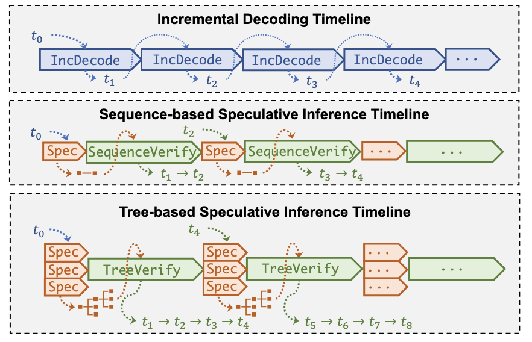
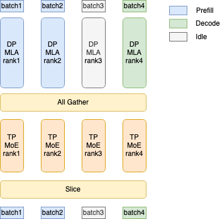
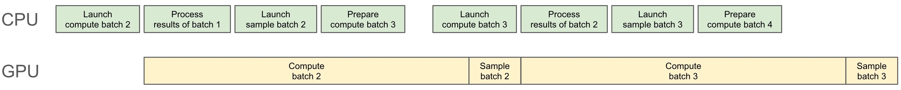
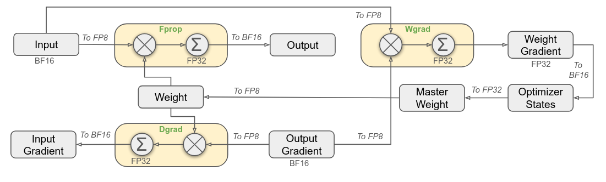

    
# DeepSeek V3 SGLang Optimizations
    
Continuing our technical series on DeepSeek V3 integration in SGLang, we want to discuss the various optimization strategies available for enhancing performance and efficiency. As an inference serving engine, SGLang interfaces with multiple components of the ML infrastructure stack, providing opportunities for optimization at different levels. Most of the optimizations comes in the form of flags for the `launch_server` CLI. These flags provide a convenient entry point into understanding the various performance enhancements that have been implemented over time in the SGLang ecosystem.

## Kernel Execution Optimizations


#### Related flags:

```bash
--disable_cuda_graph: # Disable cuda graph.
--cuda_graph_bs: # The batch sizes to capture by `CudaGraphRunner`.
--cuda_graph_max_bs: # Adjust the maximum batchsize when using cuda graph.
--enable-torch-compile: # Enable torch.compile compilation of the cuda graphs captured.
```

#### **Context:**

Both the [Cuda graph](https://pytorch.org/blog/accelerating-pytorch-with-cuda-graphs/) and [`torch.compile`](https://pytorch.org/tutorials/intermediate/torch_compile_tutorial.html) flags do with improving the efficiency of kernel operations. CUDA graphs significantly reduce kernel launch overhead by recording and replaying sequences of CUDA operations as a single unit, eliminating the per-kernel launch costs during inference. Meanwhile, `torch.compile` employs kernel fusion, operator elimination, and specialized kernel selection to optimize the computational graph. However, SGLang `torch.compile` can use either the Pytorch-generated graph or the Cuda graph to link the two optimizations.


#### **Benchmarks:**

 `—disable-cuda-graph`  → no cuda graphs + torch.compiler functions

```bash
$ python3 -m sglang.bench_one_batch --batch-size 1  --input 256
--output 32 --model deepseek-ai/DeepSeek-V3  --trust-remote-code  --tp 8
--torch-compile-max-bs 1 --disable-cuda-graph
--profile

max_total_num_tokens=481419
Warmup ...
Prefill. latency: 14.62753 s, throughput:     17.50 token/s
Decode.  latency: 7.50929 s, throughput:      0.13 token/s
Decode.  latency: 0.17148 s, throughput:      5.83 token/s
Decode.  latency: 0.14005 s, throughput:      7.14 token/s
Decode.  latency: 0.14014 s, throughput:      7.14 token/s
Decode.  latency: 0.14026 s, throughput:      7.13 token/s

Decode.  median latency: 0.14028 s, median throughput:      7.13 token/s
Total. latency: 23.009 s, throughput:     11.47 token/s

Benchmark ...
Prefill. latency: 0.21180 s, throughput:   1208.67 token/s
Decode.  latency: 0.22759 s, throughput:      4.39 token/s
Decode.  latency: 0.22772 s, throughput:      4.39 token/s
Decode.  latency: 0.23007 s, throughput:      4.35 token/s
Decode.  latency: 0.22846 s, throughput:      4.38 token/s
Decode.  latency: 0.22964 s, throughput:      4.35 token/s

Decode.  median latency: 0.22889 s, median throughput:      4.37 token/s
Total. latency:  7.322 s, throughput:     39.34 token/s
```

No flags → cuda_graph activated + torch.compiler functions

```bash
$ python3 -m sglang.bench_one_batch --batch-size 1  --input 256
--output 32 --model deepseek-ai/DeepSeek-V3  --trust-remote-code  --tp 8
--torch-compile-max-bs 1 --cuda-graph-max-bs 1
--profile

[2025-02-26 02:44:03 TP3] Registering 123 cuda graph addresses
[2025-02-26 02:44:03 TP3] Capture cuda graph end. Time elapsed: 12.15 s
[2025-02-26 02:44:03 TP4] Capture cuda graph end. Time elapsed: 12.14 s
[2025-02-26 02:44:03 TP1] Capture cuda graph end. Time elapsed: 12.15 s
[2025-02-26 02:44:03 TP5] Capture cuda graph end. Time elapsed: 12.14 s
[2025-02-26 02:44:03 TP2] Capture cuda graph end. Time elapsed: 12.15 s
[2025-02-26 02:44:03 TP7] Capture cuda graph end. Time elapsed: 12.14 s
[2025-02-26 02:44:03 TP0] Capture cuda graph end. Time elapsed: 12.16 s
[2025-02-26 02:44:03 TP6] Capture cuda graph end. Time elapsed: 12.14 s

max_total_num_tokens=481419
Warmup ...
Prefill. latency: 10.09186 s, throughput:     25.37 token/s
Decode.  latency: 0.95599 s, throughput:      1.05 token/s
Decode.  latency: 0.02685 s, throughput:     37.24 token/s
Decode.  latency: 0.02651 s, throughput:     37.73 token/s
Decode.  latency: 0.02650 s, throughput:     37.74 token/s
Decode.  latency: 0.02651 s, throughput:     37.72 token/s

Decode.  median latency: 0.02651 s, median throughput:     37.72 token/s
Total. latency: 11.208 s, throughput:     23.56 token/s

Benchmark ...
Prefill. latency: 0.25809 s, throughput:    991.92 token/s
Decode.  latency: 0.03481 s, throughput:     28.72 token/s
Decode.  latency: 0.03304 s, throughput:     30.27 token/s
Decode.  latency: 0.03396 s, throughput:     29.44 token/s
Decode.  latency: 0.03220 s, throughput:     31.05 token/s
Decode.  latency: 0.03467 s, throughput:     28.84 token/s

Decode.  median latency: 0.03220 s, median throughput:     31.05 token/s
Total. latency:  1.256 s, throughput:    229.27 token/s

```

`—enable-torch-compile` → cuda graphs activated + torch.compiler(cuda graph)

```bash
$ python3 -m sglang.bench_one_batch --batch-size 1  --input 256
--output 32 --model deepseek-ai/DeepSeek-V3  --trust-remote-code  --tp 8
--enable-torch-compile --torch-compile-max-bs 1 --cuda-graph-max-bs 1
 --profile
 
 # Limiting cuda graph and torch compile batch size to batch size

[2025-02-26 02:20:03 TP0] Registering 123 cuda graph addresses
[2025-02-26 02:20:03 TP7] Capture cuda graph end. Time elapsed: 89.67 s
[2025-02-26 02:20:03 TP1] Capture cuda graph end. Time elapsed: 89.68 s
[2025-02-26 02:20:03 TP5] Capture cuda graph end. Time elapsed: 89.66 s
[2025-02-26 02:20:03 TP6] Capture cuda graph end. Time elapsed: 89.67 s
[2025-02-26 02:20:03 TP4] Capture cuda graph end. Time elapsed: 89.66 s
[2025-02-26 02:20:03 TP0] Capture cuda graph end. Time elapsed: 89.66 s
[2025-02-26 02:20:03 TP2] Capture cuda graph end. Time elapsed: 89.66 s
[2025-02-26 02:20:03 TP3] Capture cuda graph end. Time elapsed: 89.67 s

max_total_num_tokens=481419
Warmup ...
Prefill. latency: 15.17720 s, throughput:     16.87 token/s
Decode.  latency: 0.34072 s, throughput:      2.93 token/s
Decode.  latency: 0.02163 s, throughput:     46.23 token/s
Decode.  latency: 0.02130 s, throughput:     46.96 token/s
Decode.  latency: 0.02131 s, throughput:     46.93 token/s
Decode.  latency: 0.02129 s, throughput:     46.97 token/s

Decode.  median latency: 0.02135 s, median throughput:     46.83 token/s
Total. latency: 15.646 s, throughput:     16.87 token/s

Benchmark ...
Prefill. latency: 0.26079 s, throughput:    981.64 token/s
Decode.  latency: 0.02492 s, throughput:     40.12 token/s
Decode.  latency: 0.02443 s, throughput:     40.94 token/s
Decode.  latency: 0.02404 s, throughput:     41.60 token/s
Decode.  latency: 0.02437 s, throughput:     41.03 token/s
Decode.  latency: 0.02442 s, throughput:     40.95 token/s

Decode.  median latency: 0.02415 s, median throughput:     41.42 token/s
Total. latency:  1.011 s, throughput:    284.86 token/s
```

#### **Results:**
As expected, when stacking optimizations ( torch.compiler / cuda graphs + torch.compiler / torch.compiler(cuda graphs) + torch.compiler) we reduce total latency (`7.322 / 1.256 / 1.011 s`) and improve total throughput (`39.34 / 229.27 / 284.86 token/s`).

**Note:** Due to initial increase compute by torch.compiler compilations and cuda graphs not capturing prefill phase operations, we see a degradation in the prefill phase latency (`0.21180 / 0.25809 / 0.26079 s`) and throughput (`1208.67 / 991.92 / 981.64 token/s`)


### bf16 Batch Matrix Multiplication (bmm)

#### **Context:**

Batch matrix multiplications are the main workload performed in LLMs. As Deepseek v3 uses different quantized fp8 dtypes (float8_e5m2 and float8_e4m3fn) for its training, thus reducing the memory allocation, we test accuracy and latency for a random set of bmm with different combinations of dtypes for fp8 and base bf16. This optimization doesn’t rely on flags.

#### **Commits:** 

([fix fp8 for MLA and support bmm fp8 for DeepSeek V2](https://github.com/sgl-project/sglang/pull/1285), [Enable DeepseekV3 on AMD GPUs](https://github.com/sgl-project/sglang/pull/2601), [integrate bmm_fp8 kernel into sgl-kernel](https://github.com/sgl-project/sglang/pull/3056))

#### **Benchmarks:**

```bash
$ pytest -s test_bmm_fp8.py

Input types: torch.float8_e4m3fn, torch.float8_e4m3fn
cosine similarity between bmm bf16 and fp8: 0.99609
latency bmm bf16: 0.05708 s
latency bmm fp8: 0.06103 s

Input types: torch.float8_e5m2, torch.float8_e4m3fn
cosine similarity between bmm bf16 and fp8: 1.00000
latency bmm bf16: 0.00007 s
latency bmm fp8: 0.00405 s

Input types: torch.float8_e4m3fn, torch.float8_e5m2fn
cosine similarity between bmm bf16 and fp8: 1.00000
latency bmm bf16: 0.00004 s
latency bmm fp8: 0.00344 s

Input types: torch.float8_e4m3fn, torch.float8_e4m3fn
cosine similarity between bmm bf16 and fp8: 0.99948
latency bmm bf16: 0.00005 s
latency bmm fp8: 0.00736 s

Input types: torch.float8_e5m2, torch.float8_e4m3fn
cosine similarity between bmm bf16 and fp8: 1.00005
latency bmm bf16: 0.00004 s
latency bmm fp8: 0.00372 s

Input types: torch.float8_e4m3fn, torch.float8_e5m2
cosine similarity between bmm bf16 and fp8: 0.99660
latency bmm bf16: 0.00004
latency bmm fp8: 0.00367 s
```

*Results obtained with a modified versiong of `test_bmm_fp8.py` (Anex 1)

#### **Results:**

Similarity between results are nearly identical (cosine similarity = 1 identical) while latency for fp8 is worse than bf16 due to casting compute. 

### Support nextn speculative decoding

#### **Related flags:**

```bash
--speculative-num-steps: # The number of steps sampled from draft model in Speculative Decoding.
--speculative-eagle-topk: # The number of token sampled from draft model in eagle2 each step.
--speculative-num-draft-tokens: # The number of token sampled from draft model in Speculative Decoding.
--speculative-draft: # Draft model to be used. It need the same tokenizer as verifier model (default: SGLang/DeepSeek-V3-NextN)
```

#### **Context:**

Speculative decoding accelerates inference by introducing a draft model (a smaller, faster model) that generates multiple tokens at once. A verification step then checks if these draft tokens match the predictions of the larger, more accurate LLM.

Its major flaw is that as naive speculative decoding generate a single linear sequence of draft tokens if even a single token in the sequence is rejected, all subsequent tokens are discarded, lowering the acceptance rate.

Sglang implementation of NextN is based on EAGLE-2 and SpecInfer:



With tree-based speculative decoding (SpecInfer and EAGLE-2) the predictions are organized as a tree, where each node represents a possible next token. With this approach we generate multiple speculative branches that can be parallely verified by the verifier LLM, increasing the acceptance rate.

EAGLE-2 key improvements are dynamic draft trees based on the context and pruning of the nodes based on confidence score of the draft model.

#### **Commits:** 

([[Track] DeepSeek V3/R1 nextn progress #3472,](https://github.com/sgl-project/sglang/issues/3472) [Support NextN (MTP) speculative decoding for DeepSeek-V3/R1 #3582](https://github.com/sgl-project/sglang/pull/3582),  [Support Eagle2 for Triton backend #3466](https://github.com/sgl-project/sglang/pull/3466), [Eagle speculative decoding part 4: Add EAGLE2 worker #2150](https://github.com/sgl-project/sglang/pull/2150))

#### **Benchmarks:**

No flags

```bash
python3 -m sglang.launch_server --model deepseek-ai/DeepSeek-V3 --tp 8 --trust-remote-code
python3 -m sglang.bench_serving --backend sglang --dataset-name random --random-input 256 --random-output 32 --random-range-ratio 1 --num-prompts 1 --host 127.0.0.1 --port 30000
```

```bash
# Input tokens: 256
# Output tokens: 32
# Batch size: 1

============ Serving Benchmark Result ============
Request throughput (req/s):              0.22      
Input token throughput (tok/s):          56.16     
Output token throughput (tok/s):         7.02      
Total token throughput (tok/s):          63.18     
Concurrency:                             1.00      
----------------End-to-End Latency----------------
Mean E2E Latency (ms):                   4556.85   
Median E2E Latency (ms):                 4556.85   
---------------Time to First Token----------------
Mean TTFT (ms):                          3749.94   
Median TTFT (ms):                        3749.94   
P99 TTFT (ms):                           3749.94   
-----Time per Output Token (excl. 1st token)------
Mean TPOT (ms):                          26.03     
Median TPOT (ms):                        26.03     
P99 TPOT (ms):                           26.03     
---------------Inter-token Latency----------------
Mean ITL (ms):                           26.03     
Median ITL (ms):                         26.80     
P99 ITL (ms):                            27.31     
==================================================
```

`--speculative-algo NEXTN --speculative-draft SGLang/DeepSeek-V3-NextN --speculative-num-steps 2 --speculative-eagle-topk 4 --speculative-num-draft-tokens 4`

```bash
python3 -m sglang.launch_server --model deepseek-ai/DeepSeek-V3 --speculative-algo NEXTN --speculative-draft SGLang/DeepSeek-V3-NextN --speculative-num-steps 2 --speculative-eagle-topk 4 --speculative-num-draft-tokens 4 --tp 8 --trust-remote-code
python3 -m sglang.bench_serving --backend sglang --dataset-name random --random-input 256 --random-output 32 --random-range-ratio 1 --num-prompts 1 --host 127.0.0.1 --port 30000
```

```bash
# Input tokens: 256
# Output tokens: 32
# Batch size: 1

============ Serving Benchmark Result ============       
Request throughput (req/s):              1.34      
Input token throughput (tok/s):          342.32    
Output token throughput (tok/s):         42.79     
Total token throughput (tok/s):          385.11    
Concurrency:                             1.00      
----------------End-to-End Latency----------------
Mean E2E Latency (ms):                   746.72    
Median E2E Latency (ms):                 746.72    
---------------Time to First Token----------------
Mean TTFT (ms):                          190.57    
Median TTFT (ms):                        190.57    
P99 TTFT (ms):                           190.57    
-----Time per Output Token (excl. 1st token)------
Mean TPOT (ms):                          17.94     
Median TPOT (ms):                        17.94     
P99 TPOT (ms):                           17.94     
---------------Inter-token Latency----------------
Mean ITL (ms):                           39.72     
Median ITL (ms):                         39.89     
P99 ITL (ms):                            41.13     
==================================================
```

#### **Results:**

We achieve and overall improvement of general throughput (Request, input and output) and a important (x6) reduction on end-to-end latency.

## MLA

### TP+DP Attention

#### **Related flags:**

```bash
--enable-dp-attention: # Enable compatible MLA Data Parallelism.
```

#### **Context:**

Tensor parallelism (TP) works with MHA by splitting the kv cache by TP devices (usually 8) so each devices process 1/TP of the kv cache. [1]

If we apply this for Multi-head Latent Attention (MLA) and TP parallelism, each GPU splits the `kv cache` along the `head_num` dimension. However, MLA's `kvcache` has a `head_num` of `1`, making it impossible to split. Therefore, each GPU must maintain a complete `kvcache` → the `kvcache` gets duplicated per device.

When using DP (Data Parallelism) for MLA, it split according to requests, and the latent states caches of different requests are stored in different GPUs. e.g: We can’t divide the only kv cache, so we divide the data into batches and paralelize them into different workers performing different tasks (prefill, decode).

After MLA, an all-gather operation is performed, allowing each GPU to acquire all sequences' `hidden_state`. Then, after **MOE (Mixture of Experts)**, each GPU extracts its corresponding sequences using **slice** operations.



**Commits:** ([Support cuda graph for DP attention](https://github.com/sgl-project/sglang/pull/2061), [Support multinode DP Attention](https://github.com/sgl-project/sglang/pull/2925), [Multi-node Tensor Parallelism](https://github.com/sgl-project/sglang/pull/550), [Support DP MLA](https://github.com/sgl-project/sglang/pull/1970))

#### **Benchmarks:**

No flags

```bash
# Launch server with profiler env
export SGLANG_TORCH_PROFILER_DIR=/sgl-workspace/profiler_env_folders/ # Optional for profiling
python3 -m sglang.launch_server --model deepseek-ai/DeepSeek-V3 --tp 8 --trust-remote-code

# Prefill
python3 -m sglang.bench_serving --backend sglang --dataset-name random --random-input 512 --random-output 1 --random-range-ratio 1 --num-prompts 10000 --host 127.0.0.1 --port 30000 
# Decode
python3 -m sglang.bench_serving --backend sglang --dataset-name random --random-input 1 --random-output 512 --random-range-ratio 1 --num-prompts 10000 --host 127.0.0.1 --port 30000
```

```bash
# PREFILL
# Input tokens: 5120000 (512)
# Output tokens: 10000 (1)
# Batch size: 10000

============ Serving Benchmark Result ============    
Request throughput (req/s):              21.00     
Input token throughput (tok/s):          10749.75  
Output token throughput (tok/s):         21.00     
Total token throughput (tok/s):          10770.74  
Concurrency:                             5099.94   
----------------End-to-End Latency----------------
Mean E2E Latency (ms):                   242905.21 
Median E2E Latency (ms):                 241251.45 
==================================================

# DECODE
# Input tokens: 10000 (1)
# Output tokens: 5120000 (512)
# Batch size: 10000

============ Serving Benchmark Result ============  
Request throughput (req/s):              10.76     
Input token throughput (tok/s):          10.76     
Output token throughput (tok/s):         5507.91   
Total token throughput (tok/s):          5518.66   
Concurrency:                             5729.14   
----------------End-to-End Latency----------------
Mean E2E Latency (ms):                   532565.15 
Median E2E Latency (ms):                 556271.32   
==================================================

```

`—enable-dp-attention`

```bash
# Launch server with profiler env
export SGLANG_TORCH_PROFILER_DIR=/sgl-workspace/profiler_env_folders/
python3 -m sglang.launch_server --model deepseek-ai/DeepSeek-V3 --tp 8 --trust-remote-code --enable-dp-attention

# Prefill
python3 -m sglang.bench_serving --backend sglang --dataset-name random --random-input 512 --random-output 1 --random-range-ratio 1 --num-prompts 10000 --host 127.0.0.1 --port 30000
python3 -m sglang.bench_serving --backend sglang --dataset-name random --random-input 1 --random-output 512 --random-range-ratio 1 --num-prompts 10000 --host 127.0.0.1 --port 30000
```

```bash
# PREFILL
# Input tokens: 5120000 (512)
# Output tokens: 10000 (1)
# Batch size: 10000

============ Serving Benchmark Result ============      
Request throughput (req/s):              25.60     
Input token throughput (tok/s):          13106.99  
Output token throughput (tok/s):         25.60     
Total token throughput (tok/s):          13132.59  
Concurrency:                             5247.85   
----------------End-to-End Latency----------------
Mean E2E Latency (ms):                   204997.47 
Median E2E Latency (ms):                 203447.68 
==================================================

# DECODE
# Input tokens: 10000 (1)
# Output tokens: 5120000 (512)
# Batch size: 10000

============ Serving Benchmark Result ============  
Request throughput (req/s):              17.48     
Input token throughput (tok/s):          17.48     
Output token throughput (tok/s):         8949.40   
Total token throughput (tok/s):          8966.88   
Concurrency:                             7014.61   
----------------End-to-End Latency----------------
Mean E2E Latency (ms):                   401309.94 
Median E2E Latency (ms):                 500722.48 
==================================================
```

#### **Results:**

As it is a scheduler paradigm, it performs better when using large batch sizes, if not the overhead added is bigger than the actual data parallelization.

For larger batch sizes (in this case 10000), we see an overall improvement in both prefill and decode phases. From end-to-end latency, overall throughput and concurrency.

### Support overlap scheduler with DP Attention

#### **Related flags:**

```bash
--disable-overlap-schedule: # Disable the Overhead-Scheduler
```

#### **Context:**

We can overlap the CPU scheduling with the GPU computation. The scheduler runs one batch ahead and prepares all the metadata required for the next batch. By doing this, we can keep the GPUs always busy and hide expensive overheads such as the radix cache operations. 



#### **Commits:** 

([Faster overlap scheduler](https://github.com/sgl-project/sglang/pull/1738), [Enable overlap by default](https://github.com/sgl-project/sglang/pull/2067),  [Enable overlap scheduler by default for the triton attention backend](https://github.com/sgl-project/sglang/pull/2105))

#### **Benchmarks:**

`--disable-overlap-schedule`

```bash
python3 -m sglang.launch_server --model deepseek-ai/DeepSeek-V3 --tp 8 --trust-remote-code --disable-overlap-schedule
python3 -m sglang.bench_serving --backend sglang --dataset-name random --random-input 256 --random-output 32 --random-range-ratio 1 --num-prompts 10000 --host 127.0.0.1 --port 30000
```

```bash
# Input tokens: 2560000 (256)
# Output tokens: 320000 (32)
# Batch size: 10000

============ Serving Benchmark Result ============
Backend:                                 sglang    
Traffic request rate:                    inf       
Max reqeuest concurrency:                not set   
Successful requests:                     10000     
Benchmark duration (s):                  293.55    
Total input tokens:                      2560000   
Total generated tokens:                  320000    
Total generated tokens (retokenized):    317484    
Request throughput (req/s):              34.07     
Input token throughput (tok/s):          8720.78   
Output token throughput (tok/s):         1090.10   
Total token throughput (tok/s):          9810.88   
Concurrency:                             6070.84   
----------------End-to-End Latency----------------
Mean E2E Latency (ms):                   178210.55 
Median E2E Latency (ms):                 157435.18 
---------------Time to First Token----------------
Mean TTFT (ms):                          145935.97 
Median TTFT (ms):                        141775.21 
P99 TTFT (ms):                           277559.21 
-----Time per Output Token (excl. 1st token)------
Mean TPOT (ms):                          1041.12   
Median TPOT (ms):                        947.28    
P99 TPOT (ms):                           7600.99   
---------------Inter-token Latency----------------
Mean ITL (ms):                           1186.69   
Median ITL (ms):                         251.08    
P99 ITL (ms):                            28399.72  
==================================================
```

No flags → enable overlap scheduler

```bash
python3 -m sglang.launch_server --model deepseek-ai/DeepSeek-V3 --tp 8 --trust-remote-code
python3 -m sglang.bench_serving --backend sglang --dataset-name random --random-input 256 --random-output 32 --random-range-ratio 1 --num-prompts 10000 --host 127.0.0.1 --port 30000
```

```bash
# Input tokens: 2560000 (256)
# Output tokens: 320000 (32)
# Batch size: 10000

============ Serving Benchmark Result ============
Backend:                                 sglang    
Traffic request rate:                    inf       
Max reqeuest concurrency:                not set   
Successful requests:                     10000     
Benchmark duration (s):                  304.19    
Total input tokens:                      2560000   
Total generated tokens:                  320000    
Total generated tokens (retokenized):    317539    
Request throughput (req/s):              32.87     
Input token throughput (tok/s):          8415.90   
Output token throughput (tok/s):         1051.99   
Total token throughput (tok/s):          9467.88   
Concurrency:                             6063.35   
----------------End-to-End Latency----------------
Mean E2E Latency (ms):                   184438.68 
Median E2E Latency (ms):                 204926.41 
---------------Time to First Token----------------
Mean TTFT (ms):                          147687.43 
Median TTFT (ms):                        144274.50 
P99 TTFT (ms):                           280238.25 
-----Time per Output Token (excl. 1st token)------
Mean TPOT (ms):                          1185.52   
Median TPOT (ms):                        1014.91   
P99 TPOT (ms):                           7837.04   
---------------Inter-token Latency----------------
Mean ITL (ms):                           1372.83   
Median ITL (ms):                         234.99    
P99 ITL (ms):                            29248.21  
==================================================
```

#### **Results:**

The results shows that something is not working properly as the latency and general throughput are better when disabling the scheduler overlap.

### FlashInfer prefill and MLA decoding

#### **Related flags:**

```bash
--enable-flashinfer-mla: # Enable FlashInfer MLA optimization
```

#### **Context:**

FlashInfer backend instead of triton.

#### **Commits:**
([Add fast decode plan for flashinfer mla,](https://github.com/sgl-project/sglang/pull/3987) [MLA prefill w/o weight absorption](https://github.com/sgl-project/sglang/pull/2349))

#### **Benchmarks:**

No flags

```bash
python3 -m sglang.launch_server --model deepseek-ai/DeepSeek-V3 --tp 8 --trust-remote-code
python3 benchmark/gsm8k/bench_sglang.py --num-shots 8 --num-questions 1319 --parallel 1319
```

```bash
Accuracy: 0.951
Invalid: 0.000
Latency: 77.397 s
Output throughput: 1809.790 token/s
```

With `--enable-flashinfer-mla`

```bash
python3 -m sglang.launch_server --model deepseek-ai/DeepSeek-V3 --tp 8 --trust-remote-code --enable-flashinfer-mla
python3 benchmark/gsm8k/bench_sglang.py --num-shots 8 --num-questions 1319 --parallel 1319
```

```bash
Accuracy: 0.948
Invalid: 0.000
Latency: 71.480 s
Output throughput: 1920.021 token/s
```

#### **Results:**

Due to FlashInfer fused operation, we obtain less latency and more output throughput for a nearly similar accuracy.

## FP8

### Improve the accuracy for FP8

#### **Context:**

Numerical overflow occurs when a value exceeds the representable range of a given numerical format (like FP8), causing incorrect or infinite values. In the context of FP8 quantization on Tensor Cores, overflow happens because FP8 has a very limited dynamic range. To prevent numerical overflow, values are scaled down before being quantizied using the max element of the matrix, although this makes it sensitive to outliers values. To avoid it, Deepseek team propose blockwise and tilewise scaling, in which each 128×128 submatrix of a weight matrix and each 1×128 subvector of an activation vector is scaled and quantized separately.

The FP8 GEMM accumulation on NVIDIA H800 Tensor Cores is limited to about `14 bits` of precision, which is significantly lower than FP32 accumulation precision. Thats why Deepseek uses a separate FP32 accumulator register using CUDA Cores thus mitigating the loss of accuracy. The dequantizing scaling factor is also applied to this FP32 accumulator.



#### **Commits:** 
([support blockwise fp8 matmul kernel #3267](https://github.com/sgl-project/sglang/pull/3267), [add unit test for block wise fp8#3156](https://github.com/sgl-project/sglang/pull/3156), [integrate blockwise fp8 kernel#3529](https://github.com/sgl-project/sglang/pull/3529), [[Track] DeepSeek V3/R1 accuracy](https://github.com/sgl-project/sglang/issues/3486))

#### **Benchmarks:**

```bash
python3 -m sglang.launch_server --model deepseek-ai/DeepSeek-R1 --tp 8 --trust-remote-code
python3 benchmark/gsm8k/bench_sglang.py --num-shots 8 --num-questions 1319 --parallel 1319
```

```bash
# baseline gsm8k perf (from https://github.com/sgl-project/sglang/issues/3486)
Accuracy: 0.955
Latency: 109.212 s
Output throughput: 1244.611 token/s

# Current gsm8k perf
Accuracy: 0.957
Latency: 84.355 s
Output throughput: 1605.663 token/s
```

#### **Results:**

More output throughput, less latency, same or slighly better accuracy.

### Tunning FP8 GEMM

#### **Context:**

Open source code released by sglang team to perform fp8 blockwise quantization tunning for tailored performance.

It contains specific fp8 gemm code for AMD or CUDA kernels that benchmark different kernel shapes for each GPU, obtaining the most performant configuration based on latency.

Key functions:

```bash
# fn: benchmark_config(A_fp8, B_fp8, As, Bs, block_size, config, out_dtype=torch.float16, num_iters=10)
A: torch.Tensor,     # Input matrix (FP8) - typically activations
B: torch.Tensor,     # Input matrix (FP8) - typically weights
As: torch.Tensor,    # Per-token-group scale factors for `A`
Bs: torch.Tensor,    # Per-block scale factors for `B`
block_size: List[int],  # Block size for quantization (e.g., [128, 128])
config: Dict[str, Any],  # Kernel configuration parameters
output_dtype: torch.dtype = torch.float16,  # Precision of output
```

```bash
# fn: tune(M, N, K, block_size, out_dtype, search_space):
M,N,K: int  # Shape of the matrix multiplication (M × K @ K × N → M × N)
block_size: int # Tuple defining blockwise quantization size ([block_n, block_k])
out_dtype: str # Output precision (e.g., float16, bfloat16)
search_space: List[dict{str,int}] # List of configurations to test (e.g., block sizes, number of warps).

# search_space example:
{
"BLOCK_SIZE_M": block_m,
"BLOCK_SIZE_N": block_n,
"BLOCK_SIZE_K": block_k,
"GROUP_SIZE_M": group_size,
"num_warps": num_warps,
"num_stages": num_stages,
}
```

Output example: `N=512,K=7168,device_name=NVIDIA_H200,dtype=fp8_w8a8,block_shape=[128, 128].json`

#### **Commits:** 
([add tuning block wise fp8#3242](https://github.com/sgl-project/sglang/pull/3242))

#### **Benchmarks:**

```bash
$python3 benchmark/kernels/quantizationtuning_block_wise_fp8.py
{
    "2048": {
        "BLOCK_SIZE_M": 64,
        "BLOCK_SIZE_N": 64,
        "BLOCK_SIZE_K": 128,
        "GROUP_SIZE_M": 1,
        "num_warps": 4,
        "num_stages": 4
    },
    "3072": {
        "BLOCK_SIZE_M": 64,
        "BLOCK_SIZE_N": 64,
        "BLOCK_SIZE_K": 128,
        "GROUP_SIZE_M": 1,
        "num_warps": 4,
        "num_stages": 3
    },
    "4096": {
        "BLOCK_SIZE_M": 64,
        "BLOCK_SIZE_N": 128,
        "BLOCK_SIZE_K": 128,
        "GROUP_SIZE_M": 64,
        "num_warps": 4,
        "num_stages": 3
    }
}
```

#### **Results:**

Example of the optimal configuration for the kernel: `N=512,K=7168,device_name=NVIDIA_H200,dtype=fp8_w8a8,block_shape=[128, 128]`

### FP8 GEMM CUTLASS implementation

#### Context:

Due to blockwise scaling, these operations need to be fused into the FP8 matmul operations.`sgl-kernel/src/sgl-kernel/csrc/int8_gemm_kernel.cu` contains CUDA-accelerated implementation of integer 8-bit (int8) scaled matrix multiplication fused with W8A8 quantization.

#### **Commits:** 
([support w8a8 fp8 kernel with CUTLASS #3047](https://github.com/sgl-project/sglang/pull/3047) , [Support cutlass Int8 gemm #2752](https://github.com/sgl-project/sglang/pull/2752)**,** [](https://github.com/NVIDIA/cutlass/pull/1932)[Support sm90 Int8 gemm#3035](https://github.com/sgl-project/sglang/pull/3035)**,** [Blockwise Scaling for FP8 #1932 from NVIDIA/cutlass](https://github.com/NVIDIA/cutlass/pull/1932))

#### **Benchmarks:**

```bash
root@cluster-h200-02-f2:/sgl-workspace/sglang/sgl-kernel/benchmark# python3 bench_int8_gemm.py 
deepseek-ai/DeepSeek-Coder-V2-Lite-Instruct N=3072 K=2048: 
int8 scaled matmul:
   batch_size  vllm int8 gemm  sgl-kernel int8 gemm
0         1.0    1.120091e+03          1.166485e+03
1        16.0    1.812745e+04          1.860871e+04
2        32.0    3.615101e+04          3.721742e+04
3        64.0    7.292893e+04          7.509943e+04
4       128.0    1.210235e+05          1.475638e+05
5       256.0    2.175294e+05          2.213457e+05
6       512.0    4.285929e+05          4.369421e+05
7      1024.0    6.554132e+05          6.651310e+05
8      2048.0    1.020821e+06          1.040553e+06
deepseek-ai/DeepSeek-Coder-V2-Lite-Instruct N=4096 K=2048: 
int8 scaled matmul:
   batch_size  vllm int8 gemm  sgl-kernel int8 gemm
0         1.0    1.452199e+03          1.501989e+03
1        16.0    2.310752e+04          2.389527e+04
2        32.0    4.634235e+04          4.792670e+04
3        64.0    9.371739e+04          9.558109e+04
4       128.0    1.613647e+05          1.879584e+05
5       256.0    2.851232e+05          2.887944e+05
6       512.0    5.595766e+05          5.666449e+05
7      1024.0    8.626806e+05          8.753052e+05
8      2048.0    1.134484e+06          1.158908e+06
deepseek-ai/DeepSeek-Coder-V2-Lite-Instruct N=2048 K=2048: 
int8 scaled matmul:
   batch_size  vllm int8 gemm  sgl-kernel int8 gemm
0         1.0      770.815235            803.816546
1        16.0    12369.317695          12782.881372
2        32.0    24309.642590          25488.290148
3        64.0    49477.270779          50822.575805
4       128.0    88538.270835         101953.160592
5       256.0   149531.309235         151551.998365
6       512.0   293198.638867         298399.503402
7      1024.0   580078.330374         587677.630898
8      2048.0   871056.168115         881035.528090
deepseek-ai/DeepSeek-Coder-V2-Lite-Instruct N=576 K=2048: 
int8 scaled matmul:
   batch_size  vllm int8 gemm  sgl-kernel int8 gemm
0         1.0      233.943045            242.380333
1        16.0     3778.964895           3878.085321
2        32.0     7606.533500           7756.170641
3        64.0    14513.079376          14831.547966
4       128.0    26431.643180          30822.565837
5       256.0    43406.091536          44217.420625
6       512.0    86812.183072          87011.752831
7      1024.0   172437.869523         174827.303791
8      2048.0   336445.445779         340991.996321
deepseek-ai/DeepSeek-Coder-V2-Lite-Instruct N=21888 K=2048: 
int8 scaled matmul:
   batch_size  vllm int8 gemm  sgl-kernel int8 gemm
0         1.0    3.217856e+03          3.380491e+03
1        16.0    5.142678e+04          5.444822e+04
2        32.0    1.032078e+05          1.085676e+05
3        64.0    2.013304e+05          2.057071e+05
4       128.0    4.545841e+05          3.821212e+05
5       256.0    7.602031e+05          7.683249e+05
6       512.0    1.038487e+06          1.043005e+06
7      1024.0    1.332380e+06          1.326849e+06
8      2048.0    1.436509e+06          1.425475e+06
deepseek-ai/DeepSeek-Coder-V2-Lite-Instruct N=2048 K=10944: 
int8 scaled matmul:
   batch_size  vllm int8 gemm  sgl-kernel int8 gemm
0         1.0    2.025341e+03          2.238875e+03
1        16.0    3.235870e+04          3.570792e+04
2        32.0    6.443844e+04          7.107631e+04
3        64.0    1.340782e+05          1.468057e+05
4       128.0    2.317786e+05          2.834070e+05
5       256.0    3.294703e+05          3.306850e+05
6       512.0    6.148984e+05          6.186090e+05
7      1024.0    1.152749e+06          1.140837e+06
8      2048.0    1.250151e+06          1.248519e+06
deepseek-ai/DeepSeek-Coder-V2-Lite-Instruct N=2816 K=2048: 
int8 scaled matmul:
   batch_size  vllm int8 gemm  sgl-kernel int8 gemm
0         1.0     1035.575904           1082.083796
1        16.0    16569.214472          17108.449068
2        32.0    32762.922551          34115.965500
3        64.0    66658.859984          68231.931000
4       128.0   109884.198408         135663.481364
5       256.0   200699.562395         204243.926838
6       512.0   395395.271139         400530.288894
7      1024.0   598851.115579         608700.658611
8      2048.0   944107.132900         957541.993879
deepseek-ai/DeepSeek-Coder-V2-Lite-Instruct N=2048 K=1408: 
int8 scaled matmul:
   batch_size  vllm int8 gemm  sgl-kernel int8 gemm
0         1.0      581.762038            595.157921
1        16.0     9338.219262           9553.953543
2        32.0    18321.823332          18616.385212
3        64.0    36818.415569          37473.761067
4       128.0    65605.618470          74465.540847
5       256.0   110543.124607         110279.924685
6       512.0   222146.607554         223217.201798
7      1024.0   445361.235788         443230.304613
8      2048.0   695198.039645         707138.478286
Benchmark finished!
```

#### **Results:**

Benchmarks measure GB/s per batch size. Comparing vllm same kernel (int8 gemm) to sglang kernel we get more throughput for different batch sizes for different configurations (N and K).
**Note**: We tested this benchmark using DeepSeek-Coder-V2-Lite-Instruct as the code for Deepseek-v3 isn’t implemented in SGLang.

## MoE

### FusedMoE tuning for H200

#### **Context:**

Custom SGLang kernels for fusedMoE, inspired in the work of vllm. Composed of: 

`tuning_fused_moe_triton.py`: A tool for tuning the `fused_moe_triton` kernel. Adapted from [vllm's benchmark_moe.py](https://github.com/vllm-project/vllm/blob/main/benchmarks/kernels/benchmark_moe.py), with added support for various model architectures.

`benchmark_vllm_vs_sglang_fused_moe_triton.py`: A tool for comparing the performance of fused MoE kernels between vllm and sglang implementations. Supports various model architectures and data types.

#### **Commits:** 
([Add unitest for fused_moe](https://github.com/sgl-project/sglang/pull/2416), [MoE Expert Parallel Impl](https://github.com/sgl-project/sglang/pull/2203), [`benchmark/kernels/fused_moe_triton/README.md`](https://github.com/sgl-project/sglang/tree/main/benchmark/kernels/fused_moe_triton))

#### **Benchmarks:**

```bash
$ python3 benchmark/kernels/fused_moe_triton/tuning_fused_moe_triton.py --model deepseek-ai/DeepSeek-V3 --tp-size 8  --dtype fp8_w
8a8 --tune
Namespace(model='deepseek-ai/DeepSeek-V3', tp_size=8, dtype='fp8_w8a8', seed=0, batch_size=None, tune=True)
2025-03-11 06:08:00,564 INFO worker.py:1841 -- Started a local Ray instance.
Start tuning over 1280 configurations...
(BenchmarkWorker pid=819436) Tue Mar 11 06:50:51 2025] Completed tuning for batch_size=1                 
(BenchmarkWorker pid=819437) Tue Mar 11 06:51:55 2025] Completed tuning for batch_size=2                 
(BenchmarkWorker pid=819440) Tue Mar 11 06:51:55 2025] Completed tuning for batch_size=24 [repeated 6x across cluster] (Ray deduplicates logs by default. Set RAY_DEDUP_LOGS=0 to disable log deduplication, or see https://docs.ray.io/en/master/ray-observability/user-guides/configure-logging.html#log-deduplication for more options.)                   
(BenchmarkWorker pid=819436) Tue Mar 11 07:07:44 2025] Completed tuning for batch_size=64                 
(BenchmarkWorker pid=819437) Tue Mar 11 07:08:46 2025] Completed tuning for batch_size=96                 
(BenchmarkWorker pid=819435) Tue Mar 11 07:09:04 2025] Completed tuning for batch_size=128               
(BenchmarkWorker pid=819439) Tue Mar 11 07:09:19 2025] Completed tuning for batch_size=256               
(BenchmarkWorker pid=819438) Tue Mar 11 07:09:41 2025] Completed tuning for batch_size=512               
(BenchmarkWorker pid=819440) Tue Mar 11 07:11:01 2025] Completed tuning for batch_size=1024               
(BenchmarkWorker pid=819441) Tue Mar 11 07:12:20 2025] Completed tuning for batch_size=1536               
(BenchmarkWorker pid=819456) Tue Mar 11 07:14:12 2025] Completed tuning for batch_size=2048               
(BenchmarkWorker pid=819436) Tue Mar 11 07:31:57 2025] Completed tuning for batch_size=3072               
(BenchmarkWorker pid=819437) Tue Mar 11 07:35:50 2025] Completed tuning for batch_size=4096                                                                               
Writing best config to E=256,N=256,device_name=NVIDIA_H200,dtype=fp8_w8a8,block_shape=[128, 128].json...                                                                       
Tuning took 5267.05 seconds
```

```bash
{
    "1": {
        "BLOCK_SIZE_M": 16,
        "BLOCK_SIZE_N": 64,
        "BLOCK_SIZE_K": 128,
        "GROUP_SIZE_M": 1,
        "num_warps": 4,
        "num_stages": 4
    },
    "2": {
        "BLOCK_SIZE_M": 16,
        "BLOCK_SIZE_N": 128,
        "BLOCK_SIZE_K": 128,
        "GROUP_SIZE_M": 1,
        "num_warps": 4,
        "num_stages": 3
    },
    "4": {
        "BLOCK_SIZE_M": 64,
        "BLOCK_SIZE_N": 64,
        "BLOCK_SIZE_K": 128,
        "GROUP_SIZE_M": 64,
        "num_warps": 4,
        "num_stages": 4
    },
    "8": {
        "BLOCK_SIZE_M": 64,
        "BLOCK_SIZE_N": 128,
        "BLOCK_SIZE_K": 128,
        "GROUP_SIZE_M": 1,
        "num_warps": 4,
        "num_stages": 3
    },
    "16": {
        "BLOCK_SIZE_M": 64,
        "BLOCK_SIZE_N": 128,
        "BLOCK_SIZE_K": 128,
        "GROUP_SIZE_M": 16,
        "num_warps": 4,
        "num_stages": 3
    },
    "24": {
        "BLOCK_SIZE_M": 64,
        "BLOCK_SIZE_N": 128,
        "BLOCK_SIZE_K": 128,
        "GROUP_SIZE_M": 16,
        "num_warps": 4,
        "num_stages": 3
    },
    "32": {
        "BLOCK_SIZE_M": 64,
        "BLOCK_SIZE_N": 128,
        "BLOCK_SIZE_K": 128,
        "GROUP_SIZE_M": 16,
        "num_warps": 4,
        "num_stages": 3
    },
    "48": {
        "BLOCK_SIZE_M": 64,
        "BLOCK_SIZE_N": 128,
        "BLOCK_SIZE_K": 128,
        "GROUP_SIZE_M": 1,
        "num_warps": 4,
        "num_stages": 3
    },
    "64": {
        "BLOCK_SIZE_M": 64,
        "BLOCK_SIZE_N": 128,
        "BLOCK_SIZE_K": 128,
        "GROUP_SIZE_M": 1,
        "num_warps": 4,
        "num_stages": 3
    },
    "96": {
        "BLOCK_SIZE_M": 64,
        "BLOCK_SIZE_N": 128,
        "BLOCK_SIZE_K": 128,
        "GROUP_SIZE_M": 1,
        "num_warps": 4,
        "num_stages": 3
    },
    "128": {
        "BLOCK_SIZE_M": 64,
        "BLOCK_SIZE_N": 128,
        "BLOCK_SIZE_K": 128,
        "GROUP_SIZE_M": 1,
        "num_warps": 4,
        "num_stages": 3
    },
    "256": {
        "BLOCK_SIZE_M": 64,
        "BLOCK_SIZE_N": 128,
        "BLOCK_SIZE_K": 128,
        "GROUP_SIZE_M": 32,
        "num_warps": 4,
        "num_stages": 3
    },
    "512": {
        "BLOCK_SIZE_M": 64,
        "BLOCK_SIZE_N": 64,
        "BLOCK_SIZE_K": 128,
        "GROUP_SIZE_M": 32,
        "num_warps": 4,
        "num_stages": 3
    },
    "1024": {
        "BLOCK_SIZE_M": 64,
        "BLOCK_SIZE_N": 128,
        "BLOCK_SIZE_K": 128,
        "GROUP_SIZE_M": 64,
        "num_warps": 4,
        "num_stages": 3
    },
    "1536": {
        "BLOCK_SIZE_M": 64,
        "BLOCK_SIZE_N": 128,
        "BLOCK_SIZE_K": 128,
        "GROUP_SIZE_M": 32,
        "num_warps": 4,
        "num_stages": 3
    },
    "2048": {
        "BLOCK_SIZE_M": 64,
        "BLOCK_SIZE_N": 128,
        "BLOCK_SIZE_K": 128,
        "GROUP_SIZE_M": 32,
        "num_warps": 4,
        "num_stages": 3
    },
    "3072": {
        "BLOCK_SIZE_M": 128,
        "BLOCK_SIZE_N": 64,
        "BLOCK_SIZE_K": 128,
        "GROUP_SIZE_M": 16,
        "num_warps": 4,
        "num_stages": 4
    },
    "4096": {
        "BLOCK_SIZE_M": 64,
        "BLOCK_SIZE_N": 128,
        "BLOCK_SIZE_K": 128,
        "GROUP_SIZE_M": 32,
        "num_warps": 4,
        "num_stages": 3
    }
}
```
## Anex

### **1. Code modification for `test_bmm_fp8.py`**

```bash
# Adapted from https://github.com/flashinfer-ai/flashinfer/blob/4e8eb1879f9c3ba6d75511e5893183bf8f289a62/tests/test_bmm_fp8.py

import pytest
import torch
import torch.nn.functional as F
from sgl_kernel import bmm_fp8

def to_float8(x, dtype=torch.float8_e4m3fn):
    finfo = torch.finfo(dtype)
    min_val, max_val = x.aminmax()
    amax = torch.maximum(min_val.abs(), max_val.abs()).clamp(min=1e-12)
    scale = finfo.max / amax
    x_scl_sat = (x * scale).clamp(min=finfo.min, max=finfo.max)
    return x_scl_sat.to(dtype), scale.float().reciprocal()

@pytest.mark.parametrize("input_dtype", [torch.float8_e4m3fn, torch.float8_e5m2])
@pytest.mark.parametrize("mat2_dtype", [torch.float8_e4m3fn, torch.float8_e5m2])
@pytest.mark.parametrize("res_dtype", [torch.bfloat16, torch.float16])
def test_bmm_fp8(input_dtype, mat2_dtype, res_dtype):
    if input_dtype == torch.float8_e5m2 and mat2_dtype == torch.float8_e5m2:
        pytest.skip("Invalid combination: both input and mat2 are e5m2")

    input = torch.randn([16, 48, 64], device="cuda", dtype=torch.bfloat16)
    input_fp8, input_inv_s = to_float8(input, dtype=input_dtype)

    # mat2 row  major -> column major
    mat2 = torch.randn([16, 80, 64], device="cuda", dtype=torch.bfloat16).transpose(
        -2, -1
    )
    mat2_fp8, mat2_inv_s = to_float8(mat2, dtype=mat2_dtype)

    res = torch.empty([16, 48, 80], device="cuda", dtype=res_dtype)

    start_event = torch.cuda.Event(enable_timing=True)
    end_event = torch.cuda.Event(enable_timing=True)

    start_event.record()
    bmm_fp8(input_fp8, mat2_fp8, input_inv_s, mat2_inv_s, res_dtype, res)
    end_event.record()
    torch.cuda.synchronize()
    fp8_lat = start_event.elapsed_time(end_event) / 1000.0

    start_event.record()
    reference = torch.bmm(input, mat2)
    end_event.record()
    torch.cuda.synchronize()
    bf16_lat = start_event.elapsed_time(end_event) / 1000.0

    cos_sim = F.cosine_similarity(reference.reshape(-1), res.reshape(-1), dim=0)

    print(f"input types: {input_dtype}, {mat2_dtype}")
    print(f"cosine similarity between bmm bf16 and fp8: {cos_sim:.5f}")
    print(f"latency bmm bf16: {bf16_lat:.5f}")
    print(f"latency bmm fp8: {fp8_lat:.5f}\n")
    assert cos_sim > 0.99

if __name__ == "__main__":
    pytest.main([__file__])
```

### 2. Environment

[https://docs.sglang.ai/start/install.html#method-2-from-source](https://docs.sglang.ai/start/install.html#method-2-from-source)

```bash
sglang == v0.4.3.post2
sgl-kernel == 0.0.3.post6
torch==2.5.1
nvcc -V
Cuda compilation tools, release 12.5, V12.5.82
Build cuda_12.5.r12.5/compiler.34385749_0
```

from lmsysorg/sglang:latest

```bash
# Use the last release branch
git clone -b v0.4.3 https://github.com/sgl-project/sglang.git
cd sglang

pip install --upgrade pip
pip install -e "python[all]" --find-links https://flashinfer.ai/whl/cu126/torch2.5/flashinfer-python
```

- pip freeze
  
    important:
    
    ```bash
    sgl-kernel==0.0.3.post6
    -e git+https://github.com/sgl-project/sglang.git@c0bb9eb3b3fb603247648a5e7a2ab29822f05440#egg=sglang&subdirectory=python
    ```
    
    ```bash
    pip freeze
    aiohappyeyeballs==2.4.4
    aiohttp==3.11.11
    aiosignal==1.3.2
    annotated-types==0.7.0
    anthropic==0.45.2
    anyio==4.8.0
    argcomplete==3.5.3
    asttokens==3.0.0
    async-timeout==5.0.1
    attrs==25.1.0
    black==25.1.0
    certifi==2019.11.28
    chardet==3.0.4
    charset-normalizer==3.4.1
    click==8.1.8
    cloudpickle==3.1.1
    compressed-tensors==0.8.0
    cuda-bindings==12.8.0
    cuda-python==12.8.0
    datamodel-code-generator==0.26.5
    datasets==3.2.0
    dbus-python==1.2.16
    decorator==5.1.1
    decord==0.6.0
    dill==0.3.8
    diskcache==5.6.3
    distro==1.9.0
    distro-info==0.23+ubuntu1.1
    dnspython==2.7.0
    einops==0.8.0
    email_validator==2.2.0
    exceptiongroup==1.2.2
    executing==2.2.0
    fastapi==0.115.8
    filelock==3.13.1
    flash_mla==1.0.0+bcb90f2
    flashinfer==0.1.6+cu124torch2.4
    flashinfer-python==0.2.2
    frozenlist==1.5.0
    fsspec==2024.6.1
    genson==1.3.0
    gguf==0.10.0
    h11==0.14.0
    hf_transfer==0.1.9
    html5lib==1.1
    httpcore==1.0.7
    httptools==0.6.4
    httpx==0.27.2
    huggingface-hub==0.28.1
    idna==2.8
    importlib_metadata==8.6.1
    inflect==5.6.2
    iniconfig==2.0.0
    interegular==0.3.3
    ipython==8.31.0
    isort==5.13.2
    jedi==0.19.2
    Jinja2==3.1.5
    jiter==0.8.2
    jsonschema==4.23.0
    jsonschema-specifications==2024.10.1
    lark==1.2.2
    litellm==1.59.10
    llvmlite==0.44.0
    lm-format-enforcer==0.10.9
    MarkupSafe==3.0.2
    matplotlib-inline==0.1.7
    mistral_common==1.5.2
    modelscope==1.22.3
    mpmath==1.3.0
    msgpack==1.1.0
    msgspec==0.19.0
    multidict==6.1.0
    multiprocess==0.70.16
    mypy-extensions==1.0.0
    nest-asyncio==1.6.0
    networkx==3.3
    ninja==1.11.1.3
    numba==0.61.0
    numpy==1.26.4
    nvidia-cublas-cu12==12.4.5.8
    nvidia-cuda-cupti-cu12==12.4.127
    nvidia-cuda-nvrtc-cu12==12.4.127
    nvidia-cuda-runtime-cu12==12.4.127
    nvidia-cudnn-cu12==9.1.0.70
    nvidia-cufft-cu12==11.2.1.3
    nvidia-curand-cu12==10.3.5.147
    nvidia-cusolver-cu12==11.6.1.9
    nvidia-cusparse-cu12==12.3.1.170
    nvidia-cusparselt-cu12==0.6.2
    nvidia-ml-py==12.570.86
    nvidia-nccl-cu12==2.21.5
    nvidia-nvjitlink-cu12==12.4.127
    nvidia-nvtx-cu12==12.4.127
    openai==1.60.2
    opencv-python-headless==4.11.0.86
    orjson==3.10.15
    outlines==0.0.46
    packaging==24.2
    pandas==2.2.3
    parso==0.8.4
    partial-json-parser==0.2.1.1.post5
    pathspec==0.12.1
    pexpect==4.9.0
    pillow==10.4.0
    platformdirs==4.3.6
    pluggy==1.5.0
    prometheus-fastapi-instrumentator==7.0.2
    prometheus_client==0.21.1
    prompt_toolkit==3.0.50
    propcache==0.2.1
    protobuf==5.29.3
    psutil==6.1.1
    ptyprocess==0.7.0
    pure_eval==0.2.3
    py-cpuinfo==9.0.0
    pyairports==2.1.1
    pyarrow==19.0.0
    pybind11==2.13.6
    pycountry==24.6.1
    pydantic==2.10.6
    pydantic_core==2.27.2
    Pygments==2.19.1
    PyGObject==3.36.0
    pytest==8.3.4
    python-apt==2.0.1+ubuntu0.20.4.1
    python-dateutil==2.9.0.post0
    python-dotenv==1.0.1
    python-multipart==0.0.20
    pytz==2025.1
    PyYAML==6.0.2
    pyzmq==26.2.1
    ray==2.41.0
    referencing==0.36.2
    regex==2024.11.6
    requests==2.32.3
    requests-unixsocket==0.2.0
    rpds-py==0.22.3
    safetensors==0.5.2
    sentencepiece==0.2.0
    setproctitle==1.3.4
    sgl-kernel==0.0.3.post6
    -e git+https://github.com/sgl-project/sglang.git@c0bb9eb3b3fb603247648a5e7a2ab29822f05440#egg=sglang&subdirectory=python
    six==1.17.0
    sniffio==1.3.1
    stack-data==0.6.3
    starlette==0.45.3
    sympy==1.13.1
    tiktoken==0.7.0
    tokenizers==0.21.0
    toml==0.10.2
    tomli==2.2.1
    torch==2.5.1
    torchao==0.8.0
    torchvision==0.20.1
    tqdm==4.67.1
    traitlets==5.14.3
    transformers==4.48.3
    triton==3.1.0
    typing_extensions==4.12.2
    tzdata==2025.1
    unattended-upgrades==0.1
    urllib3==2.3.0
    uvicorn==0.34.0
    uvloop==0.21.0
    vllm==0.6.4.post1
    watchfiles==1.0.4
    wcwidth==0.2.13
    webencodings==0.5.1
    websockets==14.2
    xformers==0.0.28.post3
    xgrammar==0.1.10
    xxhash==3.5.0
    yarl==1.18.3
    zipp==3.21.0
    ```
    

## References

- [sglang kernels test](https://github.com/sgl-project/sglang/tree/main/sgl-kernel/tests)

- [sglang kernels benchmarks](https://github.com/sgl-project/sglang/tree/main/sgl-kernel/benchmark)

- [[Feature] DeepSeek V3 optimization #2591](https://github.com/sgl-project/sglang/issues/2591)

- [Blog deepseek v3 techniques behind 10x efficiency](https://dataturbo.medium.com/key-techniques-behind-deepseek-models-10x-efficiency-1-moe-9bd2534987c8)

- [AI Compiler Sglang optimizations work](https://carpedm30.notion.site/02-19-2024-2nd-meeting)

- [lmsys sglang 0.4 data parallellism](https://lmsys.org/blog/2024-12-04-sglang-v0-4/#data-parallelism-attention-for-deepseek-models)

- [lmsys sglang 0.4 zero overhead batch scheduler](https://lmsys.org/blog/2024-12-04-sglang-v0-4/#zero-overhead-batch-scheduler)

- [spaces.ac.cn: MQA, GQA, MLA blog](https://spaces.ac.cn/archives/10091)

- [Tree-based speculative decoding paper](https://arxiv.org/pdf/2305.09781)

- [EAGLE2 Speculative decoding paper](https://arxiv.org/pdf/2406.16858)

- [DeepSeek v3 paper](https://arxiv.org/pdf/2412.19437)

- [Zhihu blogs: EAGLE: Speculative Sampling Requires Rethinking Feature Uncertainty](https://zhuanlan.zhihu.com/p/687404563)

- [Zhihu blogs: MLA tp and dp](https://zhuanlan.zhihu.com/p/25573883266)

- [Zhihu blog: MLA tp and dp part 2](https://zhuanlan.zhihu.com/p/15280741714)[1]

- [Colfax deepseekv3 fp8 mixed precision training](https://research.colfax-intl.com/deepseek-r1-and-fp8-mixed-precision-training/)

  
