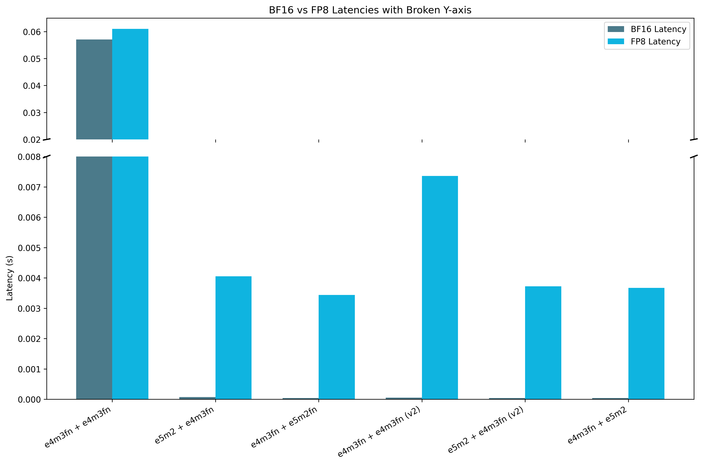
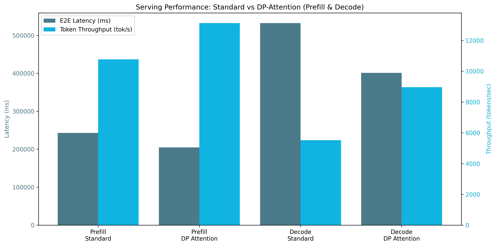
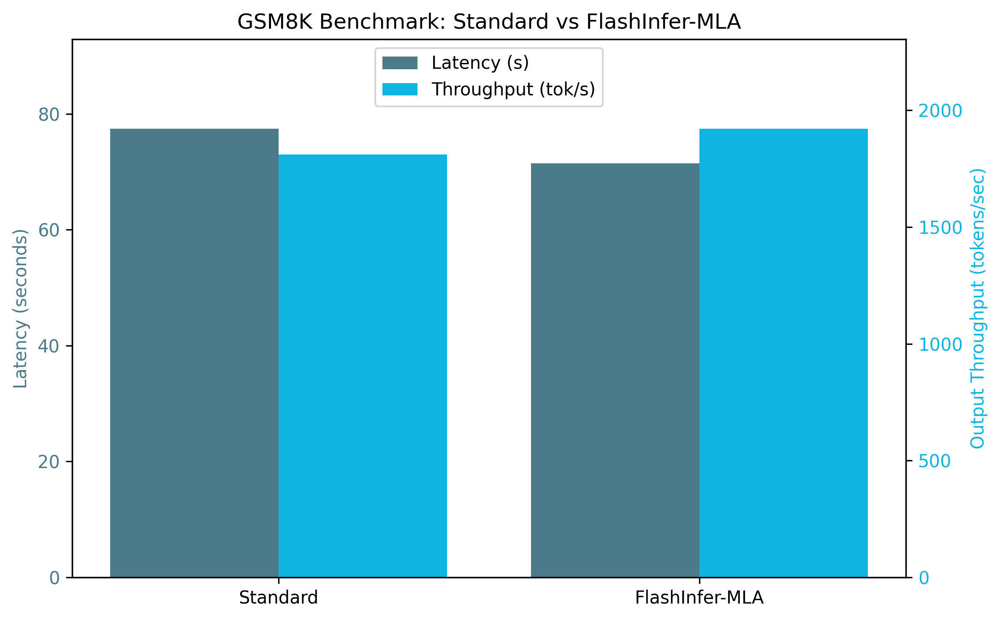
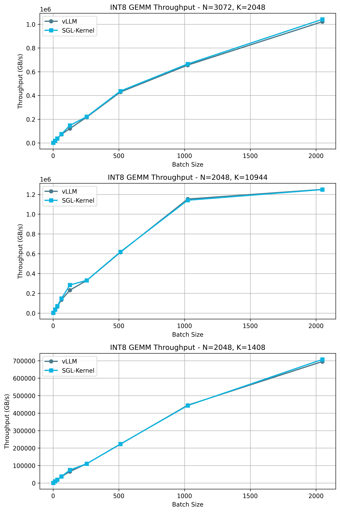
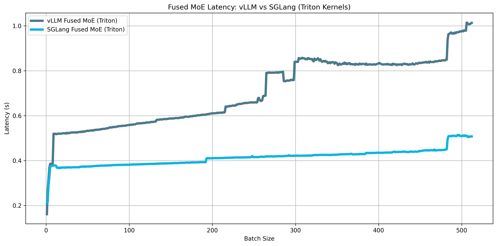

# DeepSeek V3 SGLang Optimizations

Continuing our technical series on DeepSeek V3 integration in SGLang, we want to discuss the various optimization strategies available for enhancing performance and efficiency. As an inference serving engine, SGLang interfaces with multiple components of the ML infrastructure stack, providing opportunities for optimization at different levels. Most of the optimizations comes in the form of flags for the `launch_server` CLI. These flags provide a convenient entry point into understanding the various performance enhancements that have been implemented over time in the SGLang ecosystem.

### Summary table of optimzations

| Optimization                              | Description / Benefit                                             | Related Flags / Notes                                              |
|------------------------------------------|-------------------------------------------------------------------|--------------------------------------------------------------------|
| **CUDA Graph Execution**                 | Reduces kernel launch overhead by replaying recorded CUDA ops     | `--cuda_graph_max_bs`, `--disable_cuda_graph`                      |
| **Torch Compile**                        | Applies kernel fusion, operator elimination, and graph optimizations | `--enable-torch-compile`, `--torch-compile-max-bs`             |
| **BF16 / FP8 BMM Kernels**               | Memory-efficient batch matmul with high accuracy                  | No flags (internal kernel optimization)                            |
| **NextN Speculative Decoding (EAGLE-2)** | Parallel speculative token generation with tree-based verification | `--speculative-algo`, `--speculative-draft`, `--speculative-*`     |
| **DP Attention for MLA**                | Enables data parallel attention for Multi-head Latent Attention   | `--enable-dp-attention`                                            |
| **Overlap Scheduler**                    | Overlaps CPU scheduling with GPU execution to reduce idle time    | `--disable-overlap-schedule`                                      |
| **FlashInfer MLA Optimization**          | Fused MLA operations for faster prefill and decoding              | `--enable-flashinfer-mla`                                          |
| **FP8 Accuracy Improvements**            | Blockwise/tilewise scaling, FP32 accumulation to reduce overflow  | No flags (handled inside kernel)                                   |
| **FP8 GEMM Kernel Tuning**              | Selects optimal block shapes per GPU for best FP8 performance     | Script: `quantizationtuning_block_wise_fp8.py`                     |
| **FP8 GEMM (CUTLASS Kernel)**            | Efficient fused quantization and matrix multiplication            | No flags (kernel-level implementation)                             |
| **Fused MoE Kernel + Tuning**            | Faster Mixture of Experts with custom SGLang kernel tuning        | Script: `tuning_fused_moe_triton.py`                               |


## Kernel Execution Optimizations


#### Related flags:

```bash
--disable_cuda_graph: # Disable cuda graph.
--cuda_graph_bs: # The batch sizes to capture by `CudaGraphRunner`.
--cuda_graph_max_bs: # Adjust the maximum batchsize when using cuda graph.
--enable-torch-compile: # Enable torch.compile compilation of the cuda graphs captured.
```

#### **Context:**

Both the [Cuda graph](https://pytorch.org/blog/accelerating-pytorch-with-cuda-graphs/) and [`torch.compile`](https://pytorch.org/tutorials/intermediate/torch_compile_tutorial.html) flags deal with improving the efficiency of kernel operations. CUDA graphs significantly reduce kernel launch overhead by recording and replaying sequences of CUDA operations as a single unit, eliminating the per-kernel launch costs during inference. Meanwhile, `torch.compile` employs kernel fusion, operator elimination, and specialized kernel selection to optimize the computational graph. However, SGLang `torch.compile` can use either the Pytorch-generated graph or the Cuda graph to link the two optimizations.

#### **Commits:**

([Support CUDA graph for triton backend](https://github.com/sgl-project/sglang/pull/1401), [Support cuda graph for DP attention #2061](https://github.com/sgl-project/sglang/pull/2061))


#### **Benchmarks:**

```bash
$ python3 -m sglang.bench_one_batch --batch-size 1  --input 256
--output 32 --model deepseek-ai/DeepSeek-V3  --trust-remote-code  --tp 8
--torch-compile-max-bs 1 --disable-cuda-graph
--profile

$ python3 -m sglang.bench_one_batch --batch-size 1  --input 256
--output 32 --model deepseek-ai/DeepSeek-V3  --trust-remote-code  --tp 8
--torch-compile-max-bs 1 --cuda-graph-max-bs 1
--profile

$ python3 -m sglang.bench_one_batch --batch-size 1  --input 256
--output 32 --model deepseek-ai/DeepSeek-V3  --trust-remote-code  --tp 8
--enable-torch-compile --torch-compile-max-bs 1 --cuda-graph-max-bs 1
 
```

#### **Results:**


As expected, when stacking optimizations ( torch.compiler / cuda graphs + torch.compiler / torch.compiler(cuda graphs) + torch.compiler) we reduce total latency (`7.322 / 1.256 / 1.011 s`) and improve total throughput (`39.34 / 229.27 / 284.86 token/s`).

**Note:** Due to initial increase compute by torch.compiler compilations and cuda graphs not capturing prefill phase operations, we see a degradation in the prefill phase latency (`0.21180 / 0.25809 / 0.26079 s`) and throughput (`1208.67 / 991.92 / 981.64 token/s`)

### bf16 Batch Matrix Multiplication (bmm)

#### **Context:**

Batch matrix multiplications are the main workload performed in LLMs. As Deepseek v3 uses different quantized fp8 dtypes (float8_e5m2 and float8_e4m3fn) for its training, thus reducing the memory allocation, we test accuracy and latency for a random set of bmm with different combinations of dtypes for fp8 and base bf16. This optimization doesn’t rely on flags.

#### **Commits:** 

([fix fp8 for MLA and support bmm fp8 for DeepSeek V2](https://github.com/sgl-project/sglang/pull/1285), [Enable DeepseekV3 on AMD GPUs](https://github.com/sgl-project/sglang/pull/2601), [integrate bmm_fp8 kernel into sgl-kernel](https://github.com/sgl-project/sglang/pull/3056))

#### **Benchmarks:**

```bash
$ pytest -s test_bmm_fp8.py
```

* Results obtained with a modified versiong of `test_bmm_fp8.py`  

#### **Results:**



Similarity between results are nearly identical (cosine similarity = 1 identical) which denotes no loose on accuracy. While latency for fp8 is worse than bf16 due to casting compute. 

### Support nextn speculative decoding

#### **Related flags:**

```bash
--speculative-num-steps: # The number of steps sampled from draft model in Speculative Decoding.
--speculative-eagle-topk: # The number of token sampled from draft model in eagle2 each step.
--speculative-num-draft-tokens: # The number of token sampled from draft model in Speculative Decoding.
--speculative-draft: # Draft model to be used. It need the same tokenizer as verifier model (default: SGLang/DeepSeek-V3-NextN)
```

#### **Context:**

Speculative decoding accelerates inference by introducing a draft model (a smaller, faster model) that generates multiple tokens at once. A verification step then checks if these draft tokens match the predictions of the larger, more accurate LLM.

Its major flaw is that as naive speculative decoding generate a single linear sequence of draft tokens if even a single token in the sequence is rejected, all subsequent tokens are discarded, lowering the acceptance rate.

Sglang implementation of NextN is based on EAGLE-2 and SpecInfer:


With tree-based speculative decoding (SpecInfer and EAGLE-2) the predictions are organized as a tree, where each node represents a possible next token. With this approach we generate multiple speculative branches that can be parallely verified by the verifier LLM, increasing the acceptance rate.

EAGLE-2 key improvements are dynamic draft trees based on the context and pruning of the nodes based on confidence score of the draft model.

#### **Commits:** 

([[Track] DeepSeek V3/R1 nextn progress #3472,](https://github.com/sgl-project/sglang/issues/3472) [Support NextN (MTP) speculative decoding for DeepSeek-V3/R1 #3582](https://github.com/sgl-project/sglang/pull/3582),  [Support Eagle2 for Triton backend #3466](https://github.com/sgl-project/sglang/pull/3466), [Eagle speculative decoding part 4: Add EAGLE2 worker #2150](https://github.com/sgl-project/sglang/pull/2150))

#### **Benchmarks:**

No flags

```bash
python3 -m sglang.launch_server --model deepseek-ai/DeepSeek-V3 --tp 8 --trust-remote-code
python3 -m sglang.bench_serving --backend sglang --dataset-name random --random-input 256 --random-output 32 --random-range-ratio 1 --num-prompts 1 --host 127.0.0.1 --port 30000
```

`--speculative-algo NEXTN --speculative-draft SGLang/DeepSeek-V3-NextN --speculative-num-steps 2 --speculative-eagle-topk 4 --speculative-num-draft-tokens 4`

```bash
python3 -m sglang.launch_server --model deepseek-ai/DeepSeek-V3 --speculative-algo NEXTN --speculative-draft SGLang/DeepSeek-V3-NextN --speculative-num-steps 2 --speculative-eagle-topk 4 --speculative-num-draft-tokens 4 --tp 8 --trust-remote-code
python3 -m sglang.bench_serving --backend sglang --dataset-name random --random-input 256 --random-output 32 --random-range-ratio 1 --num-prompts 1 --host 127.0.0.1 --port 30000 
```

#### **Results:**


We achieve and overall improvement of general throughput (Request, input and output) and a important (x6) reduction on end-to-end latency.

## MLA

### TP+DP Attention

#### **Related flags:**

```bash
--enable-dp-attention: # Enable compatible MLA Data Parallelism.
```

#### **Context:**

Tensor parallelism (TP) works with MHA by splitting the kv cache by TP devices (usually 8) so each devices process 1/TP of the kv cache. [1]

If we apply this for Multi-head Latent Attention (MLA) and TP parallelism, each GPU splits the `kv cache` along the `head_num` dimension. However, MLA's `kvcache` has a `head_num` of `1`, making it impossible to split. Therefore, each GPU must maintain a complete `kvcache` → the `kvcache` gets duplicated per device.

When using DP (Data Parallelism) for MLA, it split according to requests, and the latent states caches of different requests are stored in different GPUs. e.g: We can’t divide the only kv cache, so we divide the data into batches and paralelize them into different workers performing different tasks (prefill, decode).

After MLA, an all-gather operation is performed, allowing each GPU to acquire all sequences' `hidden_state`. Then, after **MOE (Mixture of Experts)**, each GPU extracts its corresponding sequences using **slice** operations.


**Commits:** ([Support cuda graph for DP attention](https://github.com/sgl-project/sglang/pull/2061), [Support multinode DP Attention](https://github.com/sgl-project/sglang/pull/2925), [Multi-node Tensor Parallelism](https://github.com/sgl-project/sglang/pull/550), [Support DP MLA](https://github.com/sgl-project/sglang/pull/1970))

#### **Benchmarks:**

No flags

```bash
# Launch server with profiler env
export SGLANG_TORCH_PROFILER_DIR=/sgl-workspace/profiler_env_folders/ # Optional for profiling
python3 -m sglang.launch_server --model deepseek-ai/DeepSeek-V3 --tp 8 --trust-remote-code

# Prefill
python3 -m sglang.bench_serving --backend sglang --dataset-name random --random-input 512 --random-output 1 --random-range-ratio 1 --num-prompts 10000 --host 127.0.0.1 --port 30000 
# Decode
python3 -m sglang.bench_serving --backend sglang --dataset-name random --random-input 1 --random-output 512 --random-range-ratio 1 --num-prompts 10000 --host 127.0.0.1 --port 30000
```

`—enable-dp-attention`

```bash
# Launch server with profiler env
export SGLANG_TORCH_PROFILER_DIR=/sgl-workspace/profiler_env_folders/
python3 -m sglang.launch_server --model deepseek-ai/DeepSeek-V3 --tp 8 --trust-remote-code --enable-dp-attention

# Prefill
python3 -m sglang.bench_serving --backend sglang --dataset-name random --random-input 512 --random-output 1 --random-range-ratio 1 --num-prompts 10000 --host 127.0.0.1 --port 30000
# Decode
python3 -m sglang.bench_serving --backend sglang --dataset-name random --random-input 1 --random-output 512 --random-range-ratio 1 --num-prompts 10000 --host 127.0.0.1 --port 30000
```

#### **Results:**



As it is a scheduler paradigm, it performs better when using large batch sizes, if not the overhead added is bigger than the actual data parallelization.

For larger batch sizes (in this case 10000), we see an overall improvement in both prefill and decode phases. From end-to-end latency, overall throughput and concurrency.

### Support overlap scheduler with DP Attention


#### **Related flags:**

```bash
--disable-overlap-schedule: # Disable the Overhead-Scheduler
```

#### **Context:**

We can overlap the CPU scheduling with the GPU computation. The scheduler runs one batch ahead and prepares all the metadata required for the next batch. By doing this, we can keep the GPUs always busy and hide expensive overheads such as the radix cache operations. 


#### **Commits:** 

([Faster overlap scheduler](https://github.com/sgl-project/sglang/pull/1738), [Enable overlap by default](https://github.com/sgl-project/sglang/pull/2067),  [Enable overlap scheduler by default for the triton attention backend](https://github.com/sgl-project/sglang/pull/2105))

#### **Benchmarks:**

`--disable-overlap-schedule`

```bash
python3 -m sglang.launch_server --model deepseek-ai/DeepSeek-V3 --tp 8 --trust-remote-code --disable-overlap-schedule
python3 -m sglang.bench_serving --backend sglang --dataset-name random --random-input 256 --random-output 32 --random-range-ratio 1 --num-prompts 10000 --host 127.0.0.1 --port 30000
```

No flags → enable overlap scheduler

```bash
python3 -m sglang.launch_server --model deepseek-ai/DeepSeek-V3 --tp 8 --trust-remote-code

python3 -m sglang.bench_serving --backend sglang --dataset-name random --num-prompts 2500 --random-input-len 1024 --random-output-len 1024 --random-range-ratio 1
```

#### **Results:**


We see a general reduction in latency: End to end (standard:`1080152.26s`| overlap: `1066166.84s`), Time per Output Token (standard:`348.10s`| overlap: 196.79s`) and inter-token latency (standard:`350.62s`| overlap: 197.96s`) although Time to first token presents a degradation result of the scheduling overhead (standard: `724050.93s`| overlap: `864850.926s`).

With larger request sizes for inputs and outputs the effect of the overlap scheduler will be even more noticeable.

### FlashInfer prefill and MLA decoding

#### **Related flags:**

```bash
--enable-flashinfer-mla: # Enable FlashInfer MLA optimization
```

#### **Context:**

FlashInfer backend instead of triton.

#### **Commits:**
([Add fast decode plan for flashinfer mla,](https://github.com/sgl-project/sglang/pull/3987) [MLA prefill w/o weight absorption](https://github.com/sgl-project/sglang/pull/2349))

#### **Benchmarks:**

No flags

```bash
python3 -m sglang.launch_server --model deepseek-ai/DeepSeek-V3 --tp 8 --trust-remote-code
python3 benchmark/gsm8k/bench_sglang.py --num-shots 8 --num-questions 1319 --parallel 1319
```

```bash
Accuracy: 0.951
Latency: 77.397 s
Output throughput: 1809.790 token/s
```

With `--enable-flashinfer-mla`

```bash
python3 -m sglang.launch_server --model deepseek-ai/DeepSeek-V3 --tp 8 --trust-remote-code --enable-flashinfer-mla
python3 benchmark/gsm8k/bench_sglang.py --num-shots 8 --num-questions 1319 --parallel 1319
```

```bash
Accuracy: 0.948
Latency: 71.480 s
Output throughput: 1920.021 token/s
```


#### **Results:**



Due to FlashInfer fused operation, we obtain less latency and more output throughput for a nearly similar accuracy.

## FP8

### Improve the accuracy for FP8

#### **Context:**

Numerical overflow occurs when a value exceeds the representable range of a given numerical format (like FP8), causing incorrect or infinite values. In the context of FP8 quantization on Tensor Cores, overflow happens because FP8 has a very limited dynamic range. To prevent numerical overflow, values are scaled down before being quantizied using the max element of the matrix, although this makes it sensitive to outliers values. To avoid it, the Deepseek team propose a blockwise and tilewise scaling, in which each 128×128 submatrix of a weight matrix and each 1×128 subvector of an activation vector is scaled and quantized separately.

The FP8 GEMM accumulation on NVIDIA H800 Tensor Cores is limited to about `14 bits` of precision, which is significantly lower than FP32 accumulation precision. Thats why Deepseek uses a separate FP32 accumulator register using CUDA Cores thus mitigating the loss of accuracy. The dequantizing scaling factor is also applied to this FP32 accumulator.


#### **Commits:** 
([support blockwise fp8 matmul kernel #3267](https://github.com/sgl-project/sglang/pull/3267), [add unit test for block wise fp8#3156](https://github.com/sgl-project/sglang/pull/3156), [integrate blockwise fp8 kernel#3529](https://github.com/sgl-project/sglang/pull/3529), [[Track] DeepSeek V3/R1 accuracy](https://github.com/sgl-project/sglang/issues/3486))

#### **Benchmarks:**

```bash
python3 -m sglang.launch_server --model deepseek-ai/DeepSeek-R1 --tp 8 --trust-remote-code
python3 benchmark/gsm8k/bench_sglang.py --num-shots 8 --num-questions 1319 --parallel 1319
```
#### **Results:**


More output throughput, less latency, for same accuracy (`0.955` vs `0.957` on gsm8k).

### Tunning FP8 GEMM

#### **Context:**

SGLang employs FP8 blockwise quantization tuning to optimize performance for different GPUs. The implementation specifically benchmarks FP8 GEMM (General Matrix Multiplication) kernels across AMD and CUDA architectures, testing different block shapes to determine the most efficient configuration based on latency.

This approach ensures that blockwise quantization aligns with the optimal block size for GEMM operations, minimizing precision loss while maximizing computational efficiency. The computations are performed in FP8, but accumulation occurs in BF16 to maintain numerical stability before final output storage.

Key functions:

```bash
# fn: benchmark_config(A_fp8, B_fp8, As, Bs, block_size, config, out_dtype=torch.float16, num_iters=10)
A: torch.Tensor,     # Input matrix (FP8) - typically activations
B: torch.Tensor,     # Input matrix (FP8) - typically weights
As: torch.Tensor,    # Per-token-group scale factors for `A`
Bs: torch.Tensor,    # Per-block scale factors for `B`
block_size: List[int],  # Block size for quantization (e.g., [128, 128])
config: Dict[str, Any],  # Kernel configuration parameters
output_dtype: torch.dtype = torch.float16,  # Precision of output
```

```bash
# fn: tune(M, N, K, block_size, out_dtype, search_space):
M,N,K: int  # Shape of the matrix multiplication (M × K @ K × N → M × N)
block_size: int # Tuple defining blockwise quantization size ([block_n, block_k])
out_dtype: str # Output precision (e.g., float16, bfloat16)
search_space: List[dict{str,int}] # List of configurations to test (e.g., block sizes, number of warps).

# search_space example:
{
"BLOCK_SIZE_M": block_m,
"BLOCK_SIZE_N": block_n,
"BLOCK_SIZE_K": block_k,
"GROUP_SIZE_M": group_size,
"num_warps": num_warps,
"num_stages": num_stages,
}
```

#### **Commits:** 
([add tuning block wise fp8#3242](https://github.com/sgl-project/sglang/pull/3242))

#### **Benchmarks:**

```bash
$python3 benchmark/kernels/quantizationtuning_block_wise_fp8.py
```

#### **Results:**

Example of the optimal configuration for the kernel: `N=512,K=7168,device_name=NVIDIA_H200,dtype=fp8_w8a8,block_shape=[128, 128]`

```bash
[...]
{
    "2048": {
        "BLOCK_SIZE_M": 64,
        "BLOCK_SIZE_N": 64,
        "BLOCK_SIZE_K": 128,
        "GROUP_SIZE_M": 1,
        "num_warps": 4,
        "num_stages": 4
    },
    "3072": {
        "BLOCK_SIZE_M": 64,
        "BLOCK_SIZE_N": 64,
        "BLOCK_SIZE_K": 128,
        "GROUP_SIZE_M": 1,
        "num_warps": 4,
        "num_stages": 3
    },
    "4096": {
        "BLOCK_SIZE_M": 64,
        "BLOCK_SIZE_N": 128,
        "BLOCK_SIZE_K": 128,
        "GROUP_SIZE_M": 64,
        "num_warps": 4,
        "num_stages": 3
    }
}
```

For all batch sizes to be tuned and a given FP8 dtype, the script test and compare different model weights dimensions (N and K) to optimize FP8 GEMM block-wise quantization based on lowest latency. Obtaining the most optimal configuration per batch size for the block tiling dimension(`BLOCK_SIZE_M/N/K`), the group size (`GROUP_SIZE_M`) for then number of tiles grouped together improving the L2 cache usage, number of warps (`num_warps`) per thread block (i.e., per tile) and number of stages (`num_stages`) for block loading into shared memory as a prefetching. This enable an autotunning of the compute parameters for diferent configurations.

### FP8 GEMM CUTLASS implementation

#### Context:

The quantization operation can be fused into the FP8 matmul operation for efficiency. In `sgl-kernel/src/sgl-kernel/csrc/int8_gemm_kernel.cu` there is CUDA-accelerated implementation of integer 8-bit (int8) scaled matrix multiplication fused with W8A8 quantization.

#### **Commits:** 
([support w8a8 fp8 kernel with CUTLASS #3047](https://github.com/sgl-project/sglang/pull/3047) , [Support cutlass Int8 gemm #2752](https://github.com/sgl-project/sglang/pull/2752), [Support sm90 Int8 gemm#3035](https://github.com/sgl-project/sglang/pull/3035), [Blockwise Scaling for FP8 #1932 from NVIDIA/cutlass](https://github.com/NVIDIA/cutlass/pull/1932))

#### **Benchmarks:**

```bash
root@cluster-h200-02-f2:/sgl-workspace/sglang/sgl-kernel/benchmark# python3 bench_int8_gemm.py 
```
#### **Results:**




Benchmarks measure GB/s per batch size (another measure of throughput). Comparing vllm same kernel (int8 gemm) to sglang kernel we get more throughput for different batch sizes for different configurations (N and K).

**Note**: We tested this benchmark using DeepSeek-Coder-V2-Lite-Instruct as the code for Deepseek-v3 isn’t implemented in SGLang.

## MoE

### FusedMoE tuning for H200

Implements the fused computation for a Mixture of Experts (MOE) using token and expert matrices.
Multiplies `A @ B` (token × expert matmul) using top-k routing.
Supports:

- `fp16`, `bfloat16`, `fp8`, `int8` formats
- Weight/activation scaling via `A_scale`, `B_scale`
- Block-wise quantization
- Expert-wise routing via `expert_ids`

#### **Context:**

Custom SGLang kernels for fusedMoE, using vLLM as reference and baseline. Composed of: 

`tuning_fused_moe_triton.py`: A tool for tuning the `fused_moe_triton` kernel. Adapted from [vllm's benchmark_moe.py](https://github.com/vllm-project/vllm/blob/main/benchmarks/kernels/benchmark_moe.py), with added support for various model architectures.

`benchmark_vllm_vs_sglang_fused_moe_triton.py`: A tool for comparing the performance of fused MoE kernels between vllm and sglang implementations. Supports various model architectures and data types.

`benchmark_torch_compile_fused_moe.py`: A tool for benchmarking the performance of the fused MoE kernel with `torch.compile` and original fused MoE kernel.

#### **Commits:** 
([Add unitest for fused_moe](https://github.com/sgl-project/sglang/pull/2416), [MoE Expert Parallel Impl](https://github.com/sgl-project/sglang/pull/2203), [`benchmark/kernels/fused_moe_triton/README.md`](https://github.com/sgl-project/sglang/tree/main/benchmark/kernels/fused_moe_triton))

#### **Benchmarks:**

```bash
$ python3 benchmark/kernels/fused_moe_triton/tuning_fused_moe_triton.py --model deepseek-ai/DeepSeek-V3 --tp-size 8  --dtype fp8_w8a8 --tune
                                                                          
Writing best config to E=256,N=256,device_name=NVIDIA_H200,dtype=fp8_w8a8,block_shape=[128, 128].json...                                                                       
Tuning took 5267.05 seconds
```

FusedMoE benchmarking sgl-kernel vs vllm:
```bash
python3 benchmark/kernels/fused_moe_triton/benchmark_vllm_vs_sglang_fused_moe_triton.py
[...]
benchmark sglang_fused_moe_triton with batch_size=505
benchmark vllm_fused_moe_triton with batch_size=506
benchmark sglang_fused_moe_triton with batch_size=506
benchmark vllm_fused_moe_triton with batch_size=507
benchmark sglang_fused_moe_triton with batch_size=507
benchmark vllm_fused_moe_triton with batch_size=508
benchmark sglang_fused_moe_triton with batch_size=508
benchmark vllm_fused_moe_triton with batch_size=509
benchmark sglang_fused_moe_triton with batch_size=509
benchmark vllm_fused_moe_triton with batch_size=510
benchmark sglang_fused_moe_triton with batch_size=510
benchmark vllm_fused_moe_triton with batch_size=511
benchmark sglang_fused_moe_triton with batch_size=511
benchmark vllm_fused_moe_triton with batch_size=512
benchmark sglang_fused_moe_triton with batch_size=512

fused-moe-performance:
[...]
     batch_size  vllm_fused_moe_triton  sglang_fused_moe_triton
505       506.0               1.014688                 0.507488
506       507.0               1.011744                 0.509344
507       508.0               1.007200                 0.504288
508       509.0               1.007232                 0.505696
509       510.0               1.007792                 0.507712
510       511.0               1.011072                 0.507248
511       512.0               1.012992                 0.507840
````

#### Results:

We perform the tunning for the fused MoE kernel for Deepseekv3 with FP8 quantization, obtanining the optimal configuration for each batch size similar to when tunning FP8 GEMM:

> for the block tiling dimension(`BLOCK_SIZE_M/N/K`), the group size (`GROUP_SIZE_M`) for then number of tiles grouped together improving the L2 cache usage, number of warps (`num_warps`) per thread block (i.e., per tile) and number of stages (`num_stages`) for block loading into shared memory as a prefetching.

```bash
[...]
"2048": {
        "BLOCK_SIZE_M": 64,
        "BLOCK_SIZE_N": 128,
        "BLOCK_SIZE_K": 128,
        "GROUP_SIZE_M": 32,
        "num_warps": 4,
        "num_stages": 3
    },
    "3072": {
        "BLOCK_SIZE_M": 128,
        "BLOCK_SIZE_N": 64,
        "BLOCK_SIZE_K": 128,
        "GROUP_SIZE_M": 16,
        "num_warps": 4,
        "num_stages": 4
    },
    "4096": {
        "BLOCK_SIZE_M": 64,
        "BLOCK_SIZE_N": 128,
        "BLOCK_SIZE_K": 128,
        "GROUP_SIZE_M": 32,
        "num_warps": 4,
        "num_stages": 3
    }
```

We then compare the latency for the fused MoE kernel implementation of SGLang with the baseline implementation from vLLM obtaining a more refined version with almost costant latency when incrementing the batch size.



## References

- [sglang kernels test](https://github.com/sgl-project/sglang/tree/main/sgl-kernel/tests)

- [sglang kernels benchmarks](https://github.com/sgl-project/sglang/tree/main/sgl-kernel/benchmark)

- [[Feature] DeepSeek V3 optimization #2591](https://github.com/sgl-project/sglang/issues/2591)

- [Blog deepseek v3 techniques behind 10x efficiency](https://dataturbo.medium.com/key-techniques-behind-deepseek-models-10x-efficiency-1-moe-9bd2534987c8)

- [AI Compiler Sglang optimizations work](https://carpedm30.notion.site/02-19-2024-2nd-meeting)

- [lmsys sglang 0.4 data parallellism](https://lmsys.org/blog/2024-12-04-sglang-v0-4/#data-parallelism-attention-for-deepseek-models)

- [lmsys sglang 0.4 zero overhead batch scheduler](https://lmsys.org/blog/2024-12-04-sglang-v0-4/#zero-overhead-batch-scheduler)

- [spaces.ac.cn: MQA, GQA, MLA blog](https://spaces.ac.cn/archives/10091)

- [Tree-based speculative decoding paper](https://arxiv.org/pdf/2305.09781)

- [EAGLE2 Speculative decoding paper](https://arxiv.org/pdf/2406.16858)

- [DeepSeek v3 paper](https://arxiv.org/pdf/2412.19437)

- [Zhihu blogs: EAGLE: Speculative Sampling Requires Rethinking Feature Uncertainty](https://zhuanlan.zhihu.com/p/687404563)

- [Zhihu blogs: MLA tp and dp](https://zhuanlan.zhihu.com/p/25573883266)

- [Zhihu blog: MLA tp and dp part 2](https://zhuanlan.zhihu.com/p/15280741714)[1]

- [Colfax deepseekv3 fp8 mixed precision training](https://research.colfax-intl.com/deepseek-r1-and-fp8-mixed-precision-training/)

  
