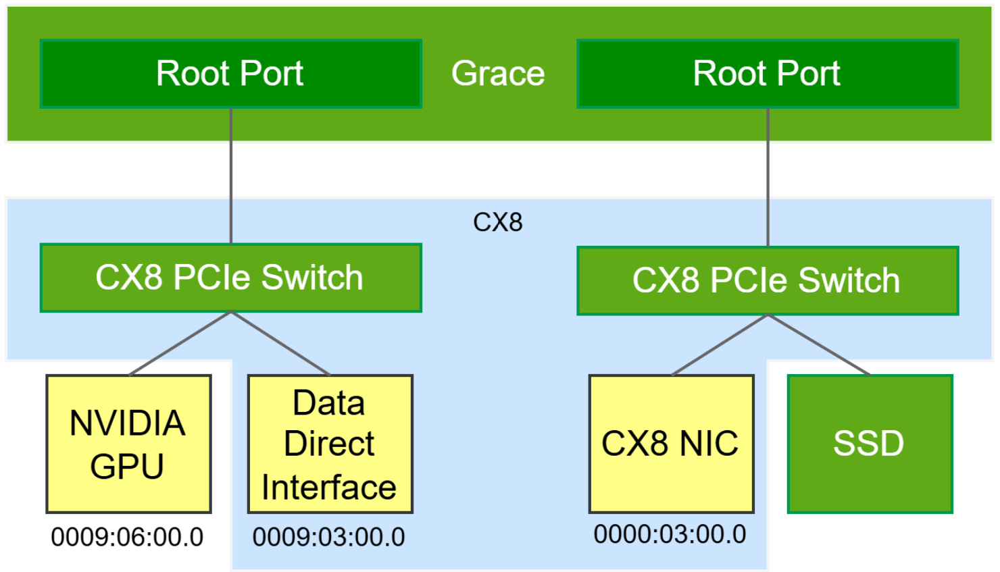

# Per-GPU Specifications

Each Blackwell GPU superchip configuration is 1 Grace CPU | 2 Blackwell GPU.

**Performance numbers without sparsity** (divide by 2):

| **Technical Specifications**         |                             |                      |                         |                      |
| ------------------------------------ | --------------------------- | -------------------- | ----------------------- | -------------------- |
| **Feature**                          | **GB300**                   | **GB200**            | **B300**                | **B200**             |
| **FP4**                              | **15 PFLOPS**               | 9 PFLOPS             | 14 PFLOPS               | 9 PFLOPS             |
| **FP8**                              | **5 PFLOPS**                | 4.5 PFLOPS           | 4.5 PFLOPS              | 4.5 PFLOPS           |
| **INT8**                             | **0.165 POPS**              | 4.5 POPS             | 0.15 POPS               | 4.5 POPS             |
| **FP16/BF16**                        | **2.5 PFLOPS**              | 2.25 PFLOPS          | 2.25                    | 2.25 PFLOPS          |
| **TF32**                             | **1.25 PFLOPS**             | 1.1PFLOPS            | 1.1 PFLOPS              | 1.1PFLOPS            |
| **FP32**                             | **0.080 PFLOPS**            | 0.075 PFLOPS         | 0.075 PFLOPS            | 0.075 PFLOPS         |
| **Attention acceleration (SFU EX2)** | **10.7 TeraExponentials/s** | 5 TeraExponentials/s | 10.7 TeraExponentials/s | 5 TeraExponentials/s |
| **GPU Memory**                       | **279 GB HBM3E**            | 129 GB HBM3E         | 270 GB HBM3E            | 180 GB HBM3E         |
| **GPU Memory Bandwidth**             | **8 TB/s**                  | 7.7 TB/s             | 7.7 TB/s                | 7.7 TB/s             |
| **Max Thermal Design Power (TDP)**   | **1.4 kW**                  | 1.2 kW               | 1.1 kW                  | 1 kW                 |

All Blackwell GPUs have Fifth-Generation NVLink **1.8 TB/s** (900 GB/s unidirectional).

Key Differences Between NVIDIA GB300 and B200 GPUs (Per GPU)

- **Compute:** GB300 dense **FP4** performance is **66.67%** (15 vs 9 PFLOPS), FP8 **+11.1%** (5 vs 4.5 PFLOPS) and FP16/BF16 **+11.1%** (2.5 vs 2.25 PFLOPS) . TF32 is also slightly faster with speedup of **13.64%** (1.25 vs 1.1 PFLOPS).
- **Memory capacity and bandwidth:** GB300 memory is **55%** bigger compare to B200 (**279 vs 180 GB**) and HBM bandwidth (**8 vs 7.7 TB/s**, +3.9%).
- **Power headroom and clocks:** GB300 has **40%** higher max GPU TDP (**1.4 kW vs 1 kW**,), which increases headroom to sustain higher SM/Tensor-Core clocks during long GEMM-heavy phases.
- **The B200 SFU Problem:** In B200 the number of SMs on a single die was reduced to 80, thus the performance of the SFU (Special Function Unit) paired with the CUDA cores was not enhanced. This tradeoff sacrifices GEMM performance against creating a compute bottleneck for Softmax in Attention. Blackwell Ultra increases SFU from 5 **10.7** TeraExponentials/s doubling B200 performance.

- **B200/B300/GB300 GEMM performance):** Part of the practical GEMM throughput gain from **B200 -> B300** (1.0 -> 1.1 kW) and further to **GB300** (1.4 kW) comes from power headroom that lets boost clocks stay higher for longer. GPUs are unable to sustain their peak clock speed due to power throttling thus increase in power does also translate in higher achievable performance.

Theoretical peak compute equation is:

$$
\mathrm{Peak\ FLOPS} = \mathrm{Tensor\ Cores} \times \mathrm{Peak\ Clock\ Speed} \times \mathrm{FLOPs\ per\ Tensor\text{-}Core\ instruction}
$$


## Rack-Aggregate Numbers

**Performance numbers without sparsity** (divide by 2):

| Metric | GB300 rack aggregate |
| --- | --- |
| FP4 | 1080 PFLOPS (**1.08 EFLOPS**) |
| FP8 | 360 PFLOPS |
| FP16/BF16 | 180 PFLOPS |
| FP32 | 3 PFLOPS |
| GPU memory | 20 TB |
| GPU memory bandwidth | 576 TB/s |
| NVLink bandwidth | 130 TB/s |
| Max GPU TDP | 100.8 kW |


## Grace CPU Unified Memory (Coherent / Fabric-Accessible)

GB300 NVL72 includes **36 Grace CPUs** and 72 GPUs (`2 GPUs per Grace CPU`), establishing a unified, coherent memory architecture via [NVLink-C2C](https://docs.nvidia.com/multi-node-nvlink-systems/multi-node-tuning-guide/overview.html#) interconnects. This design extends the GPU's addressable memory beyond local HBM3e, creating a capacity-optimized tier accessible across the fabric.

| Grace CPU memory metric | Rack value (GB300 NVL72) | Per Grace CPU (`/36`) | Notes |
| --- | --- | --- | --- |
| LPDDR5X capacity | 17 TB | ~0.472 TB (~472 GB) |  |
| LPDDR5X bandwidth | 14 TB/s | ~0.389 TB/s (~389 GB/s) |  |
| Rough per-GPU share of Grace BW | - | ~194 GB/s per GPU | assuming even split across `2 GPUs / Grace CPU` |

- Grace LPDDR5X bandwidth depends on capacity SKU, up to 512 GB/s for 120/240 GB configs, and up to 384 GB/s for 480 GB configs.
- GB300 NVL72 averages ~472 GB LPDDR5X per Grace CPU (`17 TB / 36`), which aligns with the 480 GB-class config.

The NVIDIA GB200 Grace CPU integrates ARM’s high-performance Neoverse V2 cores; however, the implementation does not use the V2 configuration with a 2 MB L2 cache per core, instead employing a reduced 1 MB L2 cache. Experimental evaluations have reported a materially higher rate of L1 cache misses on GB200 relative to comparable x86-based platforms (see Megatron [DeepSeek V3 Training on GB200 NVL72](https://github.com/NVIDIA/Megatron-LM/blob/dev/docs/discussions/deepseek-v3-gb200-optimization/deepseek-v3-gb200-optimization.md)). In addition, the GB200 **CX7** does not include an integrated PCIe switch. As a result, scale-out RDMA traffic must traverse the full Grace network-on-chip (NoC) and then cross the NVLink-C2C interconnect to reach the Blackwell GPU. Most of these problems are solved in the GB300 which uses [CX8](https://docs.nvidia.com/multi-node-nvlink-systems/grace-blackwell-cx8-gpudirect-rdma-guide/) and external PCIe switch.



# Multi-Node NVLINK NCCL

## all_reduce

Full rackscale NCCL run (18x nodes) from [nccl-tests](https://github.com/NVIDIA/nccl-tests):

```shell
OMPI_ALLOW_RUN_AS_ROOT=1 OMPI_ALLOW_RUN_AS_ROOT_CONFIRM=1 mpirun -H $(echo pod4-gb300-1-tray{01..18}-f3:4 | tr ' ' , ) --mca btl ^openib --mca btl_openib_warn_no_device_params_found 0 ./build/all_reduce_perf -e 16G -n 1000 -b 1G -f 2 -g 1

```


| Message Size (GB) | Count (elements) | Type | RedOp | Out-of-place time (us) | Out-of-place algbw (GB/s) | Out-of-place busbw (GB/s) | Out-of-place #wrong | In-place time (us) | In-place algbw (GB/s) | In-place busbw (GB/s) | In-place #wrong |
| --- | --- | --- | --- | --- | --- | --- | --- | --- | --- | --- | --- |
| 1 | 268435456 | float | sum | 2914.04 | 368.47 | 726.71 | 0 | 2917.91 | 367.98 | 725.75 | 0 |
| 2 | 536870912 | float | sum | 5253.87 | 408.74 | 806.13 | 0 | 5256.57 | 408.53 | 805.72 | 0 |
| 4 | 1073741824 | float | sum | 9972.94 | 430.66 | 849.36 | 0 | 9982.61 | 430.25 | 848.54 | 0 |
| 8 | 2147483648 | float | sum | 19176.2 | 447.95 | 883.45 | 0 | 19151.2 | 448.53 | 884.61 | 0 |
| 16 | 4294967296 | float | sum | 36878.3 | 465.85 | 918.77 | 0 | 36873.3 | 465.92 | 918.89 | 0 |

- Out-of-bounds values: `0` (OK)
- Average bus bandwidth: **`836.792 GB/s`**

# References

1. [(Zartbot) Inside Nvidia GPU: Discussing Blackwell's Limitations and Predicting Rubin's Microarchitecture #3](https://github.com/zartbot/blog/issues/3)
2. [White Paper, NVIDIA Blackwell Architecture Technical Brief, table 3. System Specifications, Per GPU specs](https://resources.nvidia.com/en-us-blackwell-architecture/blackwell-architecture-technical-brief?ncid=no-ncid)
3. [NVIDIA Blackwell Ultra Datasheet](https://resources.nvidia.com/en-us-blackwell-architecture/blackwell-ultra-datasheet?ncid=no-ncid)
4. [NVIDIA GB300 NVL72 Platform](https://www.nvidia.com/en-us/data-center/gb300-nvl72/)
5. [NVIDIA Grace Performance Tuning Guide](https://docs.nvidia.com/dccpu/grace-perf-tuning-guide/index.html)
6. [NVIDIA NVLINK Multi-Node Tuning Guide, NCCL](https://docs.nvidia.com/multi-node-nvlink-systems/multi-node-tuning-guide/nccl.html)
7. [Introducing NVFP4 for Efficient and Accurate Low-Precision Inference](https://developer.nvidia.com/blog/introducing-nvfp4-for-efficient-and-accurate-low-precision-inference/)
8. [NVIDIA DGX B300 Datasheet](https://resources.nvidia.com/en-us-dgx-systems/dgx-b300-datasheet)
9. [NVIDIA DGX B200 Datasheet](https://resources.nvidia.com/en-us-dgx-systems/dgx-b200-datasheet)
10. [Strangely, Matrix Multiplications on GPUs Run Faster When Given "Predictable" Data! (Horace He)](https://www.thonking.ai/p/strangely-matrix-multiplications)
