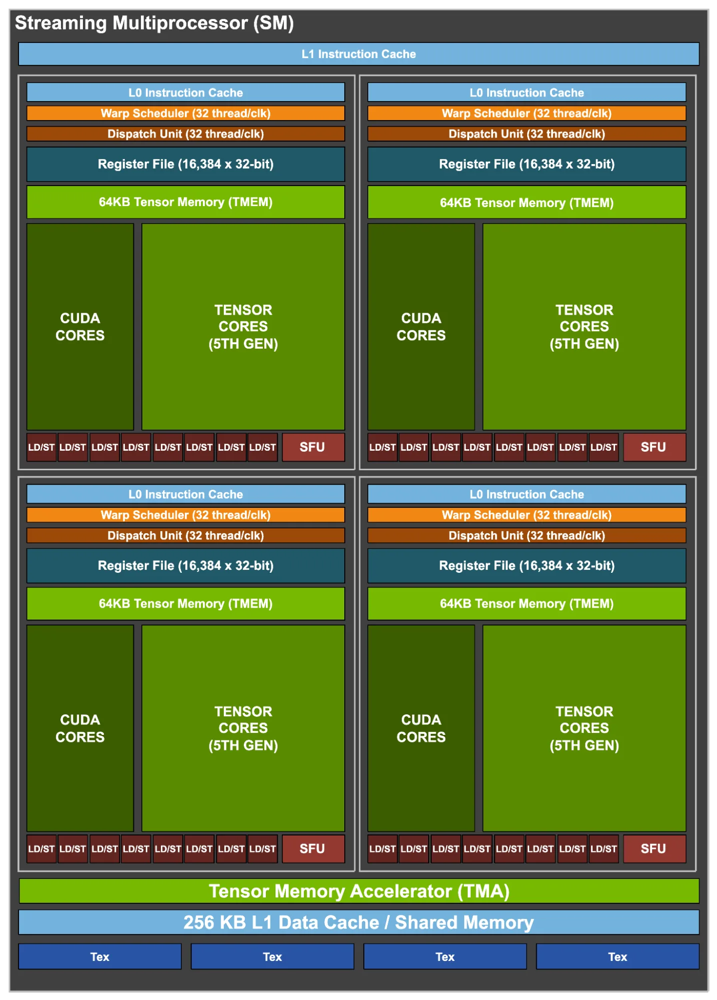
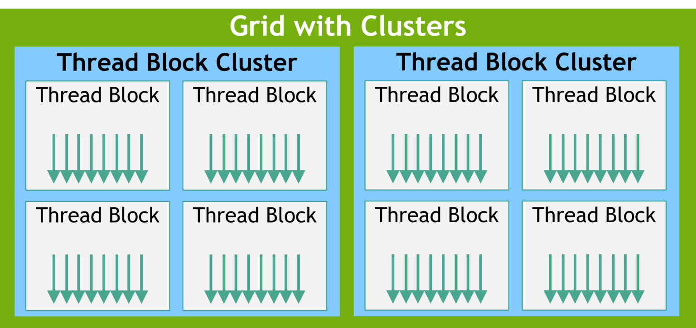

# Huang's Law, not Moore's Law

Moore's Law, traditionally described as the transistor count doubling about every two years, is slowing. As a result, the performance gains of a single GPU chip will eventually reach saturation. At the same time, demand for computing power is accelerating, which drives the need for more efficient GPUs. Jensen Huang, NVIDIA's CEO, notably observed that GPU capabilities have been advancing much faster than those of CPUs [Huang’s Law, https://en.wikipedia.org/wiki/Huang's_law]. As the semiconductor industry approaches the physical limits of transistor scaling, engineers increasingly focus on architecture, packaging, and circuit design to reduce the energy and area required for each computation, thereby improving performance per Watt and overall efficiency.

In this blogposts series, we will look into the latest NVIDIA NVFP4, a 4-bit floating point format introduced with NVIDIA Blackwell architectures. In Part 1, our goal will be to understand what is needed to make NVFP4 practical, while Part 2 will focus on how to write a GEMM kernel for B200 using CuTeDSL.

## Making Data Smaller

NVFP4 is an innovative 4-bit floating point format introduced with the NVIDIA Blackwell GPU architecture. NVFP4 builds on the concept of low-bit microscaling floating-point formats (MX Formats) [2] and enhances the OCP MXFP4 by introducing a different scaling pattern.

One of the crucial points to keep in mind when dealing with floating points is that we have to deal with a fixed budget: the number of bits used. To understand the tradeoffs introduced by this constraint, we must distinguish between three concepts that depend on how we allocate the bits of the representation:
- **Dynamic range**, controlled by the **exponent** (E) bits, determines the scale of the number we are trying to represent, aka how large or how small a number can be (e.g., from $10^{-45}$ to $10^{38}$). With more E bits, we can represent a wider range, reducing the risk of overflow or underflow. The dynamic range of an FP format can be quantified using binades. 
- **Precision**, controlled by the **mantissa** (M) bits, refers to the density of samples on the real number line $\mathbb{R}$.
- **Accuracy** measures the error between the stored number in the chosen representation and the actual real number.


> [!NOTE]
> **Measuring Dynamic Range with Binades**
> 
> A binade is one power of 2 of dynamic range, essentially how many binary numbers sharing the same sign and exponent bits fit between the smallest and largest representable values:
> 
> $$\text{binades} = \log_2\left(\frac{\text{max representable value}}{\text{min representable value}}\right)$$
> 
> | Format | Exponent Bits | Binades |
> |--------|---------------|---------|
> | FP32 | 8 | ~277 | Good for most computations |
> | FP16 | 5 | ~40 | Good for most activations |
> | BF16 | 8 | ~261 | Same FP32 range, but limited precision |
> | FP8 E4M3 | 4 | ~18 | Suitable for forward pass |
> | FP8 E5M2 | 5 | ~32 | Needed for backward pass |
> | FP4 E2M1 | 2 | ~3.6 | Needs additional tricks to work |
> 
> Going to 4 bits allows to get only 3.6 binades, which means it can't represent typical tensor value distributions, which often span 10-20 binades. This is precisely why block scaling becomes essential at 4-bit precision.


**Figure 1.** *The figure summarizes the different floating point formats discussed in this post. Chronologically: FP32, BF16, FP8 which usually uses just with a tensor-scale factor. The `MXFP*` formats use a 32-element block level `E8M0` (just the exponent of an FP32) scale factor, and finally NVFP4, which uses a combination of 16-element block-level fractional scaling `E4M3` and a full FP32 tensor-level scaling.*

As an example, if we want to represent $\pi$ with a fixed number of decimal digits we will end up with different approximations. We know that $\pi = 3.141592653\dots$, if we were limited with a budget of three digits we can have two choices:

1. $\hat{\pi}_1 = 3.141$, which has an absolute error of $|\pi - \hat{\pi}_1| \approx 0.00059$,
2. $\hat{\pi}_2 = 3.142$, which has an absolute error of $|\pi - \hat{\pi}_2| \approx 0.00041$.

Both approximations are using the same budget in terms of digits but they are achieving a different accuracy in representing the value we want to use in our computations.  
If we would like to use more digits, we could end up with more accurate representations but sometimes also less accurate even if more precise representations. Let's clarify with an example. If we use six digits we could for instance end up storing:

3. $\hat{\pi}_3 = 3.141543$, which has an absolute error of $|\pi - \hat{\pi}_3| \approx 0.00005$,
4. $\hat{\pi}_4 = 3.142738$, which has an absolute error of $|\pi - \hat{\pi}_4| \approx 0.00115$.

As we can see in Figure 2, the value we $\hat{\pi}_i$ try to capture a good approximation of the real value of $\pi$ and varying the budget for our representation we will end up with different solutions and tradeoffs.
This simple example shows clearly that the choice of numerical representation greatly affects the outcome of computations. 


**Figure 2.** *Illustration of precision vs. accuracy using different approximations of $\pi$. A more precise representation, e.g., more decimal digits here, does not necessarily mean higher accuracy (closer to the true value). The three examples show: `3.141` (low precision, moderate accuracy), `3.141543` (higher precision and accuracy), and `3.142738` (higher precision but lower accuracy than `3.141`).*


The real number line allows for infinite precision, but silicon and memory are finite. Using a floating point representation, we can sample the real line using three bit fields:

1. **Sign (S):** Positive or negative.
2. **Exponent (E):** The dynamic range (which power of 2 is used).
3. **Mantissa (M):** The precision (samples between powers of two).

The mathematical representation is defined as:

$$
\begin{equation}
N = (-1)^{S} \times 1.M \times 2^{E - \text{bias}}
\end{equation}
$$

Let's break down the formula:

- The sign bit (`S`) determines if the number is positive (`S = 0`) or negative (`S = 1`).
- The exponent (`E`) is an integer representing the power of 2, adjusted by the $\text{bias}$ term. The exponent gives us the dynamic range, meaning which slice of the real number line we are sampling.
- The mantissa (`M`) or significand is a binary number representing the precision; if the exponent gives us the scale, the mantissa tells us which sample we are taking from that slice of the real number line.
- The $\text{bias}$ is used to store the exponent in memory as an unsigned integer, allowing to simplify hardware complexity, improve performance, and reserve in a clean manner special values. To do so we store the exponent as $E + \text{bias}$, where $\text{bias} = 2^{e−1} − 1$ and $e$ is the number of bits we are using for the exponent. By doing so we can use the numbers with exponents with all zeros (`E = 0b0000..0`) and all ones (`E = 0b1111..1`) to represent zero and sub-normals and `NaN` and `inf` values.   


In normalized floating point representation, the significand always starts with an implicit leading `1` (this is why it's called "normalized"). The mantissa bits, e.g., `1001001000`, represent the fractional digits that come after this implicit `1`, forming the complete significand `1.1001001000` in binary. Each bit position corresponds to a negative power of 2: the first bit after the decimal point represents $2^{-1} = 0.5$, the second $2^{-2} = 0.25$, the third $2^{-3} = 0.125$, and so on.

When the exponent field is all zeros (`E = 0`), the number becomes subnormal (also called denormalized). Instead of an implicit leading `1`, subnormals use an implicit leading `0`, forming significands like `0.1001001000`.  The subnormal floats are a linearly spaced set of values, which span the gap between the negative and positive normal floats.
This provides a gradual underflow to zero rather than an abrupt jump and prevents underflows.

For FP32, the smallest normalized number is approximately $2^{-126}$ (with significand `1.0`). Subnormals fill the gap between zero and this value, with the smallest subnormal being approximately $2^{-149}$ (significand `0.00...01` with 23 mantissa bits).

```
Number Line Around Zero (FP32 example):

Exponent:    E=0 (subnormal)         E=1 (normalized)    E=2      E=3
             ├──────────────────────┼───────────────────┼────────┼─────────>
             |                      |                   |        |
             0                   2^-126              2^-125   2^-124

             * * * * * * * * *      *   *   *   *      *   *    *    *
             ^               ^      ^
             0.            2^-149  2^-126 (smallest normalized)
                      (smallest subnormal)
```

Without subnormals, any calculation producing a value smaller than $2^{-126}$ would immediately round to zero, causing abrupt precision loss. Subnormals smooth this transition by trading dynamic range (giving up the implicit leading `1`) for finer granularity near zero.


### Microscaling (MX) Formats

While DeepSeek-V3 demonstrates that FP8 is viable with careful engineering, the desire for efficiency pushed AI workloads toward even smaller formats like 6-bit or 4-bit. At these precisions, standard per-tensor scaling breaks down. A single large outlier in a tensor of millions of parameters can skew the quantization scale, effectively pushing all smaller values to zero.

To make this low-precision formats practical, a consortium of tech companies, including AMD, Arm, Intel, NVIDIA, and Qualcomm, aligned under the Open Compute Project (OCP) to introduce the specification of the Microscaling Formats [2].

The core idea is moving from per-tensor to per-block scaling. Instead of assigning one scaling factor to an entire tensor, the tensor is divided into small blocks (e.g., 32 elements), each with its own shared 8-bit scale exponent.  
How it works:
1. **Block grouping:** Elements are grouped into blocks of $k$ elements (typically $k=32$).
2. **Shared per-block scale:** The hardware finds the maximum absolute value in each block to determine a shared 8-bit exponent.
3. **Local quantization:** Individual elements are quantized to 4 bits relative to their block's scale.

A simple example (real blocks use 32 elements): Consider a block of 4 values: `[0.001, 0.002, 100.0, 0.003]`. With per-tensor scaling, the scale would be dominated by `100.0`, and the small values would all round to zero. With per-block scaling, if this block gets its own scale, the outlier only affects these 4 neighbors; the rest of the tensor remains well-quantized. 
This compartmentalization of numerical noise is the key breakthrough enabling training at 4-bit precision.

### NVFP4
Building on the MX foundation, NVIDIA developed NVFP4 for their Blackwell architecture, adding hardware-specific refinements to push the limits of low-bit training.  

NVFP4 is a 4-bit floating point format (`E2M1`):
- Sign: 1 bit
- Exponent: 2 bits
- Mantissa: 1 bit (plus one implicit)

With only **16 unique values** available in a 4-bit representation, careful scaling becomes critical. To put this in perspective: FP32 can represent ~4 billion distinct positive values; NVFP4 can represent 8, approximately -6 to 6. For example, the values in the range could include 0.0, 0.5, 1.0, 1.5, 2, 3, 4, 6 (same for the negative range).

While the OCP MX specification uses 32-element blocks, NVIDIA rely on a finer granularity: **16-element blocks**. By calculating the shared scale factor over fewer elements, NVFP4 confines outliers more tightly, i.e., a single spike distorts a smaller neighborhood, preserving fidelity in surrounding weights.


**Figure 5.** *A 16×32 matrix stored in NVFP4 format. Each block contains 16 contiguous FP4 elements (gray and green) with a shared FP8 scale factor (yellow). The largest magnitude element in each block (green) is scaled to the FP4 maximum representable value. A per tensor FP32 scale factor is also applied (not shown). Source [3].*

Hardware support is only half the story. Training a model in 4-bit precision without diverging into noise requires specific algorithmic interventions, as detailed in NVIDIA's paper "Pretraining Large Language Models with NVFP4" [3].

**1. 2D Block Scaling**  
Scaling is applied along both **row-wise** and **column-wise** dimensions for weight matrices (16×16 blocks). Why both? During forward pass, scaling happens along rows; during backward pass, tensors are transposed, so scaling happens along columns. Without 2D scaling, the same weight would have two different quantized representations, breaking the chain rule and degrading training quality.

**2. Random Hadamard Transform (RHT)**  
One of the biggest enemies of quantization is "outlier features"—specific neurons that consistently fire with massive values. These outliers can wreck the quantization scale for their entire block.  
The Random Hadamard Transform "smears" outlier information across the entire vector *before* quantization:
- **Before RHT:** One massive value, many small ones → hard to quantize
- **After RHT:** Many medium values → efficient quantization 

This mathematical operation redistributes energy so that no single element dominates the scale calculation.

**3. Stochastic Rounding (SR)**  
With very few bits, standard "round-to-nearest" creates systematic bias. Always rounding 0.4 down to 0 accumulates massive error over billions of operations.

NVFP4 uses **stochastic rounding**, which rounds probabilistically based on the distance to the nearest representable values:

$$\mathbb{E}[\text{Round}(x)] = x$$

$$
\text{Round}(x) = 
\begin{cases} 
    \lfloor x \rfloor & \text{with probability } 1-p \\ 
    \lceil x \rceil & \text{with probability } p
\end{cases}
$$

where $p = \frac{x - \lfloor x \rfloor}{\lceil x \rceil - \lfloor x \rfloor}$

This ensures that **on average**, the expected value of the rounded number equals the original. Over many operations, rounding errors cancel out rather than accumulate in one direction, allowing gradient descent to converge correctly despite the severe quantization.


**Figure 6.** *Illustration of the compute flow for an NVFP4 quantized linear layer. All GEMM operations quantize their inputs to NVFP4. Source [3].*


<!--
Now that we've described the amalgamation of mathematical tricks and floating points, we need to understand how these bits are supposed to move on the prescribed architecture. NVFP4 was introduced for the B100, B200 and B300 chips. 

History of NVDA GPU Architecture
* TensorCores 
* Shared Memory (SMEM) / Global Memory (GMEM)
* L1/L2 Cache
* DSM
* Tensor memoery through archictecute -> increase in bandwidth and inflith efficiency
```quote
"What I cannot create, I do not understand" Richard Feynman
```
-->

# GPU Architecture
A prerequisite for writing performant GPU kernels is to understand the hardware architecture inside the GPU and how data flows through it. A GPU is optimized for exactly two operations: arithmetic operations on data, and the movement/storage of that data between hierarchical memory pools. The efficiency of the former is bounded by transistor physics; the efficiency of the latter is bounded by the speed of light and wire capacitance. 

> [!NOTE]
> The following information is based on the Blackwell architecture of the B200 GPU, and all further mentions of 'GPU' refer to the B200. 
> When we speak about matrix multiplication, the operation we refer to has the form: 
`D = A * B` or `D = A * B + C`


# Movement of Data: Physical Hierarchy
The memory architecture of modern GPUs is a spatially organized response to the inverse relationship between latency and density in CMOS design. If they could, NVIDIA would place every compute unit adjacent to register-speed memory. Instead, contemporary GPUs pack 10^4-10^5 threads across 148 Streaming Multiprocessors (SMs) on 2 distinct dies, connected by a 10TB/s NV-HBI interconnect. The GPU places the fastest and smallest memory closest to compute hardware, and iteratively hosts larger but slower memory further away, maximizing aggregate throughput by minimizing latency.

The memory hierarchy in GPUs is organised as follows:

1) **Register File (RMEM)**: The fastest storage, placed adjacent to SMs. Each SM has 256KB of register files, summing to ~37.75MB across the entire GPU. Since each SM has the ability to host up to 64 warps (i.e., 2,048 threads), each thread has 128 bytes of register storage when the GPU is fully populated.

2) **Tensor Memory (TMEM)**: An update introduced to the Blackwell architecture, containing 256KB per SM of dedicated SRAM accessible by Tensor Cores (more on these later). These play an important role in GEMM, so visualizing them is crucial. They are 2D matrices, 512 columns and 128 rows, or lanes, of 32-bit cells. TMEM functions as a loading dock for matrix multiply accumulate (MMA) tiles. Their introduction abstracts away from hardware cache prediction and gives the ability to manually control access patterns of tensor tiles. TMEM allows matrix `A` to be located in TMEM or SMEM, matrix `B` must be in SMEM, and the accumulator must be in TMEM.

**Figure 3 - TMEM** Source [4].

3) **Shared Memory (SMEM)** and **L1 Cache**: Unified 256KB SRAM structure per SM. Percentages of how much data each structure has can be manually controlled.

4) **L2 Cache:** 192MB SRAM that is physically split across the dual-die boundary; each die maintains partitions local to its 74 SMs, with coherency traffic traversing the NV-HBI interconnect. 

5) **Tensor Memory Accelerator (TMA)**: Introduced in Hopper to offload address-generation from the register file via descriptor-based async copy; refined in Blackwell with second-generation sub-byte quantization (FP4/FP6 unpacking) and CTA-pair semantics. This change in Blackwell architecture facilitates thread blocks sharing distributed SMEM and executing cooperative MMA across paired SMs.

6) **VRAM (GMEM):** The largest but most distant and slowest memory tier in the hierarchy. For B200, it consists of 192GB of HBM3e stacked on the same substrate as the GPU dies. The GPU implements 8 memory stacks (4 per die), delivering an aggregate bandwidth of 8 TB/s.

# Computation of Data: Visualizing the bits flow
Excluding L2 and GMEM, the rest of the memory we describe above is placed inside the SM, which also houses the specialized compute units and optimized datapaths that allow for high-throughput matrix operations.


**Figure 1 - Look inside Blackwell SM** Source [5].

1) **Tensor Cores**: Tensor Cores are the fundamental parts of the GPU that facilitate MMA instructions on small tiles. NVIDIA introduced these hardware cores in 2017 to rival Google's 2016 release of their systolic array TPUs. 
The earliest Tensor Core, introduced in Volta architecture, was only able to handle FP16 data types and operate on matrices with size of 4x4x4. Moreover, it was not sparse and received data slowly from SMEM and register files. 
Four generations later, each iteration increased the computation-to-memory ratio and added support for smaller precision types. The 5th generation of Tensor Cores in Blackwell can handle low-precision FP4, use CTA pairs on a single SM, and include TMEM to reduce pressure on SMEM.

2) **Warp Schedulers**: A warp consists of 32 threads, and the scheduler issues instructions to all 32 per clock cycle.

3) **LD/ST Units**: Load/Store instructions that are responsible for moving the data. All active threads in a warp always issue the same type of instruction in the same clock cycle. If that instruction is a load or store, it gets issued to the LD/ST units. If a thread is inactive (due to looping or conditional execution), the corresponding LT/ST unit stays idle. 

<!--
**Figure 1. Thread blocks** Source [6].

blackwell tensorcores [7]

tensorcore architecture and big O notation [8]-->

## Links

1. https://openrouter.ai/state-of-ai
2. https://www.opencompute.org/documents/ocp-microscaling-formats-mx-v1-0-spec-final-pdf
3. https://arxiv.org/abs/2509.25149
4. https://docs.nvidia.com/cuda/parallel-thread-execution/index.html#tensor-memory-addressing
5. https://developer.nvidia.com/blog/inside-nvidia-blackwell-ultra-the-chip-powering-the-ai-factory-era/
6. https://research.colfax-intl.com/cutlass-tutorial-gemm-with-thread-block-clusters-on-nvidia-blackwell-gpus/
7. https://mp.weixin.qq.com/s?__biz=MzUxNzQ5MTExNw==&mid=2247493056&idx=1&sn=1c6025f97df16a3b9576746b7944538e&chksm=f995f502cee27c145677e91761ebec0d59cde82d4562c463070f2c72efb3751567bac934c266&scene=178&cur_album_id=2538479717163761664&search_click_id=#rd
8. https://mp.weixin.qq.com/s?__biz=MzUxNzQ5MTExNw==&mid=2247491424&idx=1&sn=0fc2110931b27714900e78d73b11a5b5&scene=21&poc_token=HOHnjWmj8OCvlO9eiSxuNJMDxVEsmgh7A4q_qNIq
