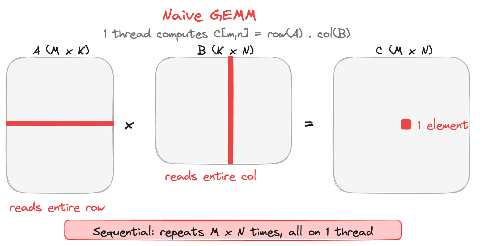
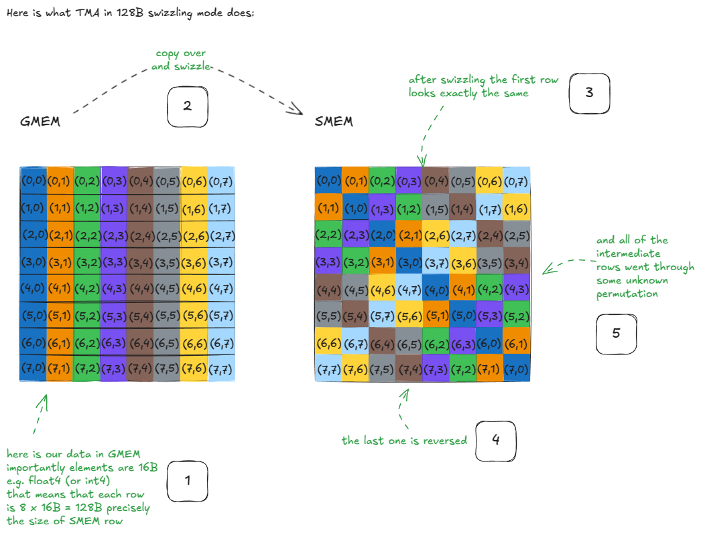
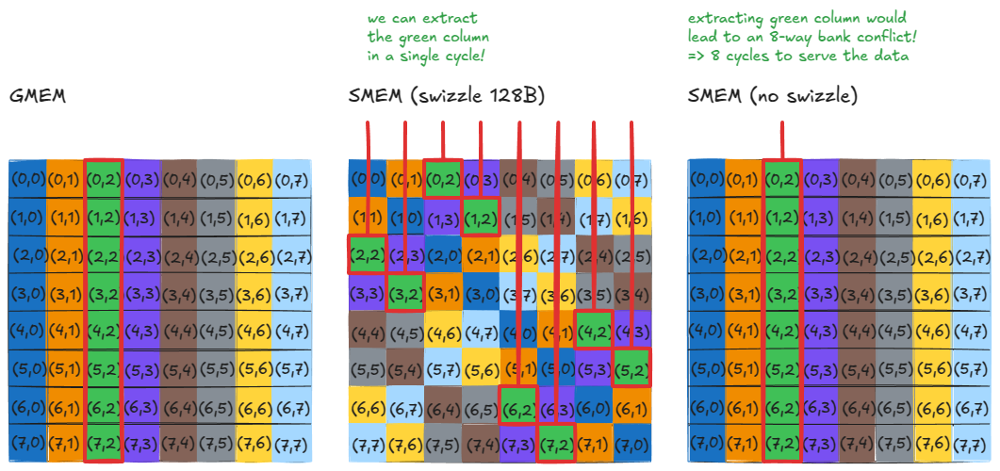
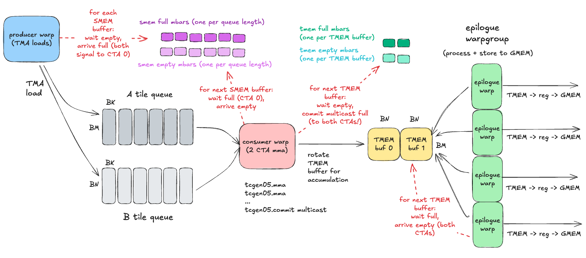
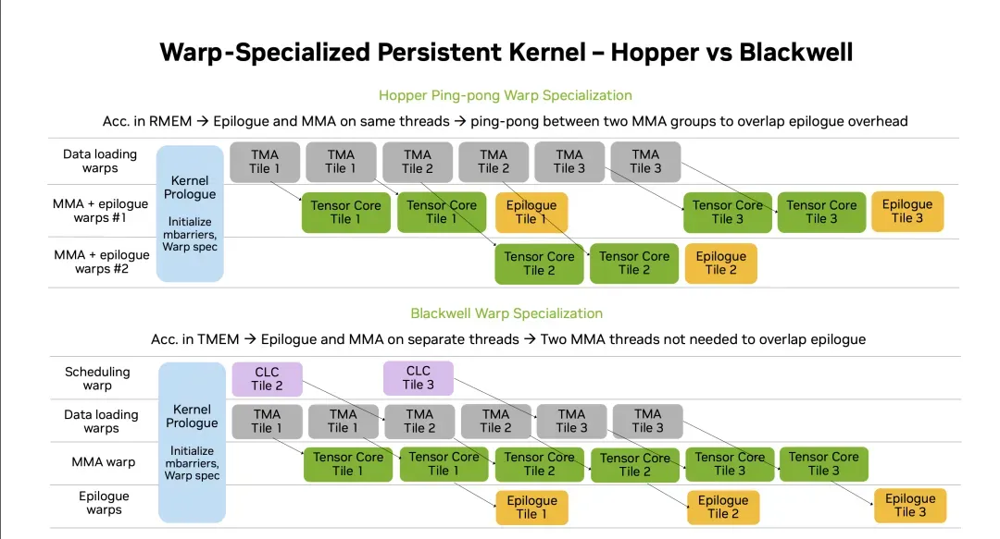

### Writing in CuTeDSL

This post walks through building an NVFP4 GEMM kernel for B200 in CuTeDSL, NVIDIA's Python frontend for CUTLASS. It starts from a textbook matrix multiply and adds one layer at a time: tiling for data reuse, swizzling for bank-conflict-free SMEM access, NVFP4 quantization for bandwidth compression, and the persistent warp-specialized pipeline that ties it all together. Each section shows the problem first, then the code that solves it.

1. Naive GEMM
2. Tiled GEMM, shared memory and data reuse
3. Swizzling
4. NVFP4 and scale factors
5. B200 2-CTA persistent GEMM pipeline

### Naive GEMM

Matrix multiplication of matrix A (shape MxK) and B (shape KxN) gives matrix C (shape MxN).

```python
@cute.kernel
def naive_gemm_kernel(A, B, C, M, N, K):
    """Naive GEMM kernel: C = A @ B"""
    for m in range(M):
        for n in range(N):
            acc = 0.0
            for k in range(K):
                acc += A[m, k] * B[k, n]
            C[m, n] = acc
```
This is slow and far from optimal, as you only have 1 thread working across the row of A and the column of B.



### Tiled GEMM
B200 has 148 SMs that can run many thread blocks in parallel, but the naive kernel has a deeper problem than single-thread serialization: every multiply-accumulate goes back to DRAM for both operands. Count the bytes — two FP32 loads (8 bytes) per FMA (2 FLOPs) is 0.25 FLOP/byte. Tensor cores want hundreds of FLOPs per byte of DRAM bandwidth, so the naive kernel is memory-bound by orders of magnitude before it ever reaches the compute units.

Tiling is the fix. A block moves a small slice of A and a small slice of B into fast on-chip **shared memory** (SMEM) once, then every thread in the block reuses those slices for many multiply-accumulates before going back to DRAM for the next slice. The K dimension is walked in chunks, streaming new tile pairs through SMEM while each thread accumulates partial sums in registers.

```python
@cute.kernel
def tiled_gemm_kernel(A, B, C, M, N, K, T):
    """Tiled GEMM with shared-memory reuse.
    Each block owns one T x T tile of C. For each T-wide chunk of K,
    the block cooperatively loads T x T tiles of A and B into SMEM,
    then every thread performs T multiply-accumulates against SMEM operands."""
    block_m, block_n, _ = cute.arch.block_idx()
    tx, ty, _ = cute.arch.thread_idx()  # thread owns C[block_m*T + tx, block_n*T + ty]

    m = block_m * T + tx
    n = block_n * T + ty

    # On-chip scratchpads: one tile of A and one tile of B
    smem_A = cute.make_shared_tensor(A.dtype, (T, T))
    smem_B = cute.make_shared_tensor(B.dtype, (T, T))

    acc = 0.0
    for k_tile in range(0, K, T):
        # Cooperative load: each thread brings in one element of each tile
        smem_A[tx, ty] = A[m, k_tile + ty]
        smem_B[tx, ty] = B[k_tile + tx, n]
        cute.arch.sync_threads()

        # All T^2 FMAs for this K-chunk source their operands from SMEM, not DRAM
        for k in range(T):
            acc += smem_A[tx, k] * smem_B[k, ty]
        cute.arch.sync_threads()

    C[m, n] = acc
```

Two things changed. Threads in a block now cooperate on one output tile instead of fighting independently for the DRAM bus, and operands live in SMEM between the load and the FMA. Count the reuse: each element of A lands in SMEM once per k_tile and is read by T threads (every thread in its M-row); each element of B is read by T threads (every thread in its N-column). The reuse factor is T. Arithmetic intensity scales linearly with T — for T = 32 in FP32, it rises from 0.25 to 8 FLOP/byte, a 32× jump. Real kernels push T much larger by having each thread compute a register-resident sub-tile of outputs rather than a single element, which is where tensor-core-shaped tiles start to matter.


This step also sets up what follows. The inner loop issues a stream of SMEM reads — every thread reads `smem_A[tx, k]` and `smem_B[k, ty]` for every `k` — and whether those reads run at full SMEM bandwidth or serialize into bank conflicts depends on how the tile is laid out across SMEM's banks. That is what swizzling controls.


### Swizzling

Swizzling is a shared-memory address remapping that reduces bank conflicts for matrix access patterns that mix row-wise and column-wise traffic.

Start with the behavior we want:
- Reading a row should stay simple and fast.
- Reading a column should also stay fast, instead of collapsing into one bank.

In unswizzled SMEM, column-style accesses often map many threads to the same bank. On a 32-bank design, that can create high conflict factors and serialize access. In practice, this can behave like an 8-way conflict for common tile shapes, which cuts effective bandwidth heavily.
 Source [1].

With swizzling enabled, those same column elements are redistributed across banks. You can think of the column as appearing diagonal in the swizzled layout. The key result is that each thread in a warp can hit a different bank in the same cycle, so row and column paths are both efficient.

 Source [1].

This is especially important for transpose-like behavior inside GEMM pipelines, where one stage may read row-major while a later stage needs column-major fragments. Without swizzling, the write or read side of that transpose path becomes a bank-conflict hotspot.

One practical note for Blackwell workflows:
> TMA (Tensor Memory Accelerator, a hardware unit that handles bulk copies between GMEM and SMEM) can handle unswizzling when data is moved back from SMEM to GMEM, so the global layout can remain canonical while local SMEM uses a conflict-friendly permutation.

At implementation level, the swizzle mapping is based on XOR over selected address bits. The high-level logic:
1. Pick a group of control bits from the address.
2. Shift them into the destination-bit positions.
3. XOR with the original address.
4. Use that transformed address for SMEM placement.

The XOR truth table is the only primitive needed:

`0 XOR 0 = 0`  
`0 XOR 1 = 1`  
`1 XOR 0 = 1`  
`1 XOR 1 = 0`

So when the mask has a `1` in a position, the corresponding destination bit flips.

For the smaller swizzle modes (`32B` and `64B`), the same XOR principle is used, but with fewer control bits. That changes which destination bits are mixed and therefore changes the final bank-distribution pattern.

Swizzling is easier to understand with very small CuTeDSL examples and explicit address traces. The key point is that the address mapping is still deterministic, so CuTeDSL layouts and TMA descriptors remain composable.

### NVFP4 and scale factors

At this point we have two separate goals that must both hold:
1. Represent values with very few bits to reduce bandwidth pressure.
2. Preserve local numerical structure so GEMM still converges during training.

NVFP4 handles this by splitting representation into two parts:
- Payload: FP4 `E2M1` values with limited range.
- Metadata: scale factors that restore local dynamic range.

This section uses a PyTorch quantizer as a conceptual reference model for that idea. It is not the exact hardware datapath, but it captures the same contract your kernel consumes: packed FP4 payload plus block-level scales.

| Component | Dtype | Granularity | Role |
| --- | --- | --- | --- |
| Payload | FP4 `E2M1` | per element | Stores compressed values |
| Local scale | FP8 `E4M3` | per 16-element block | Adapts to local outliers |
| Global scale | FP32 | per tensor | Normalizes whole tensor range |

The intuition behind two-level scaling:
- If you only use one global scale, a single outlier can zero out a large region after quantization.
- If you only use local scales, block-to-block calibration drifts and range management is harder.
- Combining both gives stable local fidelity with a bounded global operating range.

```python
import torch

FP8_AMAX = 448.0
FP8_DTYPE = torch.float8_e4m3fn

FP4_AMAX = 6.0
FP4_DTYPE = getattr(torch, "float4_e2m1fn_x2", torch.uint8)
# midpoints and the corresponding bins
# representable positives = [0.0, 0.5, 1.0, 1.5, 2.0, 3.0, 4.0, 6.0]
thresholds = [
    (5.0, 0b0110), (3.5, 0b0101), (2.5, 0b0100),
    (1.75, 0b0011), (1.25, 0b0010), (0.75, 0b0001), (0.25, 0b0000),
]


# x shape: (M, N/16, 16)
# - convert each fp32 value into 4 bits along with sign
# - pack 8x4bits into 1xint32 value: (M, N/16, 2) i.e. 64 bits
# - final view to uint8 (i.e. 2xfp4): (M, N/16, 8) i.e. 64 / 8 
def cvt_1xfp32_2xfp4(x: torch.Tensor):
    assert x.dtype == torch.float32

    bits = x.view(torch.int32)
    sign_bit = (bits >> 31) & 0x1

    x_abs = x.abs()
    # prevent double counting with alternate <= and <
    other_bits = torch.full_like(x_abs, 0b0111, dtype=torch.int)
    for i, (m, code) in enumerate(thresholds):
        mask = x_abs <= m if i % 2 == 0 else x_abs < m
        other_bits = torch.where(mask, code, other_bits)

    # each fp32 now as e2m1 (pack 8xfp4 values into 1xint32)
    e2m1 = (sign_bit << 3) | other_bits

    # shape here becomes (M, N/16, 2) as 2x int32
    e2m1x2 = (
        e2m1[..., ::8]
        | (e2m1[..., 1::8] << 4)
        | (e2m1[..., 2::8] << 8)
        | (e2m1[..., 3::8] << 12)
        | (e2m1[..., 4::8] << 16)
        | (e2m1[..., 5::8] << 20)
        | (e2m1[..., 6::8] << 24)
        | (e2m1[..., 7::8] << 28)
    )
    # shape becomes (M, N/16, 8) after view
    # 64 bits / 8 bits, so each element is 2x e2m1
    return e2m1x2.view(FP4_DTYPE)


# nvfp4 needs two scaling factors
# Global encoding scale (dtype: float32):
#   s_enc = 6 * 448 / amax_x    -> from calibration
#   s_dec = 1 / s_enc
# Local encoding scale (per 16-block, dtype: fp8 e4m3):
#   s_decb = amax_b / 6
#   scales = e4m3(s_decb * s_enc) -> save this
#   s_encb = s_enc / scales.float()
# Quant:
#   xi = q(xi * s_encb)
# q here packs 1xfp32 to 8xfp4
def quant_nvfp4_torch(x: torch.Tensor, global_scale: torch.Tensor = None):
    assert x.shape[-1] % 16 == 0
    
    batch_dim = tuple(x.shape[:-1])
    # (..., N/16, 16)
    x_blocks_f32 = x.unflatten(-1, (-1, 16)).float()

    q_dtype, q_dtype_max = FP4_DTYPE, FP4_AMAX
    s_dtype, s_dtype_max = FP8_DTYPE, FP8_AMAX

    if global_scale is None:
        global_scale = FP4_AMAX * FP8_AMAX / x_blocks_f32.abs().amax()

    # (..., N/16)
    s_decb = x_blocks_f32.abs().amax(dim=-1) / q_dtype_max
    xs = (s_decb * global_scale).clamp(
        -s_dtype_max, s_dtype_max
    ).to(s_dtype)

    # (..., N/16, 1)
    s_encb = (global_scale / xs.float().clip(1e-12)).unsqueeze(-1)
    x_blocks_f32 = x_blocks_f32 * s_encb
    xq = cvt_1xfp32_2xfp4(x_blocks_f32).reshape(*batch_dim, -1)

    return xq, xs, global_scale


if __name__ == "__main__":
    shape = (512, 128)
    x = torch.randn(shape, dtype=torch.bfloat16) * 0.01   # ML-scale activations

    xq, xs, global_scale = quant_nvfp4_torch(x)

    print(f">> Quantized tensor:  shape={tuple(xq.shape)}, dtype={xq.dtype}")
    print(f"   row 0, bytes [0:8] = {xq[0, :8].view(torch.uint8).tolist()}")
    print(f"   each byte packs 2 FP4 values; E2M1 alphabet = {{0, +/-0.5, 1, 1.5, 2, 3, 4, 6}}")

    print(f">> Blockwise scales:  shape={tuple(xs.shape)}, dtype={xs.dtype}")
    print(f"   row 0 = {xs[0].tolist()}")
    print(f"   one FP8 e4m3 scale per 16-element block -> 128/16 = 8 per row")

    print(f">> Global scale:      {global_scale.item():.2f}  (fp32, = FP4_MAX * FP8_MAX / amax(x))")
```
Reference code [2].

```terminal
$ uv run code/fp4.py
>> Quantized tensor:  shape=(512, 64), dtype=torch.float4_e2m1fn_x2
   row 0, bytes [0:8] = [108, 229, 121, 94, 85, 217, 160, 193]
   each byte packs 2 FP4 values; E2M1 alphabet = {0, +/-0.5, 1, 1.5, 2, 3, 4, 6}
>> Blockwise scales:  shape=(512, 8), dtype=torch.float8_e4m3fn
   row 0 = [224.0, 208.0, 224.0, 240.0, 288.0, 416.0, 416.0, 256.0]
   one FP8 e4m3 scale per 16-element block -> 128/16 = 8 per row
>> Global scale:      80956.23  (fp32, = FP4_MAX * FP8_MAX / amax(x))
```

The numbers line up with the calibration. `global_scale = 6 x 448 / amax(x)` is defined so the largest per-block scale lands near FP8 e4m3's max of 448 — using the fp8 range fully. Drop either tier and the contract breaks: one FP8 scale can't span the ~10^5 here, and one FP32 scale would force every block to share one calibration and lose local fidelity.

With the quantization contract in place, we can now read the full kernel pipeline.

Figure: Sketch of B200 persistent GEMM kernel with 2 CTAs. Source [3].

### B200 2-CTA persistent GEMM pipeline

The diagram above shows a persistent kernel, one where CTAs (cooperative thread arrays, CUDA's name for thread blocks) stay resident and pull new tiles instead of relaunching, organized as a three-part pipeline that runs continuously across K tiles. One group of warps handles data movement, one group runs matrix multiply-accumulate (MMA) work, and one group runs epilogue stores. The objective is overlap: while one tile is being computed, the next is loaded and the previous is written back.

The memory path is GMEM (global memory) → L2 → SMEM → TMEM (tensor memory, a Blackwell per-SM scratchpad for tensor core operands) → Tensor Core execution, then back through TMEM and registers or SMEM → GMEM for writeback. This path is especially important for NVFP4 because each tile carries both payload values and scale metadata. If either stream arrives late, tensor cores stall.

#### Block-Scaled FP4

Standard GEMM is C = A @ B. Block-scaled FP4 adds scale factors because 4-bit payload values do not carry enough dynamic range by themselves for stable training behavior.

The kernel input contract is a tuple of tensors `(a, b, sfa, sfb, c)`:

| Tensor | Shape | Layout | Dtype |
| --- | --- | --- | --- |
| `a` | `M x K x L` | K-major | NVFP4 `e2m1` |
| `b` | `N x K x L` | K-major | NVFP4 `e2m1` |
| `sfa` | `M x (K//16) x L` | K-major | FP8 `e4m3fnuz` |
| `sfb` | `N x (K//16) x L` | K-major | FP8 `e4m3fnuz` |
| `c` | `M x N x L` | output tensor | FP16 |

Problem-size constraints: `M` must be divisible by `mma_tiler_mn[0]`, `N` by `mma_tiler_mn[1]`, and `K` by `256`.

The speed-of-light reference is based on `max(FP4 Tensor Core throughput, DRAM throughput)` for B200 at `1.5 GHz`. The benchmark shapes are:

| M | N | K | L |
| ---: | ---: | ---: | ---: |
| 128 | 7168 | 16384 | 1 |
| 128 | 4096 | 7168 | 1 |
| 128 | 7168 | 2048 | 1 |

Values are grouped into blocks of 16, each with a scale factor:

```
C[i,j] = sum_k (A[i,k] * SFA[i,k//16]) * (B[j,k] * SFB[j,k//16])
```

SFA and SFB are the per-block correction terms that undo local quantization loss. This is the microscaling contract that the kernel must preserve all the way from layout creation to MMA issue.

#### Blackwell architecture and 2-CTA execution

This kernel uses 2-CTA mode for larger tiles. When the M tile is 256, two CTAs act as one unit in the mainloop.

Each CTA carries part of the tile state and part of the outputs. In this 2-CTA path, the effective MMA_M reaches 256 while BLOCK_M per CTA stays 128. MMA_N does not change and still goes up to 256. The main change is data ownership. Each CTA only needs to hold half of the B tile, and output ownership is also split across the pair.

On Blackwell, CTA clusters let two blocks cooperate directly. In this code, 2-CTA mode means those two CTAs share control of data movement and compute progress.

Operand access follows the cluster layout. Tensor cores in each CTA still consume their local A fragment, so computing one side does not require the peer A fragment. For B, each CTA can consume one half from local shared memory and the other half from peer CTA shared memory using the peer-CTA memory path defined by cluster semantics.

A single CTA has 1024 threads. With NVFP4, one CTA may not issue enough MMA work to hide TMA latency. Two CTAs increase concurrent MMA issue while still using one coordinated pipeline.

The two CTAs can split one output tile and use multicast TMA for shared inputs. For matrix A, one transfer can feed both CTAs, so you avoid duplicate global reads.

Warp roles change slightly in cluster mode. One side can own specific load-side responsibilities, while both sides run MMA on different output regions and synchronize through accumulator pipeline barriers.

In CuTeDSL, the 2-CTA topology is declared at kernel launch:

```python
# Define a 1x2 cluster: 1 CTA in M-dim, 2 CTAs in N-dim
cluster_layout = cute.make_layout((Int(1), Int(2)))  # (CTA_M, CTA_N)

# Inside the kernel, check cluster rank to assign work
cta_rank_in_cluster = cute.arch.cluster_rank()
is_cta_0 = (cta_rank_in_cluster == 0)
```

The TMA multicast mask uses this layout to determine broadcast targets:

```python
if self.is_a_mcast:
    # Multicast to all CTAs in the cluster (mask = 0b11 for 2-CTA)
    a_full_mcast_mask = cpasync.create_tma_multicast_mask(
        cluster_layout_vmnk, 
        block_in_cluster_coord_vmnk, 
        mcast_mode=2  # 2-CTA multicast
    )
```

Without cluster mode, you would need separate launches or explicit synchronization through global memory. With cluster mode, both CTAs stay resident in the same persistent K loop, so control overhead is lower.

#### Kernel architecture

This is a warp-specialized persistent tile scheduler. Six warps means 384 threads per CTA:

```python
self.epilog_warp_id = (0, 1, 2, 3)  # Warps 0-3: Epilogue (store results)
self.mma_warp_id = 4                 # Warp 4: Matrix multiply
self.tma_warp_id = 5                 # Warp 5: TMA loads
```
The code hard-partitions warp roles so data movement, compute, and epilogue can overlap instead of serializing.

Each warp has one job. TMA Warp loads A, B, SFA, and SFB from global memory to shared memory. MMA Warp runs matrix multiply on tensor cores. Epilogue Warps convert and store results to global memory.

Ampere introduced `cp.async`, an asynchronous copy that moves data from global to shared memory without staging through registers. Hopper introduced mbarrier (hardware memory barrier) coordination and async proxy semantics that made warp-specialized pipelines robust in software. Blackwell extends this model into the Tensor Core path and CTA cluster control, which makes persistent multi-stage GEMM pipelines more practical to schedule and sustain.



#### The pipeline

The pipeline is split into two synchronization domains. `ab_pipeline` controls producer-consumer handoff for SMEM tile buffers, and `acc_pipeline` controls handoff between MMA and epilogue for accumulator buffers.

Producer-consumer with multiple stages:

```
[TMA Loads] --> [SMEM Buffers] --> [MMA Compute] --> [TMEM Accum] --> [Epilogue Store]
     ^              |                    ^               |                   |
     |         ab_pipeline               |          acc_pipeline             v
     +------- (empty signal) ------------+                                [GMEM]
```

Data movement is orchestrated with producer and consumer warps using acquire-release semantics. In short, an acquire-release pair makes sure anything before release on producer side is visible to anything after acquire on consumer side. In the TMA path this means that once `mbarrier_wait()` finishes, subsequent shared-memory reads and MMA consumption see fresh tile data. 

`ab_pipeline` manages shared memory buffers with barrier synchronization. TMA signals full when done loading, and MMA signals empty when done consuming. Loads and compute overlap. `acc_pipeline` manages the accumulator in tensor memory between MMA and epilogue.

In the producer phase, a dedicated warp issues TMA transfers for A and B tiles and places them into SMEM queue slots. Each slot is reused, so correctness depends on a strict full-empty protocol. The producer waits until a slot is empty, issues the copy, and then marks the slot full. This queue provides lookahead depth, which allows data movement to run ahead of compute. In the compute phase, MMA warps wait for a full SMEM slot, then consume that tile and issue tcgen05 (Blackwell's 5th-generation tensor core ISA) MMA instructions. After consumption, the slot is returned to the producer by marking it empty. Accumulation is written into TMEM buffers using rotation across buffer slots. That rotation allows compute and epilogue to run concurrently on different accumulator buffers.

In the epilogue phase, epilogue warps wait until a TMEM accumulator buffer is marked full. They read accumulator fragments, apply output math, and store results to GMEM. When that buffer has been fully drained, epilogue marks it empty so the MMA phase can reuse it.

The barrier model has two independent lifecycles. SMEM barriers synchronize producer and compute over tile queues. TMEM barriers synchronize compute and epilogue over accumulator queues. In the 2-CTA setup, readiness signals can be multicast so paired CTAs observe consistent buffer state without duplicate control logic.

#### Persistent scheduling

Persistent scheduling keeps CTAs resident so each block pulls new work tiles instead of relaunching for every tile. This is important for long-K problems where launch overhead and barrier setup costs can accumulate.

Thread blocks stay resident and grab tiles until done:

```python
tile_sched = utils.StaticPersistentTileScheduler.create(...)
work_tile = tile_sched.initial_work_tile_info()

while work_tile.is_valid_tile:
    # Process current tile
    tile_sched.advance_to_next_work()
    work_tile = tile_sched.get_current_work()
```

This amortizes launch overhead.

#### The mainloop

This is the main path in the MMA warp. Most cycles here should either advance data readiness or issue tensor core work. Extra control overhead here shows up immediately as stalls in profiling.

MMA warp loops over K tiles:

```python
for k_tile in cutlass.range(k_tile_cnt, unroll_full=True):
    # Wait for A/B data in SMEM
    ab_pipeline.consumer_wait(ab_consumer_state, peek_ab_full_status)
    
    # Copy scale factors from SMEM to TMEM
    cute.copy(tiled_copy_s2t_sfa, tCsSFA_compact_s2t_staged, tCtSFA_compact_s2t)
    cute.copy(tiled_copy_s2t_sfb, tCsSFB_compact_s2t_staged, tCtSFB_compact_s2t)
    
    # MMA for each K block
    for kblock_idx in cutlass.range(num_kblocks, unroll_full=True):
        tiled_mma.set(tcgen05.Field.SFA, tCtSFA[sf_kblock_coord].iterator)
        tiled_mma.set(tcgen05.Field.SFB, tCtSFB_mma[sf_kblock_coord].iterator)
        
        cute.gemm(tiled_mma, tCtAcc, tCrA[kblock_coord], tCrB[kblock_coord], tCtAcc)
        
        tiled_mma.set(tcgen05.Field.ACCUMULATE, True)
    
    # Done with this SMEM buffer
    ab_pipeline.consumer_release(ab_consumer_state)
```

`cute.gemm` invokes Blackwell tensor core instructions with block-scaled inputs.

#### Memory layouts and TMA

This section connects quantization math to memory movement. If these layouts are wrong, the kernel can run fast and still compute the wrong result.

Scale factors need a permuted layout for tensor cores:

```python
# ((Atom_M, Rest_M), (Atom_K, Rest_K), RestL)
sfa_layout = blockscaled_utils.tile_atom_to_shape_SF(a_tensor.shape, sf_vec_size)
```

Multicast TMA broadcasts data to multiple CTAs:

```python
if self.is_a_mcast:
    a_full_mcast_mask = cpasync.create_tma_multicast_mask(
        cluster_layout_vmnk, block_in_cluster_coord_vmnk, mcast_mode=2
    )
```

The same A slice goes to multiple CTAs that compute different C columns.

#### Stage calculation

Stage count is the throughput dial for this kernel. Too few stages and TMA latency is exposed. Too many stages and shared memory pressure hurts occupancy or forces weaker epilogue buffering.

How many pipeline stages fit in shared memory:

```python
@staticmethod
def _compute_stages(...):
    ab_bytes_per_stage = (
        cute.size_in_bytes(a_dtype, a_smem_layout_stage_one)
        + cute.size_in_bytes(b_dtype, b_smem_layout_staged_one)
        + cute.size_in_bytes(sf_dtype, sfa_smem_layout_staged_one)
        + cute.size_in_bytes(sf_dtype, sfb_smem_layout_staged_one)
    )
    
    pos = (smem_capacity // occupancy - overhead) // ab_bytes_per_stage
    num_ab_stage = max(pos, 5)
```

More stages means more overlap and better hidden memory latency.

These branches are not cosmetic. They correct pointer/layout alignment for SFB metadata when tile geometry does not fit the default tensor core-friendly partition cleanly.

Special handling for tile sizes that do not divide evenly:

```python
if cutlass.const_expr(self.cta_tile_shape_mnk[1] == 192):
    offset = cutlass.Int32(2) if mma_tile_coord_mnl[1] % 2 == 1 else cutlass.Int32(0)
    shifted_ptr = cute.recast_ptr(
        acc_tmem_ptr + self.num_accumulator_tmem_cols + self.num_sfa_tmem_cols + offset,
        dtype=self.sf_dtype,
    )
    tCtSFB_mma = cute.make_tensor(shifted_ptr, tCtSFB_layout)
```

192 does not divide into tensor core tile sizes, so indexing gets creative.

#### The epilogue

Epilogue is a separate throughput stage, not just a final cast. It converts accumulator type, coordinates shared-memory staging, and issues TMA stores without blocking the MMA producer side.

Convert FP32 accumulators to FP16 and store:

```python
for subtile_idx in cutlass.range(subtile_cnt):
    # Load accumulator from TMEM to registers
    cute.copy(tiled_copy_t2r, tTR_tAcc_mn, tTR_rAcc)
    
    # Convert to output type
    acc_vec = tiled_copy_r2s.retile(tTR_rAcc).load()
    acc_vec = epilogue_op(acc_vec.to(self.c_dtype))
    tRS_rC.store(acc_vec)
    
    # Store to SMEM
    cute.copy(tiled_copy_r2s, tRS_rC, tRS_sC[(None, None, None, c_buffer)])
    
    # TMA store to global memory
    cute.copy(tma_atom_c, bSG_sC[(None, c_buffer)], bSG_gC[(None, real_subtile_idx)])
```

#### Overlapping accumulator

This optimization is used when TMEM capacity limits the kernel to a single accumulator stage. Releasing the buffer early after enough subtile data is drained lets MMA start the next tile sooner.

When N=256, only one accumulator stage fits in TMEM. Release it early:

```python
if cutlass.const_expr(self.overlapping_accum):
    if subtile_idx == self.iter_acc_early_release_in_epilogue:
        cute.arch.fence_view_async_tmem_load()
        acc_pipeline.consumer_release(acc_consumer_state)
```

Epilogue releases the accumulator as soon as it is copied out so MMA can start the next tile. This is sub-tile double buffering.

## Links

1. https://www.aleksagordic.com/blog/matmul
2. https://gist.githubusercontent.com/Maharshi-Pandya/fa92c0b01ab684a413c73237334c9d48/raw/1a6b9710a6cca41aaff183bfca518aecc24dfdd2/quant.py
3. https://danielvegamyhre.github.io/2026/02/02/cuda-gdb.html
