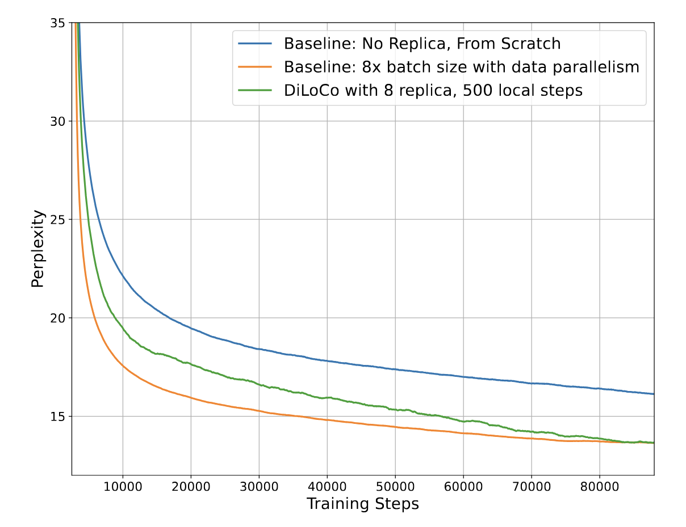
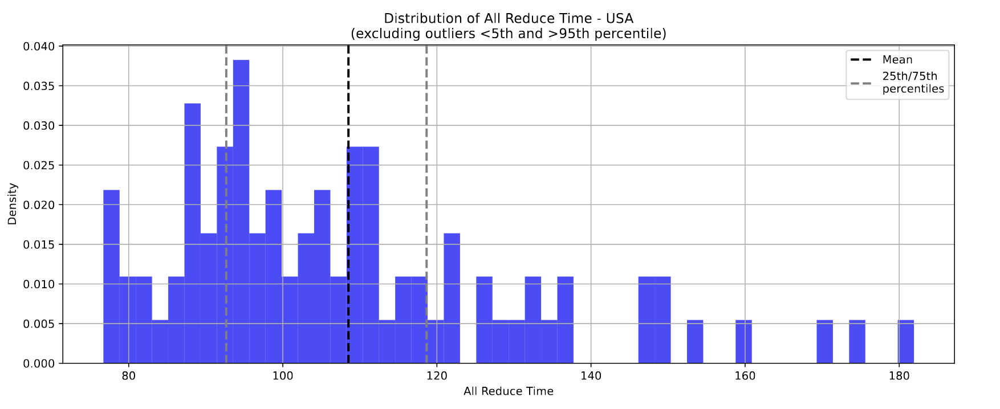
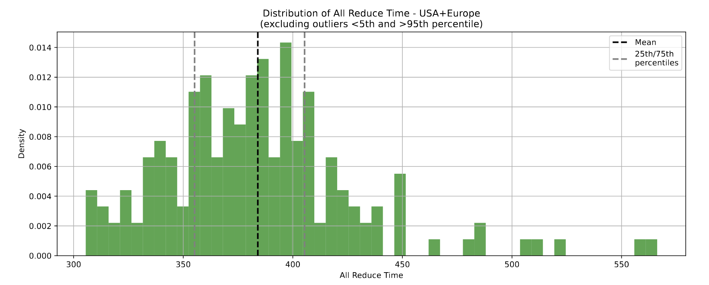
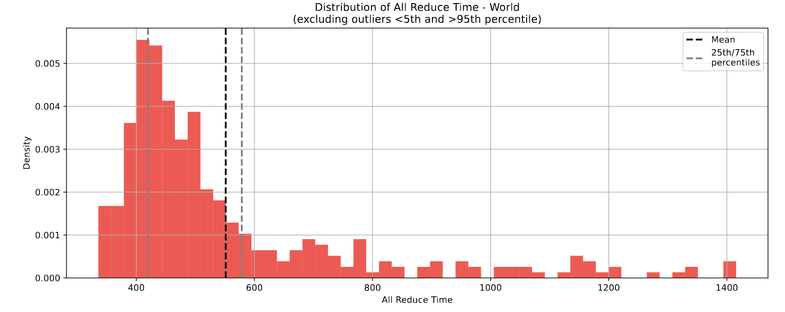
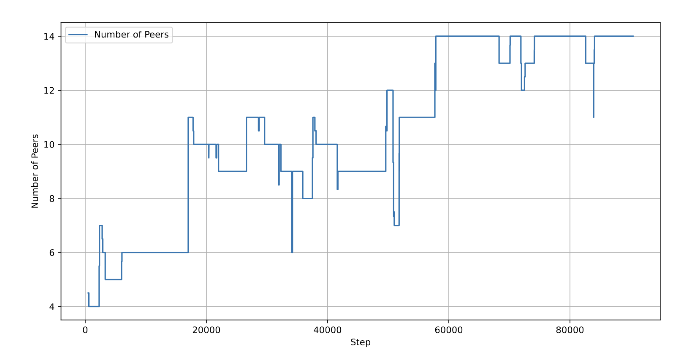

# PrimeIntellect: Geographically distributed training on multi-datacenter nodes

The proprietary nature of distributed training systems creates barriers for open-source initiatives. To address these, new training methodologies like [DiLoCo](https://arxiv.org/abs/2311.08105) have emerged, improving bandwidth efficiency and latency making geographically distributed training setups feasible.

We introduce the open-source collaborative effort from [PrimeIntellect](https://www.primeintellect.ai) on decentralized training of state-of-the-art models leveraging computational resources from geographically sparse far data centers.

# OpenDiloco

PrimeIntellect leverages [OpenDiloco](https://arxiv.org/abs/2407.07852), an adaptation of Google DeepMind’s DiLoCo, to enable large-scale training across geographically distributed systems. DiLoCo’s efficiency is based in **minimizing communication** overhead via [**local stochastic gradient descent (SGD)**](https://arxiv.org/abs/2401.09135). Each worker performs multiple local updates before synchronizing with the global model, significantly reducing bandwidth requirements.

DiLoCo’s efficiency is driven by a dual-optimizer framework:

- **Inner Optimizer:** Each worker uses the **AdamW** optimizer to perform **local updates** on its assigned data subset.
- **Outer Optimizer:** Periodically synchronizes global model weights across all workers using **pseudo-gradients**:

$$
\text{Pseudo-Gradient} = \theta^{(t)} - \theta^{(t+h)}
$$

- $\theta^{(t)}$: Global model weights before local updates (managed by the outer optimizer).
- $\theta^{(t+h)}$: Local model weights after $h$ local updates (updated by the inner optimizer).

The pseudo-gradient reflects the difference between globally synchronized weights and locally updated weights. Synchronization occurs only after every $h$ local steps.

To orchestrate the distributed communications over GPUs, PrimeIntellect introduces a framework over [Hivemind](https://github.com/learning-at-home/hivemind), resolving both NCCL network incompatibilities and custom training code that obstructs compatibilities out-of-the-box with training framework as HuggingFace or Pytorch Lighting. 

## Results

The baseline for the experimentation is the same configuration as DiLoCo original work except for using a LLama model instead of Chinchilla.

OpenDiLoCo’s main results on a 150m llama model (Figure 1 and Table 1) show that DiLoCo with 8 model replicas outperforms the baseline with no replicas and matches; with x500 less communication, the same baseline with x8 batch size using Data Parallelism (DP).

<figure>
    
    <figcaption style="text-align: center;">Figure 1: OpenDiLoCo’s main result. 150m llama model</figcaption>
</figure>

| Model                               |   Communication   | Time | Compute & Data | Perplexity |
| :---------------------------------- | :---------------: | :--: | :------------: | :--------: |
| Baseline, no replica, from scratch  |         0         |  1x  |       1x       |   16.17    |
| Baseline, 8 x batch size with DP    |       8 x N       |  1x  |       8x       |   13.68    |
| DiLoCo, 8 replicas, 500 local steps | 8 x $\frac{N}{H}$ |  1x  |       8x       | **13.73**  |

**Table 1:** Final Evaluation Perplexity Comparison.

## OpenDiloco: Global distributed training

A globally distributed training of 4 workers, each with 8xH100s in: Canada, **Finland**, and two in US performed a **1.1B** parameter **Llama** model training with $h = 500$ local steps and fp16-quantized gradients. This enables a significant reduction in communication time; the **all-reduce** bottleneck only accounts for **6.9%** of the training time, minimally impacting the overall training speed.

# PRIME framework and INTELLECT-1

PrimeIntellect’s PRIME framework extends OpenDiloco for robust distributed training. Key innovations include:

- Offloaded pseudo-gradient computation to the CPU, paired with an even int8 quantized ring-all-reduce kernel that significantly reduces communication bandwidth requirements. Overhead introduced by quantization processes is overlapped with communication overhead. Community is pushing for saving network bandwidth with reduced message size using quantized gradients (e.g. [Enabling Float8 All-Gather in FSDP2](https://dev-discuss.pytorch.org/t/enabling-float8-all-gather-in-fsdp2/2359)).
- ElasticDeviceMesh: Each node employs FSDP for local operations, leveraging high-bandwidth interconnects like NVLink or SXM to shard model parameters and optimizer states. Simultaneously, DiLoCo facilitates inter-node synchronization over IP-based communication channels. This reduces memory overhead compared to OpenDiLoCo's fully distributed approach.
- To resolve a distributed network of heterogeneous compute, where machines can show up and disappear dynamically, PRIME delivers a heartbeat mechanism for detecting and evicting failed nodes, as well as peer-to-peer checkpoint synchronization, which enables seamless integration of new nodes. Both blocking and non-blocking synchronization strategies are supported to balance stability and efficiency. PRIME also employs parallel TCP stores and retry mechanisms to handle communication failures and maintain consistency across nodes, ensuring that training remains resilient towards network variability and node outages.
- To ensure bandwidth performance between nodes, PRIME continuously measures and selects the optimal path based on maximizing the minimal bandwidth available between nodes (variation of the [Traveling Salesperson Problem](https://en.wikipedia.org/wiki/Travelling_salesman_problem)) , thus ensuring the slowest connection is the fastest possible.

## Results: Distributed training

A public training of a **10B**, LLama 3-based architecture, model across 8 datacenters between 3 continents was performed, with $h= 100$ local steps. Being the first successful training of a model of this scale across such geographically distributed compute resources with limited network bandwidth.

<figure>
    
    <figcaption style="text-align: center;">Figure 2: Locations of the nodes by all 30 compute contributors for INTELLECT-1. The lines between nodes illustrate the Ring-All-Reduce topology, spanning the whole globe from the US to Europe, Asia, and back to the US.</figcaption>
</figure>

### Compute efficiency analysis

By quantizing the pseudo-gradients to int8, communication requirements were reduced by a factor of 400x. **2 minutes** were required to **synchronize** the **outer** **optimizer** across the US and 10 for global synchronization thus resulting in **2-10% of the total training time** allocated to intra-node communication.

Table 2 shows that although MFU decreases and All-reduce communication time quickly increases, compute utilization is kept elevated. Compute Utilization refers to the proportion of time the training is not communicating with other nodes. The computation time for $h=100$ inner steps remains constant at 38 minutes.

| Scenario           | MFU (%) | Inner step time (min) | Median All-Reduce time, s | Compute Util (%) |
| ------------------ | :-----: | :-------------------: | :-----------------------: | :--------------: |
| Baseline (no comm) |  43.3   |          38           |             -             |       100        |
| USA                |  41.4   |          38           |            103            |       95.7       |
| USA + Europe       |  37.1   |          38           |            382            |       85.6       |
| Global             |  36.0   |          38           |            469            |       83.0       |

**Table 2:** Performance metrics for training across different geographical configurations. 

The all-reduce communication time increases with the geographical distance: the median is 103 seconds within the USA, 382 seconds for transatlantic communication, and 469 seconds in the global setting.

Figure 3 in blue: distribution for all-reduce completion time in USA. Showing a consistent time centered around 100 seconds. Tight distribution with minimal variance, compacted in a range from 80s to 180s.
<figure>
    
    <figcaption style="text-align: center;">Figure 3: Distribution of All Reduce Time (USA)</figcaption>
</figure>

Figure 4 in green: USA + Europe, with an increased time around the mean of 380 seconds. Shows a significantly greater time than USA only. A wider range of 300s to 600s with some outlines.
<figure>
    
    <figcaption style="text-align: center;">Figure 4: Distribution of All Reduce Time (USA+Europe)</figcaption>
</figure>
Figure 5 in red: Worldwide, showing high density around the 25th percentile, heavy right tail pointing to a greater number of outlines. The widest range from 350 to 1400s.

<figure>
    
    <figcaption style="text-align: center;">Figure 5: Distribution of All Reduce Time (world)</figcaption>
</figure>

These experiments revealed network instabilities across geographical distributions: Fluctuations in available bandwidth ranging from 500 Mb/s to 4 Gb/s, with latency spikes in intercontinental links and node dropouts due to transient network failures.

Figure 6 illustrates the capabilities of PRIME to handle dynamic node participation while maintaining training stability. Scaling from 4 to 14 nodes and enabling asymmetrical addition of new nodes and removal of failure or departed ones.

<figure>
    
    <figcaption style="text-align: center;">Figure 6: Number of active training nodes over training steps.</figcaption>
</figure>

# Conclusion

The feasibility of multi-datacenter training jobs has been demonstrated with techniques such as high-bandwidth inter-datacenter links, efficient gradient compression methods, and asynchronous training frameworks which have shown that geographically distributed training can achieve performance levels comparable to single-datacenter setups. These developments confirm that multi-datacenter training is not only practical but also advantageous in scenarios requiring scalability and fault tolerance.
As shown in this article, a bottleneck exists within proper network infrastructure. Datacrunch is well-positioned to contribute in this domain: by leveraging virtual datacenters composed of networks of physical datacenters across different European countries, as Finland and Iceland.

## References

1. [DiLoCo: Distributed Low-Communication Training of Language Models Arthur Douillard et al. (2024)](https://arxiv.org/abs/2311.08105)
2. [OpenDiLoCo: An Open-Source Framework for Globally Distributed Low-Communication Training (Jaghouar et al. (2024b))](https://arxiv.org/abs/2407.07852)
3. [INTELLECT-1 Technical Report Jaghouar et al. (2024)](https://arxiv.org/abs/2412.01152)
4. [INTELLECT-1 Release: The First Globally Trained 10B Parameter Model (blog)](https://www.primeintellect.ai/blog/intellect-1-release)
5. [Multi-Datacenter Training: OpenAI’s Ambitious Plan To Beat Google’s Infrastructure (semianalysis)](https://semianalysis.com/2024/09/04/multi-datacenter-training-openais/)
6. [PrimeIntellect-ai/prime](https://github.com/PrimeIntellect-ai/prime)
7. [PrimeIntellect-ai/OpenDiloco](https://github.com/PrimeIntellect-ai/OpenDiloco)
8. [DataCrunch EU GPU cloud making  the first cross-continental training of a 10B model (Johannes Hagemann)](https://x.com/johannes_hage/status/1847093852811022628)
