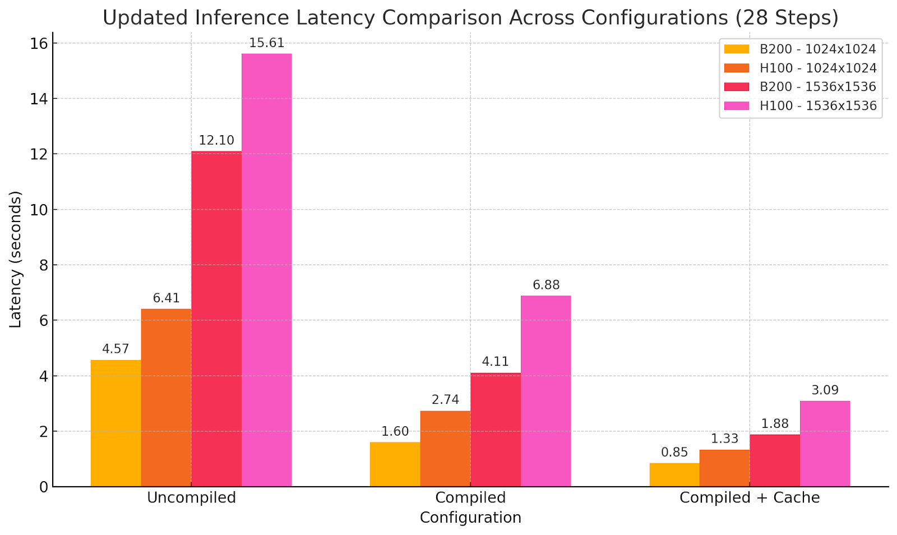

# FLUX on B200: Real-Time Image Inference with WaveSpeedAI + DataCrunch Collaboration

[WaveSpeedAI](https://wavespeed.ai/) has teamed up with EU cloud GPU provider [DataCrunch](https://datacrunch.io/) to achieve a breakthrough in generative image and video model deployment. By optimizing the open-weight [**FLUX-dev**](https://github.com/black-forest-labs/flux) model on DataCrunch’s cutting-edge NVIDIA [**B200**](https://www.nvidia.com/en-us/data-center/dgx-b200/) GPU, our collaboration delivers up to **6× faster** image inference [compared to industry-standard baselines](https://github.com/sayakpaul/diffusers-torchao). In this post, we provide a technical overview of the FLUX-dev model and the B200 GPU, discuss the challenges of scaling FLUX-dev with standard inference stacks, and share benchmark results demonstrating how WaveSpeedAI’s proprietary framework significantly improves latency and cost-efficiency. Enterprise ML teams will learn how this **WaveSpeedAI + DataCrunch** solution translates to faster API responses and significantly reduced cost per image – empowering real-world AI applications. *(WaveSpeedAI was founded by Zeyi Cheng, who leads our mission to accelerate generative AI inference.)*

*This blog is cross-posted to* [*WaveSpeedAI blog*](https://wavespeed.ai/blog)*.*

# FLUX-Dev: SOTA image generation model

[FLUX-dev](https://blackforestlabs.ai/announcing-black-forest-labs/) is a state-of-the-art (SOTA) open-source image generation model capable of text-to-image and image-to-image generation. Its capabilities include good world understanding and prompt adherence(thanks to the [T5](https://arxiv.org/abs/1910.10683) text encoder), style diversity, complex scene semantics and composition understanding. The model output quality is comparable to or can surpass popular close-source models like [Midjourney v6.0](https://updates.midjourney.com/version-6-1/), [DALL·E 3](https://cdn.openai.com/papers/dall-e-3.pdf) (HD) and [SD3-Ultra](https://arxiv.org/pdf/2403.03206). FLUX-dev has rapidly become the most popular image generation model in the open-source community, setting a new benchmark for quality, versatility, and prompt alignment.

FLUX-dev uses [flow matching](https://arxiv.org/abs/2210.02747), and its model architecture is based on a hybrid architecture of [multimodal](https://arxiv.org/abs/2403.03206) and [parallel](https://arxiv.org/abs/2302.05442) [diffusion transformer](https://arxiv.org/abs/2212.09748) blocks. The architecture has **12B parameters**, approximately 33 GB fp16/bf16. Therefore, FLUX-dev is computationally demanding with this large parameter count and iterative diffusion process. Efficient inference is essential for large-scale inference scenarios where user experience is crucial.

# NVIDIA’s Blackwell GPU architecture: B200

Blackwell architecture includes new features such as 5th-generation tensor cores (**fp8, fp4**), Tensor Memory (**TMEM**) and CTA pairs (**2 CTA**).

- **TMEM:** Tensor Memory is a new on-chip memory level, augmenting the traditional hierarchy of registers, shared memory (L1/SMEM), and global memory. In Hopper (e.g. H100), on-chip data was managed via registers (per thread) and shared memory (per thread block or CTA), with high-speed transfers via the Tensor Memory Accelerator (**TMA**) into shared memory. Blackwell retains those but adds **TMEM as an extra 256 KB of SRAM per SM** dedicated to tensor-core operations. TMEM doesn’t fundamentally change *how* you write CUDA kernels (the logical algorithm is the same) but adds new tools to **optimize data flow**. (see [ThunderKittens Now Optimized for NVIDIA Blackwell GPUs](https://www.together.ai/blog/thunderkittens-nvidia-blackwell-gpus#:~:text=There’s also a new layer,to 227KB of shared memory))
- **2CTA (CTA Pairs) and Cluster Cooperation:** Blackwell also introduces **CTA pairs** as a way to tightly [couple two CTAs on the same SM](https://www.together.ai/blog/thunderkittens-nvidia-blackwell-gpus#:~:text=stands for “Cooperative Thread Array%2C”,implementation of a thread block). A CTA pair is essentially a cluster of size 2 (two thread blocks scheduled concurrently on one SM with special sync abilities). While Hopper allows up to 8 or 16 CTAs in a cluster to share data via DSM, Blackwell’s CTA pair enables them to **use the tensor cores on common data collectively**. In fact, the Blackwell PTX model allows [**two CTAs to execute tensor core instructions that access each other’s TMEM**](https://www.together.ai/blog/thunderkittens-nvidia-blackwell-gpus#:~:text=stands for “Cooperative Thread Array%2C”,implementation of a thread block)**.**
- **5th-generation tensor cores (fp8, fp4):** B200 are notably much larger than H100 tensor cores, and faster, **~2–2.5x faster than the tensor cores in the H100**. High tensor core utilization is critical for achieving major new-generation hardware speedups (see [Benchmarking and Dissecting the Nvidia Hopper GPU Architecture](https://arxiv.org/abs/2402.13499)).

**Performance numbers without sparsity**

| **Technical Specifications** |              |                 |
| ---------------------------- | ------------ | --------------- |
|                              | **H100 SXM** | **HGX B200**    |
| **FP16/BF16**                | 0.989 PFLOPS | **2.25 PFLOPS** |
| **INT8**                     | 1.979 PFLOPS | **4.5 PFLOPS**  |
| **FP8**                      | 1.979 PFLOPS | **4.5 PFLOPS**  |
| **FP4**                      | NaN          | **9 PFLOPS**    |
| **GPU Memory**               | 80 GB HBM3   | **180GB HBM3E** |
| **GPU Memory Bandwidth**     | 3.35 TB/s    | **7.7TB/s**     |
| **NVLink bandwidth per GPU** | 900GB/s      | **1,800GB/s**   |

- [NVIDIA Blackwell Datasheet](https://resources.nvidia.com/en-us-blackwell-architecture/datasheet)
- [NVIDIA H100 Datasheet](https://resources.nvidia.com/en-us-tensor-core/nvidia-tensor-core-gpu-datasheet)

Operator level micro-benchmarking of GEMM and attention shows the following:

- BF16 and FP8 cuBLAS, CUTLASS **GEMM** kernels: up to **2x faster** than cuBLAS GEMMs on H100.
- **Attention:** cuDNN speed is **2x faster** than FA3 on H100.

The benchmarking results means the B200 is exceptionally well-suited for large-scale AI workloads, especially generative models requiring high memory throughput and dense computing.

# Challenges with Standard Inference Stacks

Running FLUX-dev on typical inference pipelines (e.g., PyTorch + Hugging Face Diffusers), even on high-end GPUs like H100, presents several challenges:

- **High latency** per image due to CPU-GPU overhead and lack of kernel fusion
- **Suboptimal GPU utilization** and idle tensor cores
- **Memory and bandwidth bottlenecks** during iterative diffusion steps

The optimization objectives of serving large-scale and cheap inference are **higher throughput and lower latency**, reducing the image generation cost.

# WaveSpeedAI’s Proprietary Inference Framework

WaveSpeedAI addresses these bottlenecks with a proprietary framework purpose-built for generative inference. Developed by founder Zeyi Cheng, this framework is our in-house high-performance inference engine optimized specifically for state-of-the-art diffusion transformer models such as **FLUX-dev** and [**Wan 2.1**](https://arxiv.org/abs/2503.20314). Key innovations in the inference engine include:

- **End-to-end GPU execution** eliminating CPU bottlenecks
- **Custom CUDA kernels** and **kernel fusion** for optimized execution
- **Advanced quantization and mixed precision (BF16/FP8)** using the Blackwell Transformer Engine, while maintaining the highest precision
- **Optimized memory planning and preallocation**
- **Latency-first scheduling mechanisms** that prioritize speed over batching depth

Xelerate follows an HW-SW co-design, fully utilizing the B200 GPU’s compute and memory capacity. It represents a significant leap forward in AI model serving, allowing us to deliver ultra-low latency and high-efficiency inference at the production scale.

We decompose the problem of efficient AI inference into multiple dimensions, like quantization, kernel optimizations, distributed inference (see [ParaAttention](https://github.com/chengzeyi/ParaAttention)) and algorithmic efficiency using DiT caching, some images require fewer denoising steps to attain a reasonable quality than others (e.g. [AdaCache](https://arxiv.org/html/2411.02397v1)). We evaluate how these optimizations impact output quality, prioritizing lossless vs loosely optimizations. **That is, we don’t apply optimization that could significantly reduce model capabilities or completely collapse visible output quality, like text rendering and scene semantics.**

# Benchmark: WaveSpeedAI on B200 vs. H100 Baseline

**Model outputs using different optimizations settings:**

*Prompt: photograph of an alternative female with an orange bandana, light brown long hair, clear frame glasses, septum piecing, beige overalls hanging off one shoulder, a white tube top underneath, she is sitting in her apartment on a bohemian rug, in the style of a vogue magazine shoot*

# Implications

The performance improvements translate into:

- **Faster response times** for image generation APIs
- **Lower cost per image** due to improved efficiency and reduced hardware utilization

We have achieved **B200 equal H100 cost-performance ratio but half the generation latency**. Thus, the cost per generation doesn’t increase while now enabling new real-time possibilities without sacrificing model capabilities. Sometimes more isn’t more but different, and here we have achieved a new stage of performance, providing a new level of user experience in image generation using SOTA models.

This enables responsive, creative tools, scalable content platforms, and sustainable cost structures for generative AI at scale.

# Conclusion and Next Steps

The FLUX-dev using B200 deployment demonstrates what’s possible when world-class hardware meets best-in-class software. We are pushing the frontiers of inference speed and efficiency at WaveSpeedAI, founded by Zeyi Cheng — creator of stable-fast, ParaAttention, and our in-house inference engine Xelerate. In the next releases we will focus on efficient video generation inference, and how to achieve close to real time inference. Our partnership with DataCrunch represents an opportunity to access cutting-edge GPUs like B200 and the upcoming [NVIDIA GB200 NVL72](https://www.nvidia.com/en-us/data-center/gb200-nvl72/) ([DataCrunch pre-order NVL72 GB200 clusters](https://datacrunch.io)) while co-developing a critical inference infrastructure stack.

**Get Started Today:**

- [WavepSpeedAI Website](https://wavespeed.ai/)
- [WaveSpeedAI All Models](https://wavespeed.ai/models)
- [WaveSpeedAI API Documentation](https://wavespeed.ai/docs)
- [DataCrunch B200 on-demand/spot instances](https://datacrunch.io/products#B200)

Join us as we build the fastest generative inference infrastructure on the planet.